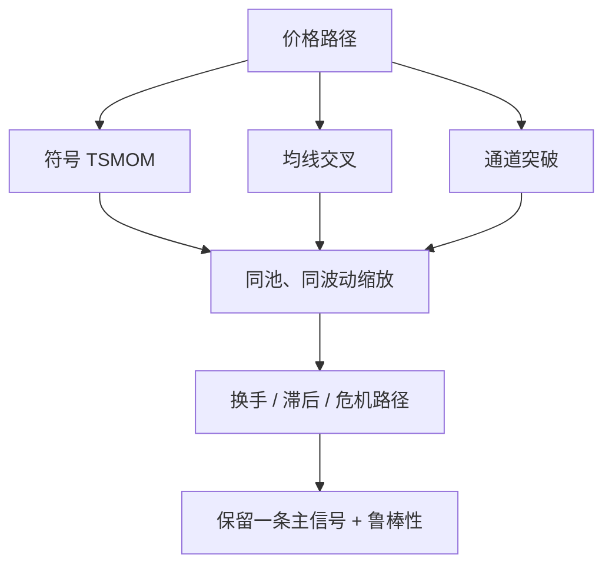

# 突破与均线

时间序列动量的论文基准是过去超额的符号；期货顾问更常把同一方向写成价格突破前高或站上均线。月频上它们几乎是同一个赌注，日频上换手与误报完全不同。

<footer>—— 对照 Moskowitz, Ooi & Pedersen, Time Series Momentum, JFE 2012；通道规则见 Donchian 一脉的管理期货实践</footer>

CTA 文档里出现最多的两句话是「突破」和「均线」。Donchian 把 N 日最高最低当成通道，价格走出通道则顺着做；双均线把快线与慢线的交叉当成状态切换；海龟一类规则是通道加单位仓位。Moskowitz、Ooi、Pedersen 证明，流动期货上过去 1 到 12 个月超额的符号能预测下一期收益。本篇写清楚：突破与均线是 TSMOM 的**滤波器实现**，不是另一类市场；差异在滞后、换手、以及震荡市里的假突破磨损。把三条规则的样本内最优当成三个 alpha，会重复计算同一条趋势溢价。

## 问题

趋势策略要一个可交易的状态变量：现在算上涨趋势还是下跌趋势。符号函数用累计超额；均线用价格与移动平均的差；突破用价格是否创区间新高或新低。若价格近乎单调，三者同号。若价格在区间里来回穿，均线与通道会反复翻转，符号函数在月频上可能一直为正。问题是度量：**同一信息在不同采样频率与不同非线性下的交易成本与路径依赖**，而不是谁更「技术分析」。

第二个问题是与风险管理叠在一起。通道常常自带止损（跌回通道则平），均线自带反手。Kaminski 与 Lo 说明止损的期望取决于数据生成过程：趋势上或有益，回归上有害。突破规则把止损写进信号，回测必须把这一非线性与成本一起报告，不能只报方向命中率。

### 三种滤波器对应三种滞后

记价格为 $P_t$。N 日均线交叉大致比较 $P_t$ 与过去窗口的均值；当窗口等于形成期 $L$ 时，它与 $\mathrm{sign}(P_t-P_{t-L})$ 相关，但在窗口内的路径形状上更平滑。Donchian 通道用 $\max\{P_{t-1},\ldots,P_{t-N}\}$ 与 $\min$，只有极值更新才换状态，对窗口内的回撤不敏感，直到击穿。符号 TSMOM 对形成期内的累计收益敏感，对是否「创新高」不敏感。因此：慢均线少交易、转折慢；短通道多交易、对噪声突破敏感；月频符号最懒。复制应固定 $N$ 或 $L$，并报告年化换手。

$$
s^{\mathrm{MA}}=\mathrm{sign}(P_t-\mathrm{MA}_{L,t}),\quad
s^{\mathrm{BO}}=\mathrm{sign}\bigl(P_t-\mathrm{High}_{N,t}\bigr)\ \text{或跌破 Low 翻空}.
$$

「55 日突破」与「12 个月 TSMOM」不是两个市场的独立证据。把参数网格上最大的夏普写成新策略，等于在同一条趋势事实上做多重检验。应预先声明一组工业常用参数，而不是搜索。

## 方法

先在同一期货池、同一波动缩放下并排三条规则：12 个月符号、一对常用均线（如 50/200 或 CTA 常用的多组指数均线）、一对常用通道（20/55 一类）。仓位都用 $\sigma_{\mathrm{tgt}}/\hat\sigma$。比较：全样本夏普、换手、平均持有期、最大回撤、以及股权危机窗口收益。差异若只出现在换手与危机路径，而方向相关很高，则只能保留一条作为主信号，其余当鲁棒性。

执行：突破用停损单或收盘确认，要声明是否允许盘中触发。均线常用收盘交叉，避免用未来的当日均线。通道在跳空开盘时可能从缺口外开始，滑点应按跳空后的可成交价，而不是按通道边界的纸面价。国内夜盘与涨跌停会把「突破」变成次日缺口，规则要定义隔夜如何处理。

### 假突破是成本，不是过滤器失效那么简单

震荡市里通道会被反复打脸，这是趋势策略的保费：用一段磨损换取能抓住大段单边。用 ATR 过滤、用时间止损、用波动压缩后再突破，都是在买更少的假突破、付出更多的滞后。样本内减少磨损很容易，样本外往往只是把参数挪到另一段震荡。更干净的做法是：接受多尺度组合里短尺度负责转折、长尺度负责少翻，用风险预算限制短尺度的名义，而不是给通道再加第四个确认指标。

## 机制

信息缓慢进入价格时，任何「追已实现方向」的滤波器都能分到趋势溢价。通道对极值敏感，更像止损反手的趋势跟踪；均线对平均水平敏感，更像低通滤波；符号对积分收益敏感，更接近 MOP 的可检验定义。套保压力与资金流不区分你用的是均线还是通道——它们只看到期货净持仓。因此机制检验应落在资产池与波动缩放上，而不是落在均线窗口是否为 19 还是 21。

震荡磨损的机制是均值回归成分：短期反向、区间交易、或政策把价格钉在区间。这时突破的期望为负，与 Kaminski–Lo 在回归 DGP 上对止损的警告同构。市场状态不可完美观测，CTA 用多时间尺度分散这种误设，而不是声称能识别「这是震荡」。

### 仓位单位与突破次数

海龟规则把一笔突破的名义与 ATR 挂钩，本质是[波动缩放](/quant/vol-scale-cta)。没有这一层，短通道在高波商品上会主导组合。突破次数（金字塔加仓）会把趋势的凸性加强，也会把回撤加强：加仓发生在已经走出来的路径上，反手时所有单位一起停。回测必须按单位记账，并禁止用同一突破在样本内加无限金字塔。风控上，通道止损与组合 kill switch 不要设成同一价格，否则同业拥挤时你与说明书上的止损一起成为供给。

均线金叉在股票软件里的流行度，不构成期货 CTA 的样本外证据。MOP 的对象是流动期货超额收益；把指数的均线规则套到含涨跌停的个股，空头腿与成交假设都变了。

## 边界与工程取舍

不要把突破写成与 TSMOM 正交的第二利润源，除非正交检验过关。不要用未扣滑点的盘中最高最低来算通道命中。不要在已经多尺度均线之后再叠一层同向的 12 个月符号而不降杠杆。参数应来自业界常用集合与论文主设定，网格搜索要做折扣。A 股与国内商品的限价、夜盘与交割月规则会改变「前高」的定义，不能直接用 CME 的 N。

与[时间序列动量 CTA](/quant/cta-tsmom) 的分工：那一篇管产品结构与 Moskowitz 定义；本篇管滤波器之间的可替代性。与危机 alpha 的关系：慢均线在急跌里更慢，可能先亏后翻空；短通道更快，但也更容易在 V 型里连续假突破。报告危机窗口时应分快慢尺度，而不是只给一个混合 CTA。

出处：Moskowitz, Ooi & Pedersen, *Time Series Momentum*, JFE, 2012。通道与单位仓位属于 Donchian / 海龟一脉的实践传统，不是 2012 年论文的定义。止损与 DGP 见 Kaminski and Lo, Journal of Financial Markets, 2014。长样本趋势见 Hurst, Ooi & Pedersen。

## 小结

- 突破、均线与过去超额符号是同一趋势赌注的三种滤波器，月频相关高，差异在换手、滞后与假突破。
- 比较必须在同一资产池与同一波动缩放下进行；胜出的若只是换手不同，不应宣称新 alpha。
- 通道自带止损，期望依赖趋势还是回归的 DGP；震荡磨损是保费。
- 金字塔加仓放大凸性也放大拥挤减仓；ATR 单位是波动缩放，不是突破本身的信息。
- 出处：Moskowitz et al., 2012；Donchian 式通道实践；Kaminski–Lo, 2014。
