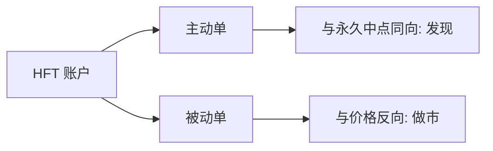

# Brogaard 高频与价格发现

高频交易者的主动单更常与随后的永久价格移动同向，他们的被动成交则常提供流动性。发现与做市可以出现在同一类参与者的不同订单上，而不是两个阵营的战争。

<footer>—— Brogaard, Hendershott and Riordan, High-Frequency Trading and Price Discovery, Review of Financial Studies, 2014</footer>

[Menkveld](/quant/menkveld-hft-mm)把一列 HFT 画成新做市商。缺口是价格发现：他们的成交是在把信息写入随机游走，还是在增加暂时噪声？Brogaard、Hendershott 与 Riordan（2014）用 NASDAQ HFT 标记，把主动与被动分开，看与中点永久移动的关系。本课接 Hasbrouck 信息含量，不重做 1995 年跨市场信息份额的代数。

## 问题

若 HFT 只是在弹跳上做市，他们的主动单应与随后中点负相关（提供流动性、价格回复）。若他们在追新闻或知情流，主动单应与永久成分正相关。混合策略则：主动腿发现，被动腿做市。问题是在有标记的数据里估计这两种协方差，并问：去掉 HFT 的主动单，随机游走方差会少多少——这是信息含量，不是道德上的「抢跑」。

与 PIN 对照：PIN 是日度体制概率，不识别谁是知情者。HFT 标记是身份，不是信息事件。HFT 可以在无公司私有信息的日子里，靠公共新闻与订单流预测做发现。

### 主动与被动必须拆开

把 HFT 全部成交加总，符号会抵消。BHR 的关键操作是按流动性方向拆。这与 Hasbrouck VAR 把 $q$ 当带符号流一致，只是 $q$ 再按账户类型切片。切片后的长期乘数，才是「这类人的这类单」的发现贡献。

后续 Brogaard 等人还有新闻、订单预测、危机时段的扩展。本课以 2014 年 RFS 的发现 vs 做市分解为核，避免写成 HFT 文献综述。

## 方法

带 HFT 标记的逐笔：标识 taker 是否 HFT。回归随后中点变化于 HFT 主动流、非 HFT 主动流，含滞后以分离永久与暂时。或估分组的 Hasbrouck 长期乘数。结果模式（原文样本）：HFT 主动流与永久价格同向，HFT 被动流与价格反向（提供流动性）。于是同一群体在会计上同时是发现者与做市商。

稳健：控制公开新闻时钟。若同向关系只存在于新闻窗，更像 Foucault–Hombert–Roşu 的新闻交易；若平时也在，则还有订单流预测（预测下一笔非 HFT 流）。后者接近有毒流，对慢的限价单是被捡。

## 机制

速度把公共信息与可预测的订单流变成可交易信号。写入价格加快，VR 在短地平线上更接近 1，Hasbrouck 定价误差下降——这是效率度量课想要的。代价落在慢挂单者的被捡与价差。发现改善与流动性供给改善可以并存于平静期（Menkveld + BHR），在新闻窗则发现腿压过做市腿。

对 Kyle：HFT 主动流是经验上的 $y$ 的一部分，其 $\alpha_q$ 高意味着这一部分流信息含量高。这不证明他们持有公司内幕，只证明他们对将要发生的价格移动预测得更好。

## 边界

标记是交易所定义的 HFT，漏掉未登记的快账户、也误伤中速算法。样本期美股不能外推到涨跌停市场。永久影响窗口选择会改结论。跨市场发现（期货领股票）需要信息份额，单市场中点回归会把领先市场的信息算到本地 HFT 头上——若 HFT 只是在本地跟上期货。

「HFT 提高价格发现」不是无条件政策结论。它描述协方差。若发现来自对慢挂单的狙击，设计仍可以改协议，让发现通过报价更新而不是通过收割完成。

下一课用 2010 年路径检验同一批账户在供给撤退时还是否做市。平静期的同向永久影响，不能外推成压力期他们会吸收库存。

## 小结

- Brogaard–Hendershott–Riordan（2014）把 HFT 主动单与永久价格同向、被动单与做市同向。
- 发现与做市是订单方向上的会计，不是两个不可重叠的行业。
- 短地平线效率可以改善，同时慢限价的被捡上升。
- 出处：Brogaard, Hendershott and Riordan, *Review of Financial Studies*, 2014；信息含量方法见 Hasbrouck, 1991。
