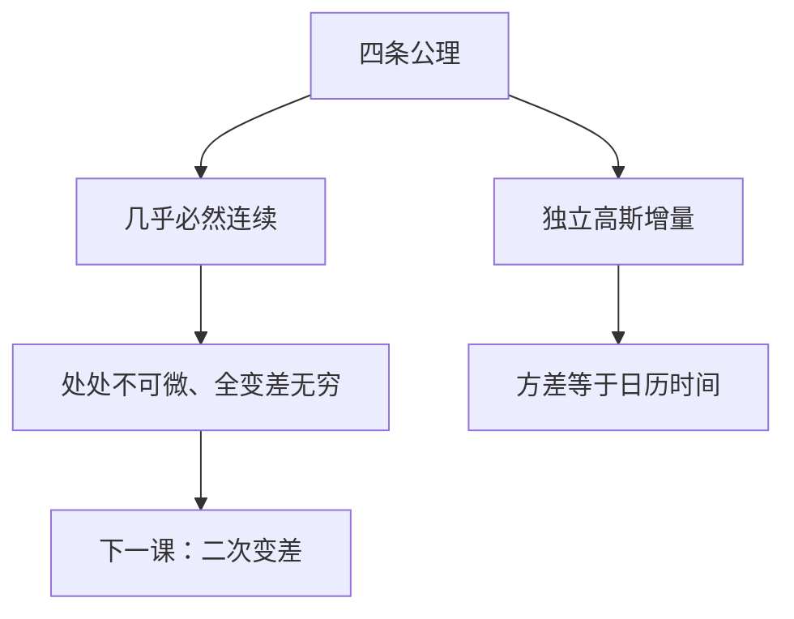

# 布朗运动与路径性质

布朗运动几乎必然连续，却几乎必然处处不可微；增量独立、平稳、高斯，方差随时间线性增长。

<footer>—— 据 Karatzas and Shreve, Brownian Motion and Stochastic Calculus, 1991, 第 2 章；Wiener, 1923 整理</footer>

本课是量化栏的第一课，也是「随机分析与金融数学」的第一课。定价数学需要一条连续时间的噪声源：既足够随机，路径又足够规则，后面才能积分、换测度、写复制。本课从路径性质起笔，不从限价簿、不从 Harris 的微观结构起笔。后课默认已经读完本课：标准布朗运动的四条公理、协方差 $\mathrm{Cov}(W_s,W_t)=\min(s,t)$，以及「连续但不可微」。

## 问题

离散时间里，独立同分布和 $S_n=\sum_{i=1}^n\xi_i$ 已经能写随机游走。缺口是连续时间：步长缩到零之后，极限过程 $W=\{W_t\}_{t\ge 0}$ 必须满足哪些**路径级**约束，才既是噪声、又能承载微积分。若样本路径像 $C^1$ 那样光滑，二次变差会消失，伊藤修正没有着落；若路径不连续，后课的伊藤积分与 Black–Scholes PDE 都要另起。本课只钉连续情形的标准对象。

连续、独立增量、高斯——三条不能互相替代。只连续可以是确定性函数；只独立增量可以是复合泊松。主干要的是：连续路径上的高斯噪声，方差按日历时间线性累积。

### 布朗运动不是从订单流推出来的

$W$ 是外生噪声，不是成交价的估计量。Bachelier 1900 与 Einstein 1905 把扩散和随机游走连起来，Wiener 给出测度；后课把股价写成 $W$ 的函数，并不表示 $W$ 来自微观结构。微观结构是另一棵树，本课程不重写。

$\mathrm{Var}(W_t)=t$ 把时间单位钉进方差。换时间尺度，增量方差按比例缩放，这是后课 GBM 里 $\sigma\sqrt{\Delta t}$ 的来源。

## 方法

概率空间 $(\Omega,\mathcal F,\mathbb P)$ 上，**标准布朗运动**满足：(i) $W_0=0$；(ii) 不相交区间上增量独立；(iii) $W_t-W_s\sim\mathcal N(0,t-s)$；(iv) 存在连续修正。由此 $\mathbb E[W_t]=0$，$\mathrm{Var}(W_t)=t$，$\mathrm{Cov}(W_s,W_t)=\min(s,t)$。平稳性：$W_{s+t}-W_s$ 与 $W_t$ 同分布。马尔可夫性：给定 $W_s$，未来只通过当前值依赖过去。

几乎必然，路径在任意区间上处处不可微，全变差无穷。这不是病态附录，而是下一课二次变差的前提：一阶变差炸掉，平方变差收敛到 $t$。

## 机制

高斯增量把有限维分布钉死：$(W_{t_1},\ldots,W_{t_n})$ 是均值为零、协方差为 $\min(t_i,t_j)$ 的多元正态。Kolmogorov 连续性准则保证存在 Hölder 指数小于 $1/2$ 的连续修正——刚好不够可微，刚好够连续。Levy 模连续性把粗糙程度定量化；本课只需记住：粗糙由二次变差刻画，不是由全变差。平移与缩放：$a^{-1/2}W_{at}$ 仍是标准布朗运动。后课换到期、换步长，噪声归一化都走这条自相似性。马尔可夫性让价格函数可以只依赖 $(t,W_t)$ 或 $(t,S_t)$，而不必记住整条路径——路径依赖合约是后课才打开的缺口。

## 边界

本课不构造 Wiener 测度，不证不变原理，不引入分数布朗或带跳过程。伊藤积分、SDE、风险中性都还没出场。后课默认：$W$ 已是标准布朗运动；写 $\mathrm d W$ 时，默认独立高斯增量与连续路径。下一课[二次变差](/quant/quadratic-variation)回答：在不可微路径上，乘法规则用什么替代 $(\mathrm d W)^2=0$。

## 小结

- 量化栏从路径噪声起笔：标准布朗运动是后面积分与定价的外生源。
- 独立平稳高斯增量、连续路径、$\mathrm{Var}(W_t)=t$。
- 几乎必然处处不可微、全变差无穷；二次变差留给下一课。
- $W$ 不是限价簿对象，本课程不重写微观结构。
- 后课默认本课已读完。
- 出处：Karatzas–Shreve 第 2 章；Wiener 1923。
