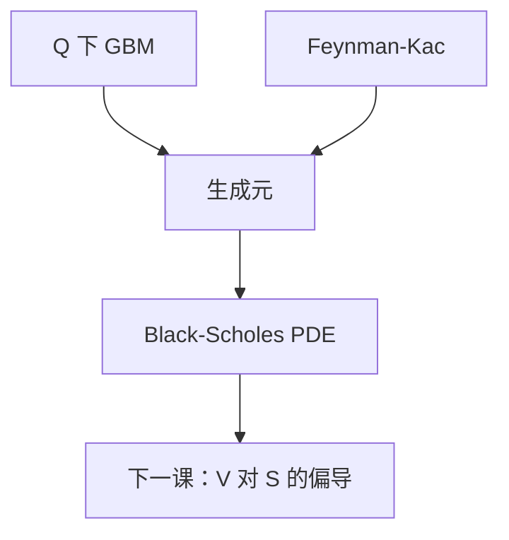

# Black–Scholes 作为 PDE

在 GBM 与常数利率下，欧式价格 $V(t,S)$ 满足 $V_t+\tfrac12\sigma^2 S^2 V_{SS}+r S V_S-r V=0$，终值是支付函数。

<footer>—— 据 Black and Scholes, J. Political Economy, 1973；Merton, Bell Journal of Economics, 1973；Shreve, Stochastic Calculus for Finance II, 第 6 章整理</footer>

上一课[Feynman–Kac](/quant/feynman-kac)给出期望与 PDE 的桥。缺口是特化：标的为[几何布朗运动](/quant/geometric-brownian-motion)，测度已是[风险中性测度](/quant/risk-neutral-measure)下的 $Q$。把 $\mu=rS$、$\sigma_{\text{diff}}=\sigma S$ 推进生成元，就得到 Black–Scholes 方程。本课只写这个 PDE 与终边值，不把闭式 $\Phi(d_1)$ 展开——那是对数正态课。

## 问题

$Q$ 下 $\mathrm d S=r S\,\mathrm d t+\sigma S\,\mathrm d W^Q$。欧式支付 $H=g(S_T)$，价格 $V(t,S_t)=\mathrm e^{-r(T-t)}\mathbb E_Q[g(S_T)\mid\mathcal F_t]$。缺口是把 Feynman–Kac 的 $\mathcal A$ 写成具体系数，使后课 delta 对冲能对 $V_S$ 说话。不重推 Girsanov，不重推 RN 存在性。

终值 $V(T,s)=g(s)$。看涨还要边界：$s\to 0$ 时 $V\to 0$，$s\to\infty$ 时 $V\sim s-Ke^{-r(T-t)}$（在无股息时）。这些是 PDE 的数据，不是新的经济假设。

### PDE 不是从投资组合瞬时无风险「另推一遍」再当定义

Black–Scholes 原文用 $\Delta$ 对冲消去 $\mathrm d W$，令收益率等于 $r$。那与「$Q$ 下贴现鞅」是同一件事的两种语言。本课走 Feynman–Kac，是因为前面已经有 $Q$；不必把 1973 的推导再当第一性原理重做。复制课会回到 $\Delta=V_S$。

无股息时漂移系数是 $rS$。连续股息 $q$ 把 $rS$ 换成 $(r-q)S$，PDE 多一项 $-qSV_S$。本课先钉 $q=0$。

## 方法

$$
V_t+\tfrac12\sigma^2 S^2 V_{SS}+r S V_S-r V=0,\qquad t\lt T,\ S\gt 0,
$$

$V(T,S)=g(S)$。这是变系数抛物方程。对数坐标 $x=\ln S$ 把它变成常系数热方程，这是闭式与有限差分数值的共同入口。$\sigma=0$ 时退成贴现的运输方程，解为 $e^{-r(T-t)}g(Se^{r(T-t)})$，即远期兑现——与无风险情形一致。

有股息、外汇、期货，只改生成元的一阶项（漂移），二阶项仍是 $\tfrac12\sigma^2 S^2 V_{SS}$。这与 Girsanov「不改波动率」一致。

## 机制

贴现过程 $\mathrm e^{-rt}V(t,S_t)$ 的 Itô 漂移由 PDE 恰好抵消，剩下 $\mathrm e^{-rt}\sigma S V_S\,\mathrm d W^Q$。因此贴现价格是 $Q$-局部鞅；在线性增长下是鞅，初值等于终端贴现支付的期望。PDE 的二阶项来自 $[S]$，一阶项来自 $Q$ 下的漂移 $rS$，零阶项来自贴现。缺任何一项都会让贴现价格带漂移，出现套利。

抛物性要求 $\sigma\neq 0$。$\sigma=0$ 是退化，解沿特征线，不再有平滑。数值上 $\sigma$ 过小要换格式，那是实现问题；理论上完备市场仍要求 $\sigma\neq 0$ 以便 $\theta$ 有定义。

## 边界

本课不解热方程，不引入隐含波动率曲面。美式把 PDE 换成变分不等式，跳把 PDE 换成 PIDE。后课默认：欧式扩散价格指这个柯西问题的多项式增长解。下一课[复制与 delta](/quant/replicating-delta)把 $V_S$ 读成股票持仓。

## 小结

- BSM PDE 是 $Q$ 下 GBM 的 Feynman–Kac。
- 二阶项来自二次变差，一阶项来自风险中性漂移。
- 终值是支付；边界由无套利渐近给出。
- 与 1973 的瞬时无风险组合是同一条件。
- 出处：Black–Scholes 1973；Merton 1973；Shreve SDE II 第 6 章。
