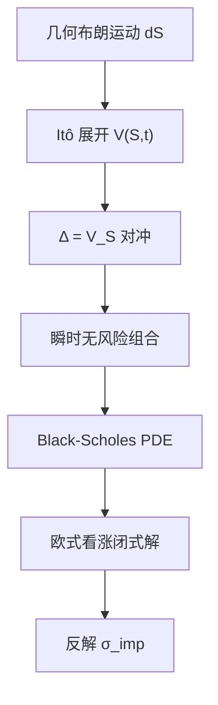

# Black-Scholes-Merton

    
若股票遵循几何布朗运动、市场无摩擦且可连续对冲，欧式看涨期权的价值由标的价格、执行价、利率、期限与波动率唯一决定，并不显式依赖股票的期望收益率。

    <footer>—— Black and Scholes, The Pricing of Options and Corporate Liabilities, Journal of Political Economy, 1973</footer>

1973 年同一季节里出现了两篇把期权从「经验规则」推进到可复制证券的论文。Black 与 Scholes 在 *Journal of Political Economy* 给出欧式看涨、看跌的闭式解，并把公司负债读成期权；Merton 在 *Bell Journal* 把论证放进连续时间，处理股利、随机利率与美式约束，标题就是「理性期权定价」。二者共用的机制是动态对冲：用标的与无风险债券复制期权的瞬时风险，组合局部无风险，因而必须赚无风险利率，否则存在套利。期望收益 $\mu$ 在复制论证里被消掉，这不是假设投资者风险中性，而是无套利把风险价格锁进了标的本身。本篇写公式与假设，PDE 的离散化见 [PDE 与有限差分](/quant/option-pde)，测度更换见 [风险中性定价](/quant/risk-neutral-pricing)。

## 问题

在 Black-Scholes 之前，期权报价依赖对股票涨跌概率的主观判断，不同人可以给同一合约完全不同的价格，且难以说明怎样用标的去对冲。若标的可以连续交易，期权就不应是独立的风险源：它的随机性来自股票，一个适当的股票-债券组合应能瞬时复制期权的增益。问题是把「可复制」写成偏微分方程或期望，并在欧式看涨的边界条件下求出闭式解。

公司金融是同一套数学的另一面。股权可视为以公司资产为标的、以负债面值为执行价的看涨期权；有限责任使股权价值不会为负。Black-Scholes 把或有索取权定价与资本结构连在一起，Merton 随后把违约距离、信用利差也放进同一框架。本篇只把股票期权写清楚，但要记住 1973 年的标题里「Corporate Liabilities」不是点缀。

### 几何布朗运动与市场假设

标的满足

$$
\mathrm{d}S_t = \mu S_t\,\mathrm{d}t + \sigma S_t\,\mathrm{d}W_t,
$$

$\sigma$ 为常数，没有跳跃，交易连续、无印花税、可卖空、利率 $r$ 为常数。欧式合约只在 $T$ 行权，看涨支付 $(S_T-K)^+$。这些假设把随机性收成一个布朗驱动，使对冲比率可以写成 $S$ 与 $t$ 的确定函数。放松其中任何一条——随机波动、跳跃、离散对冲、交易成本——闭式解就不再是市场价，而只是一个基准。

Black-Scholes 并不要求 $\mu=r$。$\mu$ 进入股票的真实测度动力学，但对冲组合的漂移被复制条件钉在 $r$ 上。把「模型假设投资者风险中性」当成 1973 年论文的前提，是把后来的风险中性语言倒灌回去。

## 方法

设期权价格 $V(S,t)$ 足够光滑。Itô 公式给出

$$
\mathrm{d}V = \left(V_t + \mu S V_S + \tfrac12\sigma^2 S^2 V_{SS}\right)\mathrm{d}t + \sigma S V_S\,\mathrm{d}W.
$$

持有一单位期权、卖空 $\Delta=V_S$ 单位标的，布朗项相消，组合瞬时无风险。无套利要求其收益率等于 $r$，整理得 Black-Scholes 方程

$$
V_t + r S V_S + \tfrac12\sigma^2 S^2 V_{SS} - r V = 0.
$$

连续红利率 $q$ 时，把 $rS V_S$ 换成 $(r-q)S V_S$。欧式看涨的终值是 $(S-K)^+$，空间边界在 $S\to 0$ 时价值趋于 0，在 $S\to\infty$ 时渐近于远期。分离变量或把方程化成热方程，得到

$$
C = S e^{-qT} N(d_1) - K e^{-rT} N(d_2),
$$

$$
d_1 = \frac{\ln(S/K)+(r-q+\sigma^2/2)T}{\sigma\sqrt{T}},\qquad d_2 = d_1-\sigma\sqrt{T},
$$

其中 $N$ 为标准正态 cdf，$T$ 为剩余期限。看跌由平价

$$
C-P = S e^{-qT}-K e^{-rT}
$$

给出，或直接把支付换成 $(K-S_T)^+$。无股利时 $q=0$，即 Black-Scholes 原文的公式。Merton（1973）强调：有股利的美式看涨可能提前行权，欧式公式不再是美式价格的上界以外的「答案」，见 [美式期权](/quant/american-exercise)。

### 希腊值与对冲比

$\Delta = e^{-qT} N(d_1)$ 正是复制组合里的股票份数。$\Gamma = e^{-qT} n(d_1)/(S\sigma\sqrt{T})$ 衡量 $\Delta$ 对 $S$ 的敏感，离散对冲时残余风险与 $\Gamma$ 和实现方差有关。$\mathrm{Vega}=S e^{-qT} n(d_1)\sqrt{T}$ 对 $\sigma$ 求导，是把模型接到 [隐含波动率曲面](/quant/vol-surface) 的通道：市价一旦偏离公式，通常不改 $r$ 而改 $\sigma$，反解出 $\sigma_{\mathrm{imp}}$。$\Theta$ 与 $r$、$q$、$\sigma$ 通过 PDE 互相约束，即 $r$ 与 $\sigma$ 的贡献必须被时间衰减平衡，否则又出现套利。

## 机制

复制论证的核心是「局部」：$\Delta$ 只在下一瞬间抵消扩散，必须连续再平衡。真实测度下期权的期望收益可以高于或低于 $r$，取决于 $\mu$ 与风险偏好；但任何偏离复制关系的定价都会被动态组合套利。因此定价公式里出现的是 $r$ 而不是 $\mu$。同一件事用测度语言说：存在等价鞅测度 $\mathbb{Q}$，使 $e^{-rt}S_t$ 为鞅（有股利时是 $e^{-qt}S_t$ 经货币账户折现后为鞅），价格是

$$
V_0 = e^{-rT}\mathbb{E}^{\mathbb{Q}}[(S_T-K)^+].
$$

$S$ 在 $\mathbb{Q}$ 下的漂移是 $r-q$，对数正态积分就是 $N(d_1)$、$N(d_2)$。Harrison-Pliska 把「无套利 $\Leftrightarrow$ 等价鞅测度」写成定理，那是 1981 年的语言；1973 年的论文用的是 PDE 与无风险组合。

$N(d_2)$ 是风险中性下到期实值的概率；$e^{-qT}N(d_1)$ 是以股票为计价物时的实值概率，也是 $\Delta$。两个概率一般不相等，因为计价物不同。把 $N(d_2)$ 直接叫做「股票上涨的真实概率」是错的：真实概率里有 $\mu$，公式里没有。

$d_1$ 与 $d_2$ 相差 $\sigma\sqrt{T}$，来自对数正态的 Jensen 调整：$\mathbb{E}[S_T]=S e^{(r-q)T}$ 对应的是均值，而执行事件看的是分布函数。波动越大，$d_1$ 与 $d_2$ 分得越开，看涨的保险价值越高。

### 股利、平价与公司负债

连续红利率 $q$ 把标的的持有成本改成 $r-q$，平价成为 $C-P=Se^{-qT}-Ke^{-rT}$。离散股利在除权日让 $S$ 下跳，欧式仍可用调整后的现货（从 $S$ 里减去股利现值）塞进公式，但美式不能。Black-Scholes 把股权看成以企业资产为标的、以负债面值为执行价的看涨：资产波动进入 $\sigma$，负债越多股权越像期权。Merton 随后把违约写成资产触及负债边界，信用利差与期权是同一套复制。这些推广不改变「$\mu$ 不进入价格」的机制，只改变标的与边界。

## 边界

常数 $\sigma$、连续路径、连续再平衡，是公式的边界。1973 年之后的经验事实是：隐含波动率随执行价与期限变化，形成 [Skew 与 Smile](/quant/vol-skew)；局部波动与随机波动都是为了在保留无套利的前提下生成微笑。跳跃会让对冲出现无法用 $\Delta$ 消掉的缺口，Merton（1976）自己写了跳跃扩散。利率随机时，股票期权仍可用修正的股利与折现处理，但利率衍生品要换到另一套短期利率或远期测度。

离散对冲把局部无风险变成近似无风险，误差随再平衡间隔与 $\Gamma$ 增长。交易成本使连续复制不可行，Leland 一类调整把 $\sigma$ 改成含换手成本的有效波动，已不是原文公式。美式行权、障碍、回望、篮子与随机波动，通常没有同样简洁的闭式解，要走树、[蒙特卡洛](/quant/mc-pricing) 或 PDE。Black-Scholes-Merton 仍然是市场的坐标系：几乎所有后续模型都先报价成隐含波动，再讨论偏离。

不要把 Black-Scholes 公式里的 $\sigma$ 当成历史波动率的同义词。公式要的是定价用的波动参数；交易员输入的是隐含波动。历史估计是另一个统计问题，二者可以接近，但没有定理保证相等。

## 小结

- Black-Scholes（1973）与 Merton（1973）用动态复制把欧式期权写成 PDE 的解，价格不显式依赖 $\mu$。
- 几何布朗运动、常数 $r$、$\sigma$、连续无摩擦交易是闭式解的前提。
- 看涨公式为 $C=S e^{-qT}N(d_1)-K e^{-rT}N(d_2)$，看跌由平价得到。
- $\Delta=e^{-qT}N(d_1)$ 是复制比；$N(d_2)$ 是风险中性实值概率，不是真实测度概率。
- 有股利的美式看涨可能提前行权；无股利美式看涨与欧式同价。
- 市场用反解的 $\sigma_{\mathrm{imp}}$ 承接模型误差，曲面与偏斜是后续对象。
- 出处：Black and Scholes, *Journal of Political Economy*, 1973；Merton, *Bell Journal of Economics and Management Science*, 1973。
