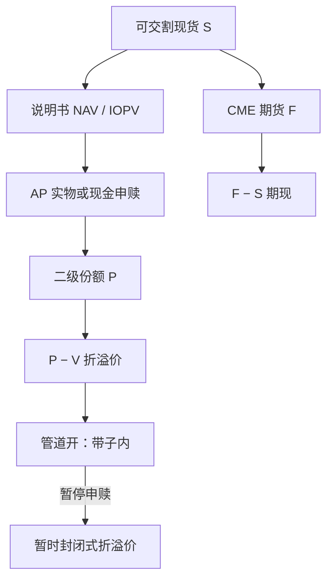

# 比特币现货 ETF 基差

现货比特币 ETF 把可申赎的份额钉在托管比特币的净值附近；份额相对 CME 期货、相对场外现货、相对封闭式折溢价的偏离，是三套不同的基差，不能收成一个「币圈升水」。

<footer>—— 据 2024 年起美国上市现货比特币 ETF 的公开说明书、申赎机制与 CME 比特币期货规则整理；ETF 管道对照 Petajisto</footer>

2024 年 1 月美国现货比特币 ETF 获批上市（IBIT、FBTC 等，GBTC 从封闭式信托转为开放式 ETF），把比特币的敞口放进证券经纪账户。价格发现从此多了一层：二级份额、一级申赎篮子（比特币或现金）、CME 期货、以及各现货场所。本篇写**基差的分解**：份额对 IOPV/NAV、ETF 对 CME 期货、ETF 对可交割现货。制度前件是 [创建赎回](/quant/etf-create-redeem)；加密腿对照 [期现基差](/quant/crypto-basis-trade) 与 [永续资金](/quant/crypto-perp-funding)。对象是公开净值、申赎清单与期货结算规则，不是跨所延迟撮合。

## 问题

记二级成交价 $P$，基金披露的每份净值 $V$（按说明书的定价源与时间切），CME 近月期货 $F$，可交割现货 $S$。至少有三条缝：

$$
P-V,\qquad F-S,\qquad P-F_{\mathrm{share}}.
$$

$P-V$ 受一级管道约束：授权参与商能否按创建单位申购或赎回比特币（实物）或现金。管道开着时，偏离应落在费用、冲击与结算延迟的带子里，逻辑与股票 ETF 相同，见 Petajisto。$F-S$ 是加密期现，周末现货仍交易、CME 有时段，持有成本含保证金与基差风险。$P$ 对期货的「份额隐含期货」还要换算乘数与费用。把 GBTC 时代的封闭式溢价、ETF 时代的 $P-V$、以及永续资金费画在一张「比特币基差」图上，会把三种会计混成一条叙事。

第二句话是定价时钟。比特币 7×24 交易，ETF 在交易所时段竞价，NAV 按说明书时点（常为下午某一时刻的定价源）计算。盘中 IOPV 若用滞后的现货指数，开盘跳空可以看起来像巨大折溢价，其实是时钟。周末累积的现货变动，周一开盘一次性写入 $P$，这是日历，不是 alpha。

### GBTC 折溢价不是 ETF 基差

转换前的 GBTC 是封闭式产品：份额供给固定，二级价格可以相对持仓比特币大幅溢价或折价，没有每日创建赎回把 $P$ 钉回 $V$。转换后，一级期权打开，$P-V$ 的上界变成 AP 的执行成本。用 2021 年 GBTC 溢价去外推 2025 年 IBIT 的可套利空间，是把两种产品当成一种。现金申赎比例高时，管道退化成「发行人代你买卖比特币」，跟踪误差与冲击由基金承担或转嫁，收敛不再是实物仓库意义上的锁定。

实物申赎依赖托管人能交出比特币、AP 能接收并在现货市场变现。托管中断、钱包维护、或发行人暂停申赎，会把 ETF 暂时变成封闭式。规则书里的暂停条款是基差的尾部，应写进压力情景，而不是脚注。

## 方法

**NAV/IOPV 对齐。** 读各基金说明书：定价源（哪家指数、哪些场所、何时切）、现金差额、创建单位大小、实物还是现金、费用。盘中用公开 IOPV 或自建可成交篮子（托管规格的比特币加现金）估计 $V$。可执行折溢价 = $P$ 相对买卖档减去篮子冲击、创建费、预估现金差额误差。仅当超出带子且一级窗口开放时，才把 $P-V$ 当成 AP 套利。

**对 CME 的期现。** 份额多头对冲近月 CME，或反向。基差须用同一比特币定义：CME 结算参考的现货指数不必等于 ETF 定价源。展期、保证金、税款与 1940 年法案基金的持仓限制，都会让「纸面期现」兑现不成。周末与假日：期货停、现货与链上永续仍在，周一的缺口是时间错配，见 [加密期现](/quant/crypto-basis-trade)。

**流量。** 申购赎回份额是公开的一级流量，与链上交易所流入不是同一对象，见 [链上交易所流](/quant/onchain-exchange-flows)。ETF 净申购增加托管比特币需求，可以抬 $S$ 而不必抬 $P-V$。把「ETF 流入」直接当成基差信号，混了价格发现与管道库存。

### 创建单位、结算与现金替代

创建单位以万份计，对应一整块比特币。零售看到的每份折溢价在达不到单位时不可一级执行。结算周期（证券 T+1 与比特币链上确认）不对齐时，AP 承担在途风险。现金替代把执行质量交给基金经理：你锁住的是对 NAV 公式的索赔，不是对某一 UTXO 集合的索赔。回测若假设任意时刻可用 NAV 成交，等于假设自己是 AP 且篮子无限深。

## 机制

一级期权（创建赎回）是 $P$ 贴近 $V$ 的机制：份额贵则申购卖出，便宜则买入赎回。AP 之间的竞争把利润压到执行成本。CME 与现货之间的机制是期货到期结算加保证金，不是 ETF 信托。两类资本（ETF AP、期货基差交易者）面对不同的监管、托管与税务，所以 $P-V$ 与 $F-S$ 可以暂时各走各的。现货 ETF 上市后，GBTC 式的巨大折价难以持久，是因为产品类型变了，不是因为「市场学会了定价比特币」。

资金费与 ETF 基差。永续升水是无到期合约的租金；ETF 折溢价是份额相对信托资产。用资金费去交易 IBIT 而不做期货或现货腿，没有会计恒等式保证收敛。可以做的是相对价值观点，必须计入两套微观结构。

### 谁在提供收敛

开盘拍卖与收盘拍卖集中了股票账户的再平衡；比特币的价格发现在拍卖之外继续。AP 与做市商在时段内把 $P$ 拉向 $V$，时段外 $V$ 的「真实」现货已经走了。于是隔夜/周末的现货波动表现为开盘基差，随后被一级与二级交易消化。这与 [隔夜日内](/quant/overnight-intraday-alpha) 的时钟分解同类，标的从股票换成比特币信托。

同一发行人的现货比特币 ETF 与以太坊 ETF 不能用同一条基差带子。托管、创建单位、定价源与期货对冲工具都不同。合并报告「加密 ETF 基差」只会让监控阈值失去参照。

## 边界与工程取舍

不要用 GBTC 历史溢价当 IBIT 的回测。不要用非说明书指数代替 NAV。不要假设现金申赎与实物申赎有相同的锁定质量。税务（收集账户、实物赎回的资本利得处理）会改变 AP 的参与意愿，从而改变带子宽度，这是制度变量。CME 持仓限额与基金衍生品使用限制，会使期货对冲腿先于现货腿达到容量。

作为风险：折溢价扩大是管道压力的仪表，应触发降杠杆而不是自动加仓「均值回复」。作为交易：只有 AP 或有 AP 通道的主体能把 $P-V$ 当成套利用；二级投资者交易的是份额本身，面对的是买卖价差与跟踪误差，不是一级锁定。公开信息已经足够写清这层分工。

出处：各现货比特币 ETF 说明书与 CME 比特币期货规则；ETF 定价效率见 Petajisto, FAJ, 2017。封闭式折溢价文献不要直接当作开放式 ETF 的基差模型。

## 小结

- 现货比特币 ETF 的 $P-V$、CME 期现 $F-S$、以及已退出历史的 GBTC 封闭式折溢价，是三套会计。
- 一级创建赎回把 $P$ 钉在可执行净值附近；暂停申赎或高现金替代会削弱锁定。
- 7×24 现货对时段 ETF 造成开盘与周末缺口，应当作时钟而不是异常收益。
- 可执行性取决于创建单位、托管、结算错配与是否具备 AP 通道。
- 永续资金费不能替代 ETF 基差的恒等式。
- 出处：基金说明书与 CME 规则；Petajisto, 2017。
