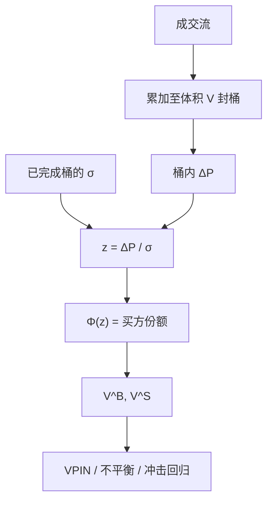

# 批量成交量分类

不必给每一笔成交贴买卖标签。把等体积的一桶看成一次实验，用桶内价格变化在正态里的位置，把整桶成交量拆成买的份额与卖的份额。

<footer>—— Easley, López de Prado & O'Hara, Discerning Information from Trade Data, Journal of Financial Economics, 2016</footer>

[Lee–Ready](/quant/lee-ready) 要逐笔对照报价，贵、吵、还依赖 BBO 对齐。[VPIN](/quant/vpin) 需要的却是每个成交量桶里的买量与卖量，并不需要知道桶内第十七笔是谁主动。Easley、López de Prado 与 O'Hara 把这件事收成 **Bulk Volume Classification (BVC)**：在[成交量 bar](/quant/volume-bars)（或时间桶、金额桶）上，用标准化价格变化的正态 CDF 当买方成交量比例。本篇写 BVC 作为分类器本身——公式、σ 的估计、它与 tick 规则的系统偏差——而不把 VPIN 的毒性叙事再写一遍。

## 问题

逐笔方向在现代市场里有三层摩擦。隐藏单与中点匹配让成交价经常落在中点；多场所让对照报价与成交不对齐；数据量让逐笔匹配成为管道瓶颈。若问题只是「这一桶净买了多少」，逐笔错误还会在加总时部分对冲，但不保证无偏：中点错误率随活跃度变化，加总偏差是状态依赖的。需要一个不读报价、计算量为每桶一次、并且在成交加速时仍有定义的规则。

BVC 的赌注是：桶内买方份额与桶收益同向、且幅度可用一个单调函数（正态 CDF）来近似。它承认单笔方向不可知，只承认体积加权的倾向。问题是这个近似何时等于「真实主动买量比例」，何时只是把已实现波动改写成了买卖不平衡。

### 正态 CDF 把涨跌映成份额

对桶 $\tau$，记开盘价 $P_{\tau}^{o}$、收盘价 $P_{\tau}^{c}$、桶体积 $V$（股数或合约数），$\sigma$ 为桶收益的滚动标准差。买方成交量

$$
V_\tau^{B}=V\cdot\Phi\bigl((P_{\tau}^{c}-P_{\tau}^{o})/\sigma\bigr),\qquad V_\tau^{S}=V-V_\tau^{B},
$$

$\Phi$ 为标准正态 CDF。收益为零时 $\Phi(0)=1/2$，买卖对半。收益相对 $\sigma$ 很大时，几乎整桶标成单边。这与 tick 规则「每笔一个 ±1 再加总」不同：BVC 允许 0.62 这样的分数份额，不要求桶内每笔同向。

$\sigma$ 必须用**已完成**桶估计。若把当前桶的收益也喂进 $\sigma$，分类与波动在同一点上互相定义，极端桶会被当成「正常波动」而份额向 1/2 收缩，或反过来被当成极端而份额顶格。滚动窗口应在封桶之后才更新。

## 方法

先选时钟：等体积 $V$ 最常见，也可用等金额或等日历间隔；原文强调成交量同步，因为信息事件伴随成交加速。封桶规则与 [volume bars](/quant/volume-bars) 相同，跨桶成交要切开。封口后取首末价（或 VWAP 相对开盘，须预先锁定），标准化，过 $\Phi$，得到 $(V^B,V^S)$。输出可以是份额 $V^B/V$，也可以是不平衡 $(V^B-V^S)/V=2\Phi(z)-1$。

校准：在有官方主动标志的子样本上，把 BVC 份额对真实买量比例回归，看截距、斜率与 $R^2$。Easley 等人报告 BVC 与逐笔算法相比，在后续价格预测上不差甚至更好——那是**预测标准**，不是逐笔正确率。若你的任务是给每一笔贴标签，BVC 答非所问。若任务是毒性、冲击、买卖压力，应用桶级矩去评，不要用 Lee–Ready 的逐笔一致率去否决。

### 正态只是一条方便的链接函数

$\Phi$ 可换成 logistic 或其他 S 形。形状决定「多大的标准化收益才把份额从 0.5 推到 0.9」。厚尾市场里正态把中等收益当成极端，份额过早顶格；若 $\sigma$ 被少数跳估得过大，份额又永远贴在 0.5。应报告 $\Phi(z)$ 的经验直方图：若大量质量贴在 0 与 1，分类器退化成「涨即全买、跌即全卖」，与符号函数无异。此时要么加大 $V$ 让单桶更接近扩散，要么换链接函数，而不是继续宣称分数份额的精细。

## 机制

机制叙事是：知情交易在短窗里留下同向成交与价格移动，买方份额应随 $\Delta P$ 上升。噪声交易与存货在桶内对冲，净 $\Delta P$ 小，份额接近一半。BVC 把这条叙事参数化成一个正态概率，而不是逐笔贝叶斯。它与 Glosten–Milgrom 的「方向更新信念」同族，但观测从单笔换成了桶统计量。

竞争性机制不需要知情者。波动上升时 $|\Delta P|/\sigma$ 的分布若未被 $\sigma$ 及时跟上，份额会两极化，不平衡看起来像毒性，其实是波动。这正是 Andersen、Bondarenko 对 VPIN 的质疑在分类器层面的根源：BVC 的输入是价格变化，输出却被叫做订单流。任何用 BVC 不平衡去「预测」后续波动的检验，都有一部分是用过去 $\Delta P$ 预测未来 $|\Delta P|$。干净的做法是：在同一成交量时钟上并排已实现波动，看不平衡的增量解释力。

### 与 tick 规则加总不是同一极限

把桶内每笔用 tick 规则分类再加总，得到整数买量。BVC 得到分数。当 $V\to$ 单笔，$\Phi(\Delta P/\sigma)$ 仍不是 tick 规则：单笔 $\Delta P$ 是相对桶开盘，不是相对上一成交，且 $\sigma$ 是桶级。两种分类器在 $V=1$ 时也不收敛到对方。因此「BVC 是 tick 规则的平滑」是错的。BVC 是价格变化的链接函数，tick 规则是成交价路径的符号序列。

金额桶与股数桶给出不同的 $z$。高价股一笔金额大，等金额桶更短；低价股相反。跨股票比较 BVC 份额前，必须锁定体积单位，否则比较的是采样频率，不是信息。

## 边界与工程取舍

开盘集合竞价、涨跌停、停牌复牌：$\Delta P$ 受制度截断，$\Phi$ 失真，这些桶应丢弃或改用 tick 规则。多市场把同一套利腿记进两个桶，BVC 会把对冲交易读成双倍单边。$\sigma$ 窗口太短，分类抖动；太长，体制切换后份额迟迟不极化。不要用闪崩单日去标定 $V$ 与 $\sigma$ 窗再声称样本外有效。

不要把 BVC 份额叫做 PIN。不要在没有封桶纪律的日历五分钟线上贴 BVC 标签却声称成交量同步。不要用逐笔 Lee–Ready 正确率作为 BVC 的验收标准。生产上：主序列可以是 BVC，对照序列用官方主动标志在同一桶内加总；只有任务真正需要逐笔 $D$ 时才回到报价规则。

出处：Easley, López de Prado & O'Hara, *Discerning Information from Trade Data*, Journal of Financial Economics, 2016。VPIN 对 BVC 的使用见同一作者 RFS 2012。质疑见 Andersen 与 Bondarenko 对价格变化进入订单流度量的讨论。

## 小结

- BVC 用桶内标准化价格变化的 CDF 把整桶体积拆成买卖份额，不读报价、不逐笔贴标签。
- $\sigma$ 只用已完成桶；否则分类与波动互相定义。
- 评价应在桶级预测与不平衡矩上做，不要用逐笔正确率否决。
- 输出与价格变化共享信息，和后续波动的相关一部分是机械的。
- 它不是 tick 规则的平滑极限，也不是 PIN。
- 制度截断与跨市场重复计算会让 $\Phi$ 失真。
- 出处：Easley, López de Prado & O'Hara, Journal of Financial Economics, 2016。
