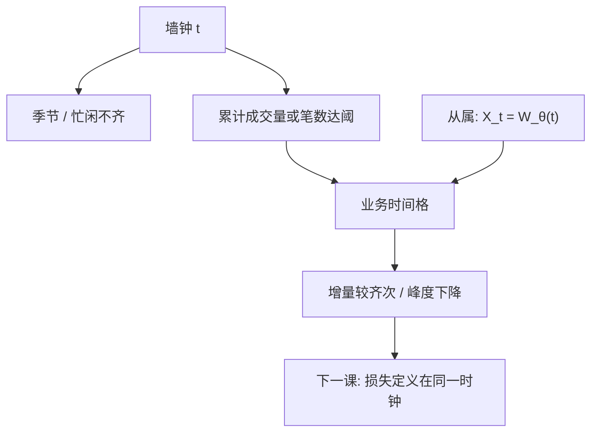

# 交易时间对成交量时间

墙钟上波动的季节与聚集，有一部分只是「忙的时候事件密」；把时间按累计成交量（或交易次数）重新标度，价格增量可以接近较齐的过程。

<footer>—— Mandelbrot and Taylor, On the Distribution of Stock Price Differences, Operations Research, 1967；Clark, A Subordinated Stochastic Process Model, Econometrica, 1973；Ané and Geman, Order Flow, Transaction Clock, and Normality of Asset Returns, Journal of Finance, 2000</footer>

[点过程](/quant/point-process-durations) 在墙钟 $t$ 上估强度 $\lambda(t)$。从属过程把日历时间换成业务时间 $\theta$：价格 $X_t=W_{\theta(t)}$，$\theta$ 随交易活动增。Clark 用交易次数从属解释收益峰度；Ané–Geman 用成交量时钟让收益更接近条件正态。本课缺口：采样方案本身（[tick bars](/quant/tick-bars)、[dollar bars](/quant/dollar-bars)）是业务时间的离散实现，会改变 RV、噪声与季节的外观。最后一课把预测损失定义在你选定的时钟上——时钟一换，QLIKE 的对象跟着换。

## 问题

墙钟五分钟：开盘格信息多、午间少，同 $\Delta t$ 不同质。业务时间：每发生 $V$ 的成交额（或 $N$ 笔、或 $Q$ 股）封一根，使每根的「活动量」齐。问题是 $\theta$ 的选择：笔数、股数、金额、还是经验累积 $|r|$。Mandelbrot–Taylor 的交易时间、Clark 的从属、López de Prado 的 bars 是同一思想的不同工程。

对象：让增量更齐次，以便 GARCH/RV/正态近似更好用。不是发现新 alpha。换时钟不能把噪声变没——繁忙段 $n$ 仍大，只是被并进更少的「业务格」。

### 与日内季节

去季节 $s_i$ 是在墙钟格上除确定性尺度。业务时间是把格本身拉长缩短。两者都在对付 U 形，机制不同：一个除权，一个重采样。叠用要声明，否则双重补偿。期货全球会话的「忙」按产品，金额时钟更跨会话可比。

成交量时钟在价格趋势里：同样股数的名义风险随价格变，dollar bars 更齐，见已有 dollar bars 课。本课给计量动机：从属过程与正态化。

## 方法

**构造。** 累计 $q_i$ 或 $p_i q_i$ 达阈值封 bar，收益用 bar 内第一笔到最后一笔（或 VWAP 差，对象不同）。阈值按日或按滚动分位，使每天 bar 数大致稳定——否则危机日 bar 暴增，又回到异质。

**诊断。** 墙钟收益 vs 业务时间收益的峰度、ACF、季节。Ané–Geman：适当时钟下无条件更近正态。GARCH 的 $\alpha+\beta$ 常下降——部分「持续」被时钟吸收。

**RV。** 在业务格上算 RV，积分的是业务时间里的二次变差，再映射回日历日要声明。与核估计混用时钟会错单位。隔夜仍单独，业务时间不跨会话累计除非明确。

### 对冲与回归

已实现 $\beta$ 在业务时间格上：共同活动对齐更好，可能减轻部分异步（都在忙时更新）。但不能替代刷新：一只没成交时金额时钟不会替它更新。业务时间不是同步规则。

## 机制

从属：日历上的厚尾来自随机的 $\theta(t)$ 混合。给定 $\theta$，增量更近高斯。机制把异方差的一部分写成时间变形，而不是 $\sigma_t$ 过程。GARCH 把异方差写在墙钟 $\sigma_t$；两者可同时真：即使业务时间较齐，仍可有剩余 GARCH。经验上时钟吃掉季节与部分聚集，不是全部。

噪声：业务格内若仍含多笔弹跳，格收益仍有 $\varepsilon$。格越粗，噪声相对下降，类似降频。阈值太大则分辨率丢、跳被并进一格。阈值是带宽，与 $K$、$k$、$H$ 同类。

用未来成交量定当天阈值（让每天恰好 50 根）有轻微前视。应用昨日分位或固定金额。回测非法的时钟与线性插值前视同类。

### 到预测损失的交接

HAR 预测的是日历日 RV 还是下一根 dollar bar 的方差，损失必须定义在同一时钟。用墙钟 QLIKE 去评业务时间模型，是评错对象。下一课把 Patton 纪律搬到高频：代理、损失、时钟三者锁定。

## 边界与工程取舍

停牌时 $\theta$ 冻结，墙钟仍走，从属解释断掉。拍卖、开收盘批量不是点过程从属的理想样本。外汇 24h 的「日」要定义会话切 $\theta$。

工程：盘中切片、齐次建模用 dollar/volume bars；监管与日频 HAR 用墙钟。报告阈值与是否前视。不要把业务时间相关当成日历相关去做隔夜对冲。不要用 tick bars 当无噪声观测。最后一课：高频预测的损失。

## 小结

- 业务时间把日历变形为活动时钟，从属过程解释部分厚尾与季节。
- Tick/volume/dollar bars 是其离散实现；阈值是带宽，须防前视。
- 它不替代噪声修正与刷新同步；GARCH 持续可部分被时钟吸收。
- 预测与 RV 的单位必须与时钟一致。
- 出处：Mandelbrot and Taylor, *Operations Research*, 1967；Clark, *Econometrica*, 1973；Ané and Geman, *Journal of Finance*, 2000。
