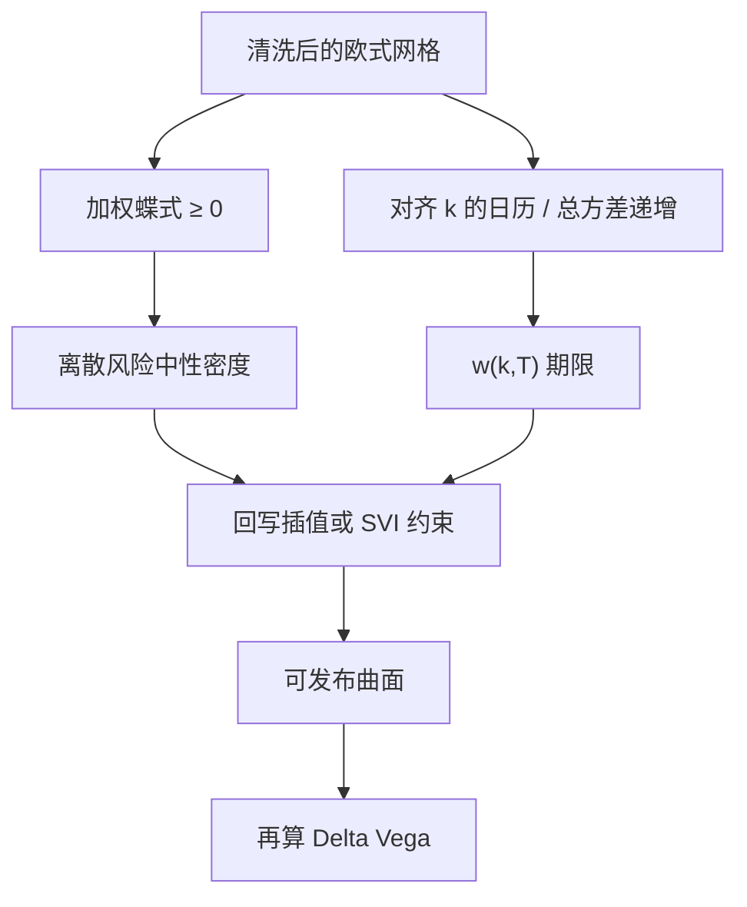

# 蝶式与日历无套利

    
到期支付对执行价凸，故看涨价格必须对 $K$ 凸；更长到期的看涨不能系统性更便宜，否则日历价差送钱。这两条静态约束先于任何波动率模型。

    <footer>—— Breeden and Litzenberger, Journal of Business, 1978；曲面叙述见 Gatheral, The Volatility Surface, 2006</footer>

期权做市的第一张风控表不是 [Heston](/quant/heston) 参数，而是自己的报价能否被三档执行价或两个到期的静态组合锁死。蝶式价差检验凸性，日历价差检验期限。它们不依赖复制论证、不依赖连续对冲，只依赖欧式收益的定义与货币的时间价值。Gatheral 把这些不等式翻译成对隐含波动率曲面的语言，使交易员能在 $\sigma_{\mathrm{imp}}$ 坐标上监控。本篇写可交易的套利组合、与密度的对应、以及和 [无套利插值](/quant/arb-free-iv)、[SVI / SSVI](/quant/svi-ssvi) 的分工；[Skew](/quant/vol-skew) 写形状从哪来，这里写形状不能越过哪条线。

## 问题

欧式看涨到期支付 $(S_T-K)^+$ 作为 $K$ 的函数是凸的、递减的。取期望与折现不破坏凸性，故 $C(K,T)=e^{-rT}\mathbb{E}[(S_T-K)^+]$ 对 $K$ 凸。离散市场上取三档 $K-\Delta K$、$K$、$K+\Delta K$，凸性变成蝶式

$$
C(K-\Delta K)-2C(K)+C(K+\Delta K)\ge 0
$$

（等间距时；不等间距要按杠杆加权）。左端除以 $(\Delta K)^2$ 是密度的离散代理：Breeden–Litzenberger 说 $\partial^2 C/\partial K^2=e^{-rT}p^{\mathbb{Q}}(K)$。负蝶式等于负密度，静态套利是买两翼、卖中间（或相反，视符号），持有到期，收益非负且在某些路径严格为正。

日历更精妙。简单的「$T_2>T_1$ 则 $C(K,T_2)\ge C(K,T_1)$」在有利率、股息、且执行价按即期而非远期对齐时不必成立。无套利的干净形式是对未折现期望或对总方差：在利率股息处理正确后，同一远期货币性上，更长到期的看涨不应更便宜到可被日历价差锁定。问题是把教科书连续不等式，收成带买卖价差、美式溢价与期货乘数的可执行扫描。

### 蝶式是密度，不是「弯曲交易」的别名

交易员口语里的「买蝶式」常指做多凸性、赌实现波动落在执行价附近。那是波动观点。无套利扫描里的蝶式是检验报价表内部是否自洽，不表达对实现波动的看法。一张负蝶式可以在隐含波动看起来「光滑」时出现——因为光滑的 $\sigma_{\mathrm{imp}}(K)$ 不保证 $C(K)$ 凸。这正是必须在价格空间扫描、而不能只在波动率图上目测的原因。

等间距蝶式的系数是 $1,-2,1$。执行价网格不规则时，要用二阶差商的正确权重，否则会把网格伪影报成套利。外汇 Delta 网格映射到 $K$ 后几乎从不等距。

## 方法

**蝶式扫描。** 对每个到期、每一组相邻虚值报价（经平价转到同一侧），计算加权二阶差分，与买卖价差比较。只有当套利收益在穿过价差、手续费、保证金之后仍为正，才称为可执行。深度实值看涨的凸性检验无信息：价格贴齐远期，数值差分被最小报价单位主导。应在虚值端工作，或用看跌。

**日历扫描。** 对相近货币性 $k=\ln(K/F_T)$（注意两个到期的远期不同，应对齐 $k$ 而不是对齐名义 $K$），比较未折现看涨或比较总方差 $w(k,T)$。若 $w(k,T_2)<w(k,T_1)$，存在日历套利的候选。执行时用日历价差：买长到期、卖短到期，并处理股息与利率，使组合在短到期时不因提前行权或期货交割而破裂。股票美式看跌的日历不能当欧式扫。

**从扫描到曲面修补。** 发现违规则回到插值层：放宽穿过脏点的要求、改用凸回归、或对 SVI 参数加 $b(1+|\rho|)$ 一类翼部约束。不要在违例的三档上人为「微调一个波动率点」却不管邻档——凸性是全局的，局部修补会在下一档再破。

### 与模型希腊字母的关系

静态套利成立时，任何定价模型——包括校准得再好的 Heston 或 SABR——若仍复制那张违例曲面，模型价格也可被同一蝶式收取。这不是 [Delta / Gamma / Vega 对冲](/quant/greeks-hedge) 能对冲掉的：对冲假设你按模型中间价成交，而套利者按你的违例报价成交。做市系统应在希腊字母之前跑静态扫描。反过来，曲面无静态套利并不表示 Heston 的 $\rho$ 对、也不表示 SABR Delta 与市场 sticky 一致；那是动态问题。

## 机制

蝶式把三档香草合成一个近似的 Arrow–Debreu 证券：到期时 $S_T$ 落在中间执行价附近则支付为正，落在两翼之外为零（离散近似下为三角帽）。市价为负意味着市场对某一区间卖出了负的状态价格，现金机器出现。日历价差合成的是「多等一段时间」的凸性：在没有股息奇异、利率处理正确时，时间不能使欧式看涨变便宜。违例意味着折现、远期或美式溢价没从报价里剥干净，或者中间价不可成交。

隐含波动率语言里，过陡的翼会破坏 Lee 矩，等价于远处蝶式出问题；期限结构倒挂会破坏总方差递增。SVI 的参数约束与 SSVI 的 $\theta_t$ 递增，都是为了在参数空间里提前满足这些不等式，而不是事后用扫描去撞。扫描仍不可省，因为参数化只覆盖你选用的那一族形状。

### 可执行性：价差、钉住与提前行权

理论蝶式忽略买卖价差。翼部价差宽时，中间价负蝶式在卖出中间、买入两翼之后可能翻负变正——即不可执行。报告「无套利违约次数」必须声明是否穿透价差。到期日附近还要叠加 [Pin risk](/quant/pin-risk)：蝶式的中间腿可能被钉住，对冲与行权决策把静态收益变成隔夜缺口。美式提前行权使「持有到期」的套利证明失效，必须改用欧式上市合约或先剥提前行权溢价。

把日历套利理解成「短到期隐含波动必须低于长到期」是错的。短端可以更高，$\sigma_{\mathrm{imp}}$ 的期限结构倒挂很常见；约束的是总方差 $w=\sigma^2 T$ 以及经远期对齐后的价格，不是 $\sigma$ 本身单调。

## 边界与工程取舍

离散执行价使密度只在格子上有定义；格子之间的负密度可以被参数化藏住，也可以被样条制造出来。扫描粒度决定你看见多少。跨交易所、跨结算（期货期权对现货期权）的「蝶式」含基差，不是纯凸性。有红利的股票在除息附近，欧式看涨的日历会受分红影响，必须用带分红的无套利界，而不是零利率口诀。

Heston 作为扩散，理论价格满足这些不等式；校准残差若用插值补回市场点，补丁可能再引入静态套利——这是「模型 + 残差表面」管道的已知裂缝，应在残差层也做凸性约束。SABR 的 Hagan 展开在翼部可以破无套利，那是近似公式的问题，不是蝶式定义的问题；应用数值 SABR 或切断翼部。Gatheral（2006）系统整理了这些约束，并不是 1973 年 Black–Scholes 的推论：常数 $\sigma$ 的世界里蝶式自动满足，正是因为对数正态密度为正。

静态无套利是当日报价表的性质。明日曲面如何跳、隔夜是否缺口，属于动态与跳跃风险，要用 Vega 限额与 [隔夜跳空对冲](/quant/overnight-gap-hedge)，不能靠蝶式扫描保证。

## 小结

- 蝶式非负 $\Leftrightarrow$ 离散凸性 $\Leftrightarrow$ 风险中性密度非负；日历约束应对齐远期货币性并看总方差，而非 $\sigma_{\mathrm{imp}}$ 单调。
- 检验必须在价格空间做，并扣除买卖价差；光滑的隐含波动曲线可以仍破凸。
- 发现违例应回写插值或 SVI/SSVI 约束，而不是先改希腊字母。
- 静态套利先于 Heston / SABR 动态；模型拟合不能自动治愈脏报价。
- 美式、分红、不等距网格与钉住风险限制「持有到期」证明的可执行性。
- 出处：Breeden and Litzenberger, *Journal of Business*, 1978；Gatheral, *The Volatility Surface*, 2006；Lee 矩公式，2004；SSVI 见 Gatheral and Jacquier, 2014。
