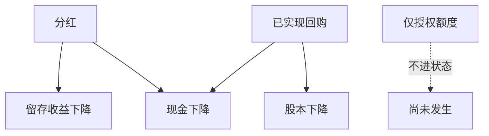

# 回购与分红

分红从留存收益拿走现金；回购同时减现金与股本。总回报要含现金分配，但因子信号不能把尚未宣告的分配写进过去。

<footer>—— 据 Penman 对净财务交易的处理；Fama and French 对分红与回购的经验研究整理</footer>

上一课[股份稀释](/quant/share-dilution)钉死了股本口径。回购会把股本减回去，分红则主要走现金与留存收益，不一定改股数。两者都是三张表上的筹资活动，也是总回报的组成部分。本课补：如何把分配从「公司状态」里正确扣掉、又如何避免把分配政策当成已经实现的因子。不重写稀释公式。

## 问题

价格复权常把分红除权，市值用除权价会少一块股东拿到的现金。组合总回报必须把分红与回购的现金加回来；基本面信号则要问：现金走了之后，账面、应计、净现金还剩什么。Fama–French 一类研究把分红与回购都视为支付政策，但回测里常见两种错：用后来的高分红回填历史「股息率」；或把授权回购额度当成已经减记的股本。缺口是**已宣告且已发生的分配**才进入当时状态，授权与预测不进入。

### 回购不是负的增发那么简单

增发稀释股本并增加现金；回购减少股本并减少现金，但执行价格、执行节奏、库存股与注销的会计处理不同。额度授权可能数年不用。用「董事会批准的回购上限」当因子，是在交易意向，不是在交易已完成的资产负债表。本课只认现金流量表筹资项与股本变动已经实现的部分。

除权价序列适合算资本利得；总回报指数才含分红。价值因子的市值用未除权口径的市值，不要用复权价乘当前股数。

## 方法

状态更新：分红宣告日进入事件日历，除权日改价格，发放日改现金。回购按实际买回股数减股本、减现金，可用日期是公司披露买回的日期，不是授权日。账面权益随留存收益下降（分红）或随库存股/注销下降（回购）。这些更新全部走 PIT：年报里才出现的全年回购金额，不能提前摊到每个交易日。

信号上，股息率用当时已宣告的股利对市值；回购收益率用过去已实现买回对市值，窗口与可用日期对齐。不要把分析师预期股利提前写成股息率——预期是后面分析师课的对象。

除权、发放、宣告三个日期不得合成一个「分红日」。信号用宣告日更新股息率；价格序列在除权日机械调整；现金在发放日才离开公司账户。回购同理：授权日不改状态，买回披露日减股本与现金。用年报封面的「本年度回购总额」按日均摊，会把下半年才发生的买回提前写进上半年的账面市值。

## 机制

分配改变杠杆与现金缓冲，也改变后续应计与盈利的分母。高分红公司账面下降更快，价值排序会被支付政策推动。总回报侧，漏记分红会让高股息组合看起来更弱。制度课后面会把融资融券的融券费、资金成本当成另一层摩擦；本课只在公司财务数据层把分配闭合进三张表。事件研究若以分红除权为事件，要用宣告日而不是除权日当信息日——信息在宣告，价格在除权机械调整。

特别股息与常规股息对滞后与 PIT 的处理相同：都以宣告/披露为准，不以「市场传闻」为准。

股息率用已宣告股利对当时市值，窗口内遇特别股息单独标记。回购收益率用已披露买回金额或股数，不用剩余授权。总回报指数与价格指数分列：因子排序用市值，绩效报告用总回报。除权日价格下跌不是负 alpha，而是把现金从市值里分开记账；漏加分红会让高股息组合的回测系统性偏弱，看起来像价值失效。

## 边界

不讲税差与客户效应理论全文，不把股利政策做成 MM 命题课。股份支付造成的稀释已在上一课。后课商誉与税会再改权益，但那是估计与税务，不是分配。后课默认：总回报含已实现分配；因子状态只含已披露的分红与买回，不含授权。

后课商誉与税还会改权益，但那不是分配。本课交给后面的是：总回报含已实现现金；状态只含已宣告股利与已买回股份。授权回购、管理层「未来将回购」的访谈，一律不当成当时账面已经变瘦。特别股息与常规股息共用宣告/除权/发放三时点，只是特别股息要在窗口里单独标记以免股息率爆炸。

后课默认总回报含已实现分配，因子状态只含已宣告股利与已买回股份；授权与访谈不改当时账面。

特别股息会使股息率分母不变、分子跳升，必须单独标记，否则价值排序会被一次性现金分配劫持。库存股与注销的会计路径不同，但因子只认已买回并已披露的股数变化。

## 小结

- 分红改现金与留存收益；回购还改股本。
- 总回报必须加回现金分配；市值口径不要与复权价混乘。
- 授权回购不是已减记的账面。
- 股息率、回购收益率都要可用日期，不能用终局年度总额回填。
- 宣告日是信息日，除权日是价格机械调整日。
- 出处：Penman；Fama–French 对分红与回购的研究与因子构造惯例。
