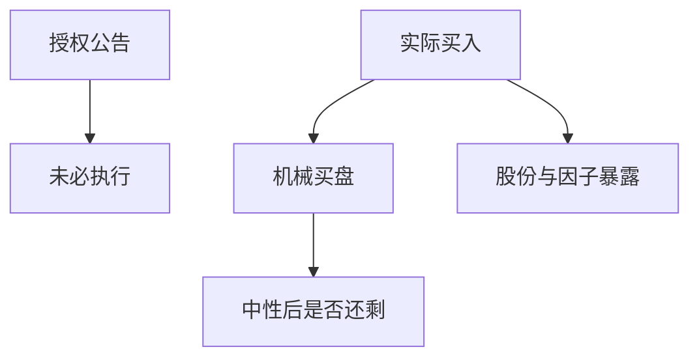

# 回购流

公司按授权在市场上买回本股票，是又一股可预测的机械需求；截面上的「回购异象」混着估值、动量与实施缺口，不能直接当免费因子。

<footer>—— Ikenberry, Lakonishok and Vermaelen, Journal of Finance, 1995；实施与后绩效应见后续回购文献</footer>

[上一课](/quant/index-inclusion-passive-flow)是指数规则驱动的被动买盘。回购流的缺口是**发行人自己作为流动性需求方**：授权公告、实际买入、注销。公司金融里回购的动机与信号在金融栏，本课不重写。量化栏要问的是可交易流：谁在什么价成交、如何进入组合与因子。

## 问题

Ikenberry–Lakonishok–Vermaelen 记录授权后的长期超额，常被读成市场低估。后续工作把授权与实际买入分开：真正产生价格压力的是执行，不是新闻稿。问题是识别三层：(1) 公告日事件；(2) 执行窗口的隐蔽买盘（往往用 10b-18 一类规则摊开）；(3) 股份减少对每股与因子暴露的会计效应。用公告日做事件研究会高估可捕获收益；用财报里的「本期回购金额」当下一期信号，有滞后也有前瞻偏差。

与被动流：指数基金必须在生效日完成；回购可以择时、可以暂停。流的可预测性更弱，但方向偏买入、偏在「公司认为便宜」的区间，于是和价值因子纠缠。不要再用 [CAPM](/quant/capm) 把回购组合的 alpha 当新发现——先对价值、动量、质量中性。

### 授权不是成交

许多授权从未用满。策略若买「有授权」的名字，买到的是期权：公司可以买、可以不买。可交易信号应尽量靠近实际执行（后续公告、追踪、流通变化），并承认报告滞后。

回购在指数再平衡前也能改变权重：流通市值下降会强制被动卖出或减少买入。被动流与回购流在调仓周可以反向对冲，归因时要拆开。

## 方法

信号：授权事件、执行强度、净发行（回购减增发）。对冲：价值、动量、低波动。执行：不要假设与公司同步隐蔽成交。容量：大盘回购深、小盘授权水分大。税务与交易规则因市场而异，中国与美国不可同一回测。

## 机制

发行人买盘向上倾斜需求的一侧，短期提供价格支撑，长期改变股份与杠杆。若市场对执行反应不足，留下漂移；若执行已被算法抢跑，只剩公告噪声。拥挤的「回购因子」ETF 会把执行信息更快打进价格，生命周期与后课相同。

## 边界

本课不写如何配合未公开回购计划交易。内部人窗口与 10b5-1 是合规对象，不是 alpha 来源。金融栏的回购理论此处只引用，不重推。

## 小结

- 可交易的是执行流，不是授权新闻稿。
- 先对价值/动量中性，再谈回购异象。
- 与指数被动流在调仓周可能对冲，归因要拆。
- 出处：Ikenberry, Lakonishok and Vermaelen, *JF*, 1995；公司金融动机见金融栏回购课。
