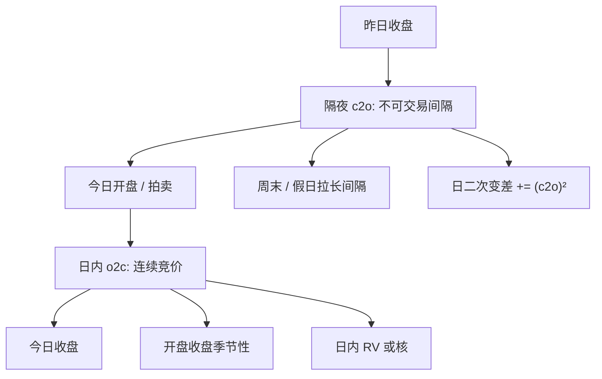

# 日历效应与隔夜

    
周末的日历长度是三天，交易时段却只有周五收盘到周一开盘这一段不可交易的间隔；把这段收益当成普通的日内增量，会把制度写成波动。

    <footer>—— French, Stock Returns and the Weekend Effect, Journal of Financial Economics 1980；隔夜与日内分解见后续开盘–收盘文献</footer>

资产定价和平稳的日内计量都默认「一天像一天」。真实日历不是这样：周末、假日、提前收盘、夏令时、指数到期、宏观发布时间，都会改变间隔长度与信息释放。French 记录的周末效应是早期证据：周一收益的均值与方差并不等于把三日闲置按交易日折算。更细的一层是把收盘到收盘拆成**隔夜**（close-to-open）与**日内**（open-to-close）。美股近年来不少样本里，风险溢价集中在隔夜，日内均值接近零甚至为负——这与连续半鞅、把隔夜当又一个五分钟格子的做法直接冲突。本篇写日历作为实验设计，以及隔夜项如何进入收益、波动与执行。

## 问题

日收益 $R_d=P_{\mathrm{close},d}/P_{\mathrm{close},d-1}-1$ 跨越一段不可交易时间。这段时间的长度在周内从约 17.5 小时到周末 65 小时不等，A 股还有午休与 T+1。信息在不可交易时段照样到达：财报常在盘后，海外市场在你闭市时交易。把 $R_d$ 当成 i.i.d.，等于假设闭市不影响生成过程。

日内高频 RV 通常只在开盘到收盘的连续竞价上加总，不含隔夜跳。用它去对账期权隐含波动或日度 CAPM 残差，会系统性地缺一块。反过来，把隔夜一个跳直接拼进五分钟网格当「第一格」，[已实现核](/quant/rv-noise) 会把这个跳的滞后项当成噪声结构。问题是显式分解：

$$
R_d^{\mathrm{c2c}}=R_d^{\mathrm{c2o}}+R_d^{\mathrm{o2c}},
$$

并对均值、方差、因子暴露分别报告，而不是只在脚注写「含隔夜」。

### 周末效应不只是均值异号

French（1980）关注周一均值偏低。后续发现更稳的往往是**方差**与**成交量**的日历：周一开盘波动高、周五下午行为不同、假日前一日成交萎缩。均值异号在样本外常减弱或翻转，方差的日历模式更持久，因为它绑定交易时段与信息发布制度。把「日历效应」理解成可交易的周一空头，是把最不稳的一阶矩当成了对象。

隔夜收益的分母、分子用哪一个价格，必须钉死：官方收盘、收盘拍卖成交、最后一笔连续竞价、开盘拍卖还是开盘后第一笔中点。拍卖机制会把隔夜信息的很大一块写进开盘价，于是「隔夜」其实含了开盘发现。口径一变，隔夜溢价的文献结论可以换符号。

## 方法

**收益分解。** 对每个交易日计算 c2o、o2c，周末、假日单独标记间隔小时数。均值检验应用异方差稳健标准误，因为隔夜方差通常大于按小时线性外推。方差可报 $\mathrm{Var}(\mathrm{c2o})/\mathrm{Var}(\mathrm{c2c})$，看日波动有多少来自闭市。

**波动拼接。** 日总二次变差的一个工作定义是 $\mathrm{RV}^{\mathrm{intraday}}+(r^{\mathrm{c2o}})^2$。隔夜只有一个增量，无法在隔夜内部做噪声修正。不要对隔夜做 TSRV。可选：用 GARCH 或已实现 GARCH 把隔夜方差建成滞后 RV 与日历哑变量的函数，而不是假装隔夜是又一次高频采样。

**因子与日历哑变量。** 在 [CAPM](/quant/capm) 或后续多因子回归里加入星期、假日、到期日、宏观发布日，或对隔夜与日内分别估 beta。市场因子本身也含隔夜：用开盘到收盘的市场收益估日内 beta，用隔夜市场收益估隔夜 beta，两者可以差很多。指数期货夜盘存在时，现货隔夜与期货隔夜还不是同一信息集。

### 季节性与日内时钟

除了日界，还有日内季节性：开盘、收盘波动高，午间低。这是日历效应在小时上的对应物。估计噪声与最优采样应对开盘第一段单独处理；有效价差在开盘更宽，不是同一只股票「流动性突然变差」那么简单，而是交易机制与隔夜信息释放。ACD 的久期也有强日内形状，通常先除季节性再建模。日历与 [不等间隔](/quant/irregular-sampling) 在这里交汇：强度的确定项是钟面时间的函数。

## 机制

隔夜均值若显著为正，机制候选包括：隔夜无法交易的风险补偿、卖空与融资约束把风险转移到开盘发现、零售与机构的时段分割（美股零售更偏隔夜持仓的叙事）、以及开盘拍卖的价格发现把正溢价记在 c2o。机制检验要看：溢价是否集中在周末、是否在财报夜更大、是否在可夜盘交易的品种上变弱。没有夜盘的现货，隔夜不可对冲，补偿应更高——与期货、ETF 对照是标准设计。

周末效应的机制候选包括结算延迟（早期文献的「支票清算」）、信息发布偏好在周五收盘后、以及空头在周末的风险。许多机制随制度消失，这解释了均值效应的不稳定。方差效应更硬：闭市时长与累积信息是物理事实。

A 股 T+1、涨跌停、集合竞价把「隔夜」改写得更重：当日买入不能用来对冲隔夜，开盘集合竞价承担价格发现。把美股 close-to-open 的溢价数字套到沪深，会忽略不能T+0 的约束。日历效应是制度函数，不是资产的普适常数。

### 对高频估计的具体破坏

把周五收盘到周一开盘当成三倍的普通隔夜，RV 年化会错。核估计若跨过周末做滞后，会把一个大跳和周五下午的微观结构搅在同一组 $\gamma_h$ 里。PIN 的「交易日独立」在长周末后的第一个交易日也不成立：信息事件在闭市期间堆积，$\alpha$ 的日度含义变了。VPIN 的成交量时钟在开盘脉冲里快速走桶，毒性指标会机械跳高。所有这些都要求：日界、周末、假日在管道里是一等公民，而不是日期列的附属。

## 边界与工程取舍

日历哑变量极易过拟合。星期效应在交易成本后往往不可交易；仍应在风险模型里保留方差的季节性。宏观日历（FOMC、CPI）是事件，不是星期，应用事件窗而不是只靠星期哑变量去吸收。夏令时切换会让「隔夜小时数」跳一小时，对欧美盘重要。

不要用包含隔夜的日 beta 去对冲纯日内策略，也不要用开盘到收盘 RV 去给隔夜卖空定价。不要把节前半日当成完整交易日去除以同一 $n$。不要在回测里对周末持仓免收融资，却在收益里计入周五到周一的全部跳变。执行上，隔夜缺口无法用连续限价簿的有效价差去表达，应单独报告开盘拍卖滑点。

「隔夜溢价」文献依赖开收盘口径与样本期。换一段 1990s 与换一段 2010s，或把开盘价从拍卖换成 9:35 中点，结论可以变。复现应锁定价格字段与是否剔除隔夜跳超过 $x\%$ 的停牌日。剔除极端隔夜会切掉你要研究的对象。

## 小结

- 收盘到收盘应拆成隔夜与日内；二者的均值、方差、beta 可以完全不同，隔夜不可做高频噪声修正。
- French 的周末效应提示日历长度与交易时段不一致；均值不稳定，方差与成交量的日历更持久。
- 日总波动常用日内 RV 加隔夜跳平方；核与 PIN/VPIN 必须在日界处切断，避免把长闭市当普通滞后。
- 开收盘字段、拍卖与 T+1 决定「隔夜」含义；制度不同，溢价不可横搬。
- 风险与对冲应按持有时段匹配因子收益，禁止用 c2c beta 对冲 o2c 策略。
- 出处：French, *Stock Returns and the Weekend Effect*, Journal of Financial Economics 1980；隔夜与日内溢价的后续分解见开盘–收盘收益文献。波动拼接与会话定义见已实现波动实务。
