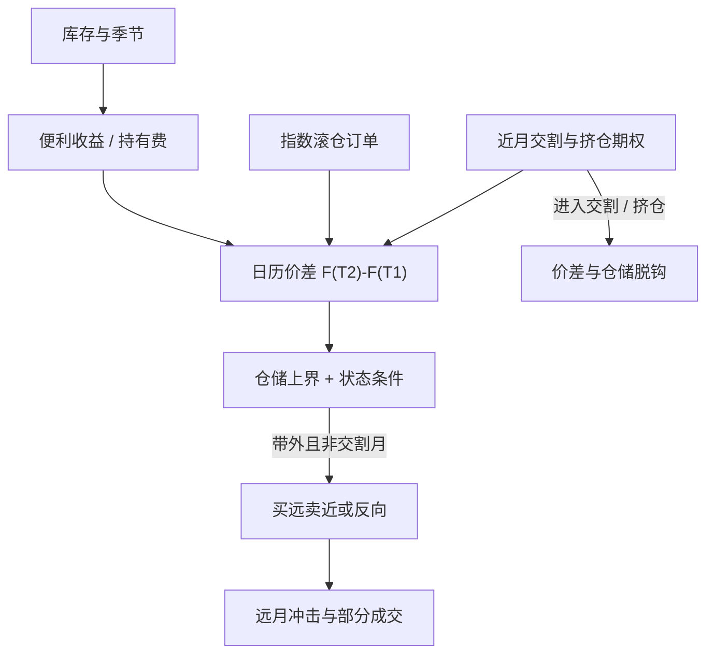

# 跨期套利

不同到期期货之间的价差，是仓储与便利收益在时间上的差分；把它当成两张高度相关合约的统计回归，会在交割月与库存冲击里把「均值」写丢。

<footer>—— Working 的持有费与反持有费；价差波动见 Ng & Pirrong 对金属库存与波动的讨论</footer>

跨期套利（calendar spread）交易同一商品、不同到期的期货：买远月卖近月，或反向，有时再加一个更远的合约做成蝶式。它看起来像期现套利抽掉现货腿，只用期货曲线的一阶差分。Working 把近月相对远月的持有费写成库存状态；库存充裕时价差接近全额仓储加融资，库存紧张时价差可以变成贴水且波动上升。Ng 与 Pirrong（1994）对金属表明，库存低时现货与近月波动更高、价差更不稳定。Hull 的持有成本给出价差的无套利参照，但不保证价差在交割选择权、挤仓与指数滚仓下沿着参照走。统计套利常用的 OU 半衰期在这里是危险的隐喻：价差的「均值」会随库存报告、季节与仓单注销而跳。

## 问题

记近月价格 $F_{t,T_1}$、远月 $F_{t,T_2}$。在持有成本世界里，

$$
F_{t,T_2}-F_{t,T_1}\approx S_t\mathrm{e}^{(r+u-y)(T_2-t)}-S_t\mathrm{e}^{(r+u-y)(T_1-t)},
$$

价差主要由 $r+u-y$ 与间隔决定。$y$ 随库存变，价差就随库存变。问题是：交易者看到的日历价差报价，混入了交割选择权（品质、地点、时间）、近月流动性溢价、以及指数在特定窗口卖掉 $T_1$、买进 $T_2$ 的需求。把价差相对过去 60 日均值的偏离当成误定价，等于假设 $y$ 在 60 日内不变。农产品收获、能源取暖季、金属罢工，都会让这个假设在你持仓正大时失败。

第二层问题是腿的可替代性。近月进入交割或持仓限制之后，你卖出的那条腿可能无法按远月的逻辑平仓，价差从「仓储差分」变成「挤仓期权」。Gay 与 Manaster 讨论期货里的品质选择权；商品日历价差同样内嵌近月是否被交割、被挤的期权。第三层是保证金：交易所对日历价差收较低保证金，杠杆高于单边，资金把小基点利润放大的同时，也把交割月缺口放大。

### 价差不是期现的影子复制

[期现套利](/quant/cash-and-carry) 有一张现货存货和一张期货；跨期是两张期货，没有仓单现金流，除非你主动接货再抛到更远的合约。因此跨期赚的是曲线形状变化，不是仓储费本身。正向市场里买远卖近，若升水收窄（库存被消化、$y$ 上升），价差交易亏损，即便现货没动。这与[展期收益](/quant/roll-yield)的会计相反：被动多头在升水里付展期；主动买远卖近是在赌升水扩大或维持。两者可以同时存在于同一个市场，盈亏符号相反。

指数滚仓周，公开规则把大量仓位从 $T_1$ 迁到 $T_2$，日历价差会被打向「对指数友好」的方向。把这一窗口的均值回归当成仓储套利，你是在提供流动性给指数，见 Mou 与 Bessembinder 等对可预测滚仓的研究。

## 方法

先把价差定义成可交易合约与固定乘数（有的市场近月与远月合约规模不同，或有裂解价差）。用仓储加融资的上界做参照带，用库存分位与季节做状态，而不是用无条件均值。开仓仅当价差超出带且库存状态与之矛盾——例如高库存却出现深度贴水，需要排除挤仓与交割地局部短缺之后，才更像可交易的错价。蝶式限制曲线的二阶弯曲，对平行的 $r$ 更不敏感，但对中间合约的流动性更敏感。

执行必须处理腿的不同深度：近月通常更厚，远月更薄，同时成交会在远月留下冲击，价差在成交完成前已经移动。部分成交使日历价差变成带 delta 的方向性仓位。容量取两腿深度的较小者，再打折，因为价差交易者与展期者、对冲者挤在同一本上。风险限额应按交割月临近逐步强制减仓，而不是按价差 z-score 加仓。

### 金属、能源与农产品不是同一套价差

Ng–Pirrong 的金属证据强调库存对波动与价差的非线性。能源有管道与库存报告的周频跳跃，价差在 EIA 公布前后的条件分布与平日不同，见[库存报告与曲线](/quant/inventory-curve)。农产品有明确的新旧作切换，旧作近月与新作远月之间的价差可以包含作物失败期权，均值在生长季节不是常数。把三个板块的日历价差放进同一个 PCA 因子，载荷在收获周会断裂。

## 机制

仓储机制：库存上升，持有费上升，买远卖近获利（升水扩大）；库存下降，便利收益上升，反向价差获利。这是 Working 反持有费（inverse carrying charge）的交易版。波动机制：低库存时近月对信息更敏感，价差方差变大，同样的保证金杠杆对应更大的爆仓概率。Ng–Pirrong 把基本面、库存与价格波动写在一起，就是在说价差的风险不是常数。

交割机制：临近 $T_1$，空头近月面临交割匹配、持仓限制与可能的挤仓。价差里的近月空头不是无风险的「短端融资」，而是一个有交割期权的空头。多头近月则可能被迫接货。日历价差在进入交割月之后，性质从相对价值变成或有实物。指数滚仓机制把部分价差变动从仓储改写成订单流，详见[展期成交量与持仓](/quant/roll-volume-oi)。

### 破裂：挤仓、限仓、月份切换

挤仓时近月脱离仓储曲线，卖近买远的「便宜升水」可以无限变贵。交易所提高保证金或强制减仓时，价差仓位的杠杆优势消失，你必须在最差的流动性里平一侧。合约到期切换使连续价差序列出现跳点：回测若用未经调整的拼接，会出现虚假的均值回归。监管调查、注册仓单突击注销、港口罢工，都是状态变量的间断，OU 拟合会把间断前的均值当成间断后的锚。

低保证金的日历价差在风险系统里常被当成「几乎对冲」。正确的风险是曲线一阶（仓储）与近月特异性（挤仓）。用单边名义的很小比例去设止损，会在近月跳空时直接穿。应按近月独立冲击加价差冲击两条限额。

## 边界与工程取舍

不要把跨期写成无现货的期现：没有入库权，你就不能收取教科书仓储。不要在交割月用历史分位开新仓。不要忽略裂解、跨商品价差与日历价差的区别——汽油–原油是炼厂边际，不是同一仓储曲线的差分。成本含两腿价差、远月冲击、以及滚仓周与你同向的拥挤。容量随交割临近下降，不是随未平仓量上升。

与国债[隐含回购](/quant/implied-repo)和 CTD 的对照：利率期货的日历价差还受最便宜可交割券切换影响，商品则受仓单与库存影响。两者都是「曲线交易」，破裂来源不同。报告应分列：仓储参照偏离、库存条件、是否处于指数滚仓窗口、近月是否可交割。若这四项里有两项已经对你不利，z-score 再高也不是套利。

Working（1948）讨论的反持有费是现货相对远期可以持续升水。跨期交易者若在贴水扩大时按「总会回到正持有费」加仓，是在做空便利收益与挤仓期权。样本内的回归来自库存回补，样本外库存可以不回补。

## 小结

- 跨期套利交易同一商品不同到期的期货价差，经济对象是仓储与便利收益的时间差分，不是无条件均值回归。
- Working 给出持有费与反持有费；Ng–Pirrong 表明低库存时价差更不稳、近月波动更高。
- 指数滚仓、交割选择权与低保证金杠杆会把仓储价差改写成订单流与挤仓期权。
- 容量受远月深度与交割临近约束；破裂是挤仓、限仓与月份拼接跳点。
- 出处：Working, *Journal of Farm Economics*, 1948 与 *AER*, 1949；Ng and Pirrong, *Journal of Business*, 1994；Gay and Manaster, *JFE*, 1984；Mou, Goldman Roll working paper；Bessembinder, Carrion, Tuttle and Venkataraman, *JFE*, 2016；Hull, *Options, Futures, and Other Derivatives*。
