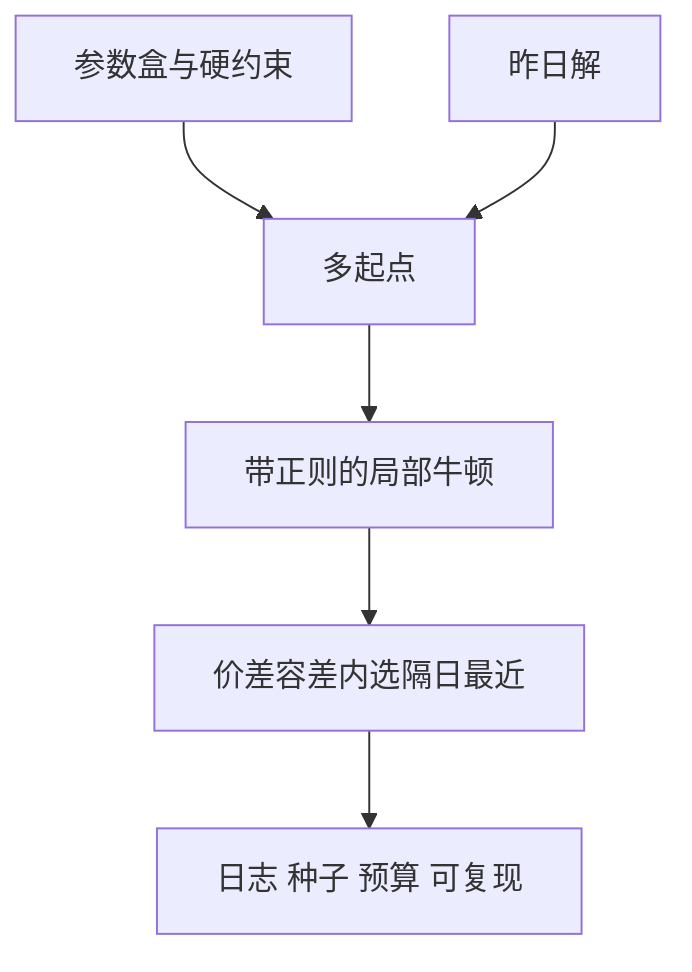

# 全局优化在校准

Heston 与 SABR 的误差曲面有多个局部谷；从昨日参数出发的局部牛顿，可能停在错误的谷里还自以为拟合良好。

<footer>—— 对照 Heston 与 SABR 校准实践；全局搜索见 Differential Evolution 等在参数校准中的应用</footer>

[上一课](/quant/calibration-regularization)加了罚项，目标函数仍可能**非凸**。本课缺口是优化器：局部 Gauss–Newton / Levenberg–Marquardt 依赖初值；Heston 的 $Feller$ 边界、SABR 的 $\rho,\nu$ 会造出多峰。后课报价惯例把校准输入的坐标系换掉；这里先写搜索策略，不把全局优化写成万能。

## 问题

同一张香草，从两组初值出发得到两组 $(\kappa,\theta,\nu,\rho,v_0)$，价格 RMSE 都可接受，但远期微笑与 cliquet 价格不同。这是模型风险在校准算法里的实现：你连「官方 $\theta$」都没选唯一。问题是把全局搜索当**日频的粗定位**，把带正则的局部牛顿当**盘中的精炼**，并拒绝「RMSE 更小 0.1 个波动点」但参数跳到另一谷的解——除非隔日罚允许。

Feller 条件 $2\kappa\theta>\nu^2$ 在 [Heston–Feller](/quant/heston-feller) 已写。优化器若穿过边界，特征函数数值与矩都会变，看起来像又一个局部谷，其实是数值坏点。约束应硬编码，不是靠罚一点了事。

### 全局不等于随机碰运气

Differential Evolution、粒子群、多起点牛顿，都要把随机种子、种群、预算记进校准日志。不可复现的「今天搜到更优」不能进生产。预算应花在：多起点覆盖参数盒、用 AAD 加速每个起点的局部精炼，而不是无限代进化。

校准的目标是稳定对冲，不是学术上的全局最小。全局最小若在翼部过拟合，正则化课已经要求丢掉它。

## 方法

参数盒：来自昨日、来自历史分位、来自无套利（$\nu>0$，$|\rho|<1$）。多起点：昨日解 + 盒上的拉丁超立方。每个起点做带 $\lambda R$ 的 LM。若多个谷的目标值在价差容差内，选隔日距离最小者。真正的大跳（体制切换）用人工确认或第二模型对照，不要让 DE 在夜盘安静改写官方参数。

SABR 按到期分别校准再插值，比一个全局 SABR 扫所有期限更少多峰，但会失去期限一致，见 [SSVI 期限](/quant/ssvi-term-consistency)。

## 机制

似然/误差作为 $\theta$ 的函数，因价格对参数非线性而多峰。特征函数振荡、积分截断又叠加数值多峰。全局搜索探索的是这条粗糙曲面；局部牛顿在二次近似成立的谷底才快。生产把两者分层，是承认计算预算与稳定性，而不是承认「市场有多个真实参数」。

## 边界

维度一高（混合局部-随机波动、LMM 的整条 vol 曲线），全局搜索指数爆炸，应降维：先校准边际再校准相关，或用 PCA 因子当参数。全局最优的统计误差条本身就宽，报告应带「等价谷」列表。不要用无法复现的黑盒优化器当审计对象。

## 小结

- 随机波动校准非凸；RMSE 接近的谷可以对冲比完全不同。
- 多起点 + 隔日选择，全局搜索只做粗定位且必须可复现。
- 硬约束挡住数值坏点；全局最小仍要过正则化关。
- 出处：Heston, *RFS*, 1993；Hagan et al., SABR, *Wilmott*, 2002；差分进化见 Storn and Price, *Journal of Global Optimization*, 1997。
