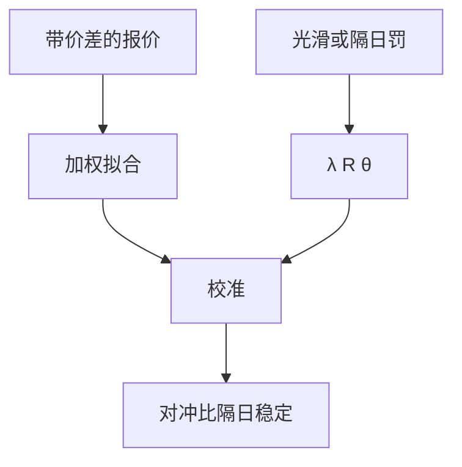

# 校准正则化

能完美穿过每一个报价的局部波动，往往明天就不能用；正则化是在拟合与稳定的对冲比之间做显式权衡。

<footer>—— 对照 Cont 对模型不确定的框架；局部波动校准的稳定性见 Dupire 实现与 Tikhonov 型罚项的行业实践</footer>

[上一课](/quant/derivative-model-risk)要求同一香草约束下保留动态区间。本课在**选定的模型类内部**处理反问题：校准 $\min_\theta\|P(\theta)-P_{\mathrm{mkt}}\|^2+\lambda R(\theta)$。主干 [Dupire](/quant/dupire) 与 [SABR 校准](/quant/sabr-calib) 已写无罚项时怎么做。缺口是 $\lambda R$：没有它，翼部噪声会让局部 vol 振荡，希腊值不可用。后课全局优化处理多峰；这里先写罚什么。

## 问题

报价有买卖价差、缺失翼部、期限不全。精确插值把噪声当成信号，Dupire 公式对 $K$ 的二阶导放大噪声，局部 vol 出现尖刺，障碍价格和桶风险乱跳。问题是把校准写成不适定反问题：解不唯一或不稳定，必须用正则化——对 $\partial_K\sigma$、对 $\partial_T\sigma$、对参数偏离先验、或对今日参数偏离昨日参数（tikhonov / Kalman / proximal）。

$\lambda$ 太大，拟合差，官方模型系统性偏离可交易香草，对冲用错工具。$\lambda$ 太小，回到振荡。$\lambda$ 是风险偏好，应随产品（香草做市 vs 障碍簿）分开，不要全行一个数。

### 罚昨日比罚光滑更像交易

隔日校准若允许参数乱跳，日 PnL 会出现「校准 Theta」：什么都没发生，模型重标定就把价值搬走。对 $\|\theta_t-\theta_{t-1}\|$ 加罚，等于承认曲面 PCA 的慢因子，让希腊值可对冲。这与完全重拟合「以拟合优度为荣」的研究习惯冲突，交易上前者才对。

买卖价差应进入加权：中间价不是真值，买侧与卖侧内的点权重大，外侧权重小。用中间价做等权 RMSE，会让稀疏翼部绑架 $\theta$。

## 方法

目标函数用价差加权的价格误差，或加权隐波误差（两者最优 $\theta$ 不同，要固定一种并报告）。$R(\theta)$ 选：二阶差分光滑、参数盒约束、相对昨日的二次罚、或 SABR 里对 $\rho,\nu$ 的先验。用 L 曲线或交叉验证在「对冲比隔日稳定」上选 $\lambda$，而不是在样本内 RMSE 上选。输出：校准残差表 + 参数隔日变化表，两张都进模型风险。

AAD 提供 $\partial P/\partial\theta$，使带罚项的 Gauss–Newton 可行。罚项本身的梯度不要漏。

## 机制

反问题把高维报价压到低维 $\theta$ 或压到一个函数 $\sigma(K,T)$。无罚时逆算子把高频噪声放大。罚项把解投影到慢子空间，正好与曲面 PCA 的前几个因子对齐。于是正则化不仅是数值稳定，也是承认市场数据的有效维度。

## 边界

正则化不能消灭 Cont 的模型区间：它只在一类模型里选稳定点。换类仍要另报。过度贴近昨日会让模型落后于真正的体制切换，需对 $\lambda$ 做压力（允许某日重估）。翼部若完全无报价，正则化等于纯先验，障碍价格的模型带应加大，而不是假装校准过了。

## 小结

- 校准是不适定反问题；光滑与隔日罚换稳定对冲比。
- $\lambda$ 按产品选，用对冲稳定性而不是最小 RMSE。
- 买卖价差加权，避免翼部噪声绑架参数。
- 出处：Cont, *Mathematical Finance*, 2006；Tikhonov 正则化的标准处理；Dupire 校准实现中的光滑罚项。
