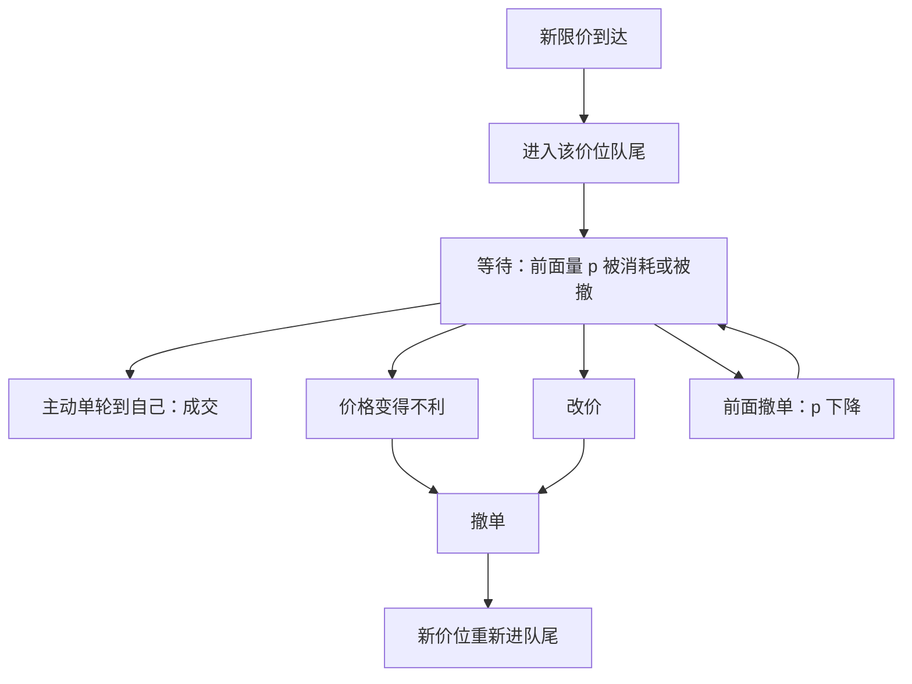

# 撤单、改单与队列位置

在同一价位上，时间优先把深度变成一条队列：先到的量先被成交。撤单与改单不是把量从数字里抹掉那么简单，它们改写名次，也改写谁还愿意继续排队。

<footer>—— 据 Harris, Trading and Exchanges 对优先规则、展示与取消的论述整理</footer>

[上一课](/quant/event-time)把下标换成了事件。[LOB](/quant/lob-structure) 在同一价格上通常按到达次序撮合。本课不重讲优先规则。缺口是名次：你的限价单能否在价格移动之前成交，首先取决于前面还有多少量，而不是这一档的总量。撤单抽走某段量，可能让你晋级，也可能抽走队头；改单在多数市场上等于撤旧加新，名次回到队尾。只看 [L2 聚合量](/quant/l2-l3-data) 会把这两种撤单当成同一信号。

## 问题

限价单提供者要同时面对三件不确定：价格会不会朝自己有利的方向走从而不被成交、会不会朝不利方向跳从而被知情者捡走、以及即使价格不动，队列要多久才轮到自己。前两件是等待与逆向选择；第三件是优先规则带来的额外状态。只看档位深度 $Q$，相当于假设自己永远在队头。FIFO 下成交从队头消耗，位置 $p$（前面剩余量）才是填成进度。

取消使这个问题变成动态的。你前面的人撤了，你的 $p$ 下降，填成变近；你后面的人撤了，$Q$ 下降但 $p$ 不变，你的处境几乎没变，盘口却看起来变薄。只观测 [L2 聚合量](/quant/l2-l3-data) 的人会把这两种撤单当成同一信号。改价去追 BBO，通常要重新排队；不改价只减量，有的市场保留位置，有的不保留。问题是：在看不见全部编号时，如何避免把「深度变化」误读成「我的名次变化」，以及为什么市场上取消比成交多出一个数量级仍可以是均衡现象而不是故障。

### 时间优先下的位置变量

记某价位队列为到达序 $1,\ldots,m$，剩余量 $q_1,\ldots,q_m$，自己的下标是 $i$。位置 $p=\sum_{j\lt i}q_j$，档位深度 $Q=\sum_j q_j$。下一笔对该价位的主动成交量为 $v$ 时，队头被消耗 $\min(v,Q)$，若 $v\gt p$ 则自己开始成交。价格若向不利方向跳开，整列可能再也轮不到。因此预期成交量是「价格仍停在这一档」与「轮到自己之前不被取消」的联合结果。把深度当唯一状态，等于丢掉了 $p$。

比例分配（pro-rata）下没有严格队头。每笔主动成交按剩余量比例切给该价位上的所有单，后到的大单也能分到。此时「位置」的含义变弱，博弈转向把量做大。不要把 FIFO 的晋级直觉搬到这类合约上。

## 方法

有 L3 编号时，位置是可计算的：本地重建该价位队列，找到自己的编号下标，对前面剩余量求和。自己的部分成交会减小自己的 $q_i$ 但不改变 $p$；前面的成交或撤单减小 $p$。改价应把旧编号从队列删除、新编号进队尾，除非规则明确是原地改。统计市场整体时，可对每一笔存活限价单记录其 $p_t$、$Q_t$，在成交或取消时关闭这条生命周期，估计填成概率与条件等待。

没有 L3 时，位置不可识别，只能做代理。常见代理是：假设自己刚挂上，则 $p$ 等于挂单前该档可见深度；假设自己已在队中但不知道名次，则对 $p$ 取均匀或不均匀先验。撤单率可用该档量的向下跳、且没有发生对应该档的成交来近似——仍会把隐藏成交与真正取消混在一起。订单成交比（提交次数相对成交次数）衡量取消有多频繁，但它是市场级强度，不是某一队列的 $p$。方法应写明识别集：能点名编号，还是只能谈档位净流量。

### 改单如何被写成两条消息

许多撮合引擎不提供原子「改价且保留时间优先」。报出的 replace 在数据里是 cancel 加 add，中间可能对其他参与者露出短暂缺口。即使字段上是一条 modify，若价格变了，优先权通常按新到达处理；若只减量，才可能保留名次。增量字段（加量）几乎总是进队尾。策略上「挪一个 tick 去追价」因此不是平移，而是放弃已积累的位置、在新价位从零开始。这解释了为什么有人宁可用新的更差价格的单去排队，也不愿取消已经很靠前、价格仍可能成交的旧单。

## 机制

时间优先把位置变成一种资本：你用更早的到达换取更高的填成概率。它也会变成沉没成本：价格已经变得不利，队头的限价单最容易被知情主动单捡走，正是逆向选择最痛的地方。取消是对这种沉没的反应——把过时的位置扔掉，避免成为 Glosten-Milgrom 里那个被选中的做市商。频繁的报价修订（flickering）于是可以是存货与信息双重驱动：既在管理自己不想要的残量，也在减少被捡走的时间窗口。Harris 指出取消与提交同样构成市场；高取消率本身不证明操纵，它首先证明限价是可撤销合约。

别人的取消会外部性地改变你的位置。队头撤离，你晋级，同时也失去了前面那层「挡箭牌」：下一笔主动单会更快打到你。队尾撤离，信号是这一档变得不拥挤，可能意味着别人认为该价格不再有吸引力，你的填成未必变好。因此撤单流的方向（相对 BBO 的哪一侧、相对队头还是队尾）比撤单量更有信息。只看订单成交比的总量，会把保护性取消与知情者拆掉对侧深度混成一个数字。

### 队列与可见性的纠缠

冰山补量常常进队尾，等于周期性把位置清零。隐藏单不占显示队列，却可能在撮合时插在可见单之前或之后，取决于规则是否允许隐藏量与可见量共享时间优先。你按 L2 看见的 $p$ 可能乐观：前面还有看不见的量；也可能悲观：显示的前面量里有一部分会先被撤掉。暗池更不会进入这张队列。位置分析若只在可见 FIFO 里做闭环，会高估公开限价单的执行确定性。机制上，取消、隐藏与场外匹配都是在削弱「我看见的队伍就是将要成交的队伍」。

位置不能跨价位继承。价格改善一档，是新的队列，旧的名次作废。所谓「队列价值」永远是「在这个价格、这套优先规则下」的条件价值。

## 边界

优先规则是边界本身。FIFO、pro-rata、按规模分层、有做市商特权插队，四种机制下「位置」不是同一个随机变量。集合竞价往往不保留连续交易的时间优先，或只用价格优先。涨跌停板上队列极长，位置几乎决定一天的成交，取消与否变成主策略；连续交易里同一套代码会过度取消。跨市场时，你在一处排到队头，全国保护规则可能把成交送到别处的稍优价格，本地位置作废。

没有 L3 就不能诚实声称估计了队列位置。用档位深度当 $p$ 的上界可以，把它写进执行模型当精确状态不行。消息乱序、本地时钟、撮合与行情通道的延迟，会让你以为自己已是队头、实际引擎里前面还有未看见的单。改单的语义必须读规则书，不能从消息名称推断是否保留优先。监管对「虚假申报、频繁取消」的条款存在，但那是行为是否造成误导的问题；微观结构模型首先要能描述合法的存货型取消，再谈是否越界。

成交只是订单生命周期的一种结束方式。用成交样本去估限价单收益，会丢掉大量主动取消的单——而那些单往往正是因为预见到逆向选择才取消的。存活偏差在队列研究里是一等错误。

## 小结

- 价格-时间优先下，填成取决于前面剩余量 $p$，不是档位总量 $Q$；两种撤单对 $p$ 的含义相反。
- L3 使位置可计算；L2 只能对刚挂上的单用挂前深度当 $p$，或承认不可识别。
- 改价多半丧失时间优先，等于放弃已积累的队列资本；减量是否保留位置由规则决定。
- 取消是可撤销限价的一部分，用来管理逆向选择与过时位置；取消流的队头/队尾结构才有信息。
- 冰山补量、隐藏量与暗池都会让可见队列不等于即将撮合的队列。
- 规则、时段、跨市场保护与存活偏差限制了位置变量能解释的执行结果。
- 出处：Harris, *Trading and Exchanges*；等待与逆向选择的权衡见 O'Hara, *Market Microstructure Theory*。
