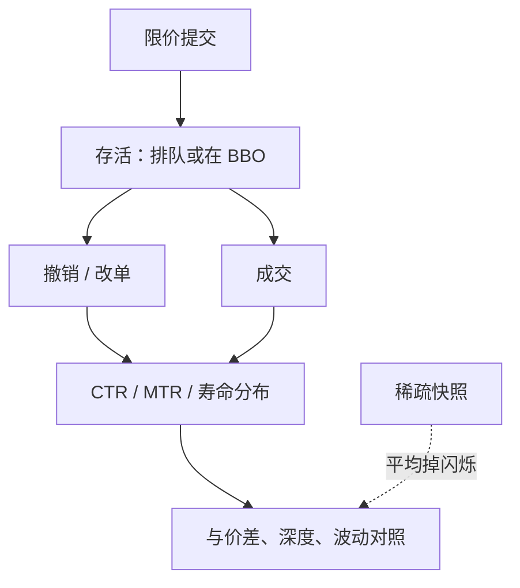

# 撤单速率

连续市场上绝大多数限价指令从未成交；取消与提交同样构成市场，报价的外观由撤销塑造的部分并不小于由成交塑造的部分。

<footer>—— 据 Harris, Trading and Exchanges 对取消、展示与报价修订的论述整理</footer>

[撤单、改单与队列位置](/quant/cancel-queue-position) 一文把 FIFO 下的名次 $p$ 当成限价策略的状态：谁在你前面撤了，你才会晋级。本篇换一个市场级对象：**撤单速率**——单位时间或单位消息里取消发生得有多频繁，通常写成取消相对成交的比、订单寿命的分布、或报价闪烁的强度。它回答的是流动性供给有多「暂时」，而不是某一张单排在第几。Hasbrouck 与 Saar 等对低延迟交易的研究把高消息率、短寿命限价当成电子做市的经验事实：限价是可撤销合约，高频修订可以是存货与逆向选择管理，而不自动等于操纵。本篇只写度量与机制，不把速率当成冰山或诱单的检测器——那是[冰山探测](/quant/iceberg-detection) 的问题。

## 问题

只看深度快照，簿可以显得很厚；若厚度由随时可撤的量组成，主动单真正能吃到的量远小于 $Q$。市场质量因此需要一个「供给有多稳」的维度。成交量告诉你消耗了多少，撤单量告诉你有多少意向在成交前被收回。两者的比随品种、随时段、随 tick 制度可以差一个数量级。没有速率，高深度会被读成高流动性，而实际上可能是短寿命报价在闪。

第二个问题是消息容量与监管口径。交易所按消息计费、监管讨论 quote-to-trade，对象都是取消相对成交是否「过多」。过多相对于什么？相对于处理成本、相对于逆向选择、还是相对于某个历史分位？把速率当违规分数，会把做市商的正常修订与真正的滥用混在同一条序列里。学术度量应先锁定义，再谈它是否预测价差、深度或随后的波动。

### 三种不可互换的速率

订单成交比（orders-to-trades 或 messages-to-trades）：提交与取消消息数除以成交笔数。对消息费敏感，但不区分取消的是队头还是远离 BBO 的垃圾单。取消成交量比：取消的股数除以成交股数，对大单取消更敏感。寿命：从提交到撤销或成交的持续时间，中位数往往远小于均值，因为少数长寿命单拉偏。报价闪烁（flickering）则是同一价位上极短间隔的增撤循环，是寿命分布的左端，不是全部取消。

改单在许多市场上等于撤加挂。若数据把 replace 记成一条消息，订单成交比会偏低；若拆成两条，会偏高。比较两个市场的 quote-to-trade 之前，必须对齐改单的记账，否则制度比较是在比较数据契约。

## 方法

有 L3 时，对每张限价单记录到达、部分成交、剩余量清零（完全成交或撤销）。撤单速率的强度可以是单位事件时间内的取消次数，或取消股数流。市场级指标按股票-日或更短窗加总：

$$
\mathrm{CTR}=\frac{\text{取消股数}}{\text{成交股数}},\qquad \mathrm{MTR}=\frac{\text{增+撤+改消息数}}{\text{成交笔数}}.
$$

寿命用生存分析更干净：把成交当作竞争风险，否则把「很快被吃掉」和「很快被撤掉」混成短寿命。条件寿命——仅在 BBO 上的单、仅在队头的单——才与可成交供给对应；远离最优档的取消对即时流动性影响弱，却能抬高 CTR。

没有 L3 时，只能用 L2 的向下跳且无对应成交来近似取消，隐藏成交与真正取消无法分开，速率被高估或低估取决于隐藏量。方法必须写明识别集。窗口应与问题匹配：监管口径常用日；做市监控用秒到分钟；与价差的共变用事件时间而不是把开盘脉冲与午后空窗等权。

### 与深度、价差一起读

单独的 CTR 没有水平含义：热门股消息多、成交也多，冷门股两者都少，比可以相近而经济完全不同。应同时报告深度、报价价差、有效价差和消息率的绝对水平。回归上，把 CTR 对随后的价差变化，控制成交强度与波动；若 CTR 上升只是波动上升的伴随物，它不是独立的毒性信号。分档位统计：BBO 取消与第三档以外取消应分开，否则「速率」会被远离市场的撤单主导。

## 机制

限价是可撤销的承诺。价值稍一移动，队头的旧价就变成被捡走的对象；存货一偏，做市商就需要把不想要的一侧撤掉。高撤单速率因此可以是**健康的**流动性供给：提供方用短寿命把逆向选择窗口切小，平均价差反而可以更窄——Hasbrouck–Saar 一类证据强调低延迟限价与市场质量可以同向。机制的另一面是：显示深度的期望可成交量下降，主动单的执行风险上升，有效冲击在深度看起来不变时已经变差。

闪烁报价把同一档的量快速开关，存量不平衡与 OFI 会出现锯齿。对依赖 L2 快照的人，这是噪声；对撮合引擎，每次增撤都是真实状态。速率度量若用稀疏快照，会把闪烁平均成「深度还在」，从而系统性地高估稳供给。事件馈送上的寿命分布才能看见左端。

### 速率不是知情概率

知情者可能更频繁地撤销过时挂单，但非知情做市同样如此。CTR 升高与 [VPIN](/quant/vpin-realtime) 升高可以同时出现（波动与成交加速），也可以背离（纯挂撤战、成交尚未放大）。把撤单速率读成 PIN，缺少生成模型：没有 $\alpha,\mu,\varepsilon$ 的分解，只有消息强度。它更接近市场质量与做市技术的描述统计，进入资产定价之前必须先变成可交易的特征或风险——例如按 CTR 排序的股票是否有溢价——而不是直接把日度 CTR 当信息风险。

时间优先下，撤别人前面的量会改变你的 $p$，但市场级 CTR 不包含你的编号。用 CTR 去推断自己的填成概率，类型错了；那是队列位置问题。本篇的速率是截面或时序上的强度，不是单张单的晋级公式。

## 边界与工程取舍

集合竞价、开盘前可以挂撤但不能成交，CTR 无定义或爆炸，应单独时段。涨跌停一侧队列冻结，取消行为被制度改写。多市场重复挂单会让消息翻倍、成交只在一处发生，MTR 被抬高。不要用 CTR 当操纵分数：高频取消首先是限价合约的性质。监管阈值若无视品种流动性与 tick，会惩罚深度供给最密集的那些名字。

不要把撤单速率与[冰山探测](/quant/iceberg-detection) 混用同一套规则。冰山关心的是成交后同价位补量；撤单速率关心的是未成交意向被收回的强度。一套阈值同时抓两种现象，既没有学术识别，也无法解释随后的价差。与 [OFI](/quant/ofi-cont) 对照：OFI 把增撤的净效果记入冲击会计，CTR 把撤的总量记入强度；净效果可以接近零而 CTR 极高（两侧同时闪）。

Harris 的教材把取消视为与提交对称的市场行为。经验文献中的 quote-to-trade、订单寿命见 Hasbrouck 与 Saar 等对低延迟交易与限价寿命的讨论。不要把某一交易所的监管口径写成微观结构定理。

## 小结

- 撤单速率度量限价供给有多暂时：取消相对成交、消息相对成交、以及订单寿命，三者不可互换。
- 高速率可以是做市修订（切短逆向选择窗口），也可以让显示深度变得不可成交；必须与价差、深度一起读。
- 改单记账、BBO 与远离档、开盘时段都会改指标水平。
- 它不是 PIN，也不是队列位置，更不是冰山检测。
- 出处：Harris, *Trading and Exchanges*；低延迟限价与寿命见 Hasbrouck–Saar 等经验研究。
