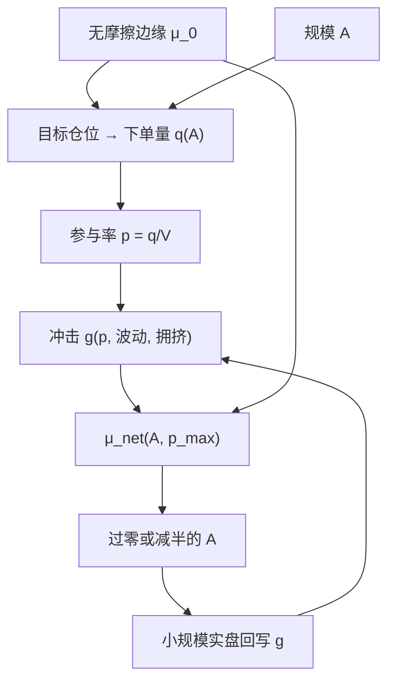

# 容量与参与率

资产管理规模有一个「刚好」的量：再大，实施缺口就会把边际投资者的净优势吃掉。容量不是市场的属性，是策略、冲击与参与率共同决定的供给曲线。

<footer>—— Perold and Salomon, The Right Amount of Assets Under Management, Financial Analysts Journal, 1991</footer>

纸面夏普默认你可以在历史成交价上任意加码。容量问的是反函数：规模 $A$ 大到哪一步，$\mu_{\mathrm{net}}(A)$ 降到零。参与率把这个问题落到每笔交易：你的下单量占同期市场成交或可获得深度的比例。Keim 与 Madhavan、Almgren 等人把机构股权交易的成本写成规模与急迫性的函数；Korajczyk 与 Sadka 表明动量的可交易利润随规模假设而变。Gatheral 从无动态套利约束讨论冲击的函数形式。本篇把容量当成回测实验设计的一轴，而不是营销口径里的「市场够深」。它与[费用敏感性](/quant/cost-sensitivity)共用成本函数，但扫的是 $A$ 与参与率，不是价差乘数。

## 问题

设无摩擦边缘为 $\mu_0$，冲击使执行价格相对决策价恶化 $g(q)$，其中 $q$ 是你要完成的量。若 $q$ 与 $A$ 成正比，则 $\mu_{\mathrm{net}}(A)=\mu_0-\mathbb{E}[g(q(A))]\times$ 换手相关因子。平方根冲击 $g\sim\sigma\sqrt{q/V}$ 下，成本随规模凹地上升，容量有限但下降较缓；线性永久冲击下，大单直接改写公平价格，容量更紧。Perold 与 Salomon（1991）的要点是：对基金而言存在一个最优 AUM，超过它，费后给投资者的优势下降——即使毛技能仍在。

参与率 $p=q/V$（$V$ 为同期成交或 ADV）是把 $A$ 翻译成 $g$ 的操作变量。同一 $A$，把单子摊到更多名字、更多时间，$p$ 下降、冲击下降，但信号可能衰减，延误变成另一种实施缺口。急迫的统计套利被迫接受更高的 $p$；慢因子可以更低。没有 $p$ 的容量数字是未定义的：你可以声称「只做 1% ADV」，从而把容量说得很大，同时隐含地假设信号愿意等。

### 参与率约束不是风险预算

风控里的波动目标决定组合的名义；参与率决定这一名义能否在给定时间内成交而不把价格推走。两者同时绑紧时，真正可部署的名义是二者的交。只设波动目标、不设 $p$ 上限，回测会在小盘上堆出无法执行的权重。只设 $p$ 上限、却按无摩擦 $\mu$ 去做[Kelly](/quant/kelly-sizing)，会在冲击已经吃掉边缘时仍建议加码。容量曲线必须在联合约束下画。

用全市场 ADV 之和当 $V$ 会高估容量。可交易的是你策略真正会买的那一截流动性：停牌、涨跌停、不可借、指数调整日剔除之后剩下的 ADV。成份过滤应发生在回测里，而不是发生在容量脚注里。

## 方法

先固定执行风格：例如每笔不超过 $p_{\max}$ 的 ADV，未完成的量按规则延期或取消。然后对 $A$ 做网格：从小账户（冲击可忽略）扫到 $p$ 经常打在 $p_{\max}$ 的规模。每个 $A$ 上记录 $\mu_{\mathrm{net}}$、换手、完成率、超限次数。容量可以定义为 $\mu_{\mathrm{net}}(A)=0$ 的 $A$，或定义为 $\mu_{\mathrm{net}}$ 相对小账户下降一半的 $A$——必须声明是哪一种。Korajczyk–Sadka 比较不同成本模型时，容量结论跟着模型变；因此应同时报平方根与线性两种冲击，作为敏感性，而不是只报让容量好看的那种。

参与率本身也要扫。$p_{\max}\in\{1\%,5\%,10\%\}$ 会改变完成时间与临时冲击。把 $(A,p_{\max})$ 做成热力图：有的策略在低参与、长时间上仍有边缘（容量来自耐心），有的必须高参与才能在信号衰减前完成（容量来自深度，通常更小）。Almgren–Chriss 把这写成风险–成本前沿：更急意味着更高的 $p$、更高的临时冲击、更低的时间风险。回测若没有时间维度上的执行轨迹，就没有真实的容量，只有一个事后按 ADV 打折的名义。

### 拥挤把别人的 $A$ 加进你的 $q$

你看到的 ADV 已被他人使用。若同类资本是 $A_{\mathrm{other}}$，冲击应按 $q\propto A+A_{\mathrm{other}}$ 估。拥挤高时，表面上 $p$ 不高，永久冲击已经发生在别人的交易里。[因子拥挤](/quant/factor-crowding) 把这一问题变成状态变量：容量曲线应至少分平静与拥挤两态，或把残差相关、借券费率作为状态。Perold 的实施缺口在拥挤态会跳升，用平静期 ADV 外推的容量是上偏的。

「策略容量 20 亿美元」若未声明参与率、冲击函数、完成率与拥挤假设，其精度只精确到营销。内部备忘录应给出 $\mu_{\mathrm{net}}(A)$ 过零点，以及该点上平均 $p$ 与最差一天的 $p$。

## 机制

冲击把你的需求曲线印到价格上。临时冲击在交易结束后部分反转，永久冲击留下。容量被永久部分与信号衰减共同决定：若你必须在衰减前完成，$p$ 升高，两部分都变大。平方根形式来自大量执行短fall 的经验拟合，Gatheral 讨论何种函数不引入动态套利。对回测架构而言，重要的是 $g(q)$ 必须单调、在 $q=0$ 时为 0，并且用你自己的成交去校准，而不是永远借用论文系数。

参与率还有信息泄露的含义。持续以高 $p$ 在同一侧出现，会让其他提供者调整报价，有效 $g$ 比静态平方根更差。这不是市场操纵叙事，而是执行的逆向选择：你的子单序列是可预测的。容量估计若假设每一子单面对独立的历史深度，会忽略这种状态依赖。事件驱动的模拟至少应按时间消耗深度，而不是按日频 bar 的均价一次性「成交」。

### 杠杆与空头腿的容量

多空策略的容量往往由空头腿决定：可借数量、召回、借券费随 $A$ 上升。名义杠杆把 $A$ 放大成市场冲击里的 $q$。残差策略在股票空间里的权重可以很大，即使组合市值中性。容量必须在成份股的 $q$ 上算，不能在组合净值上算。ETF 与期货提供额外深度，但也有场所容量与展期容量；把股票策略的容量数字直接接到衍生品腿上，会漏掉基差与展期流动性。

## 边界与工程取舍

历史 ADV 不是未来深度。波动上升时 ADV 往往上升，但价差也走阔，$g$ 的净效果不定。不要用危机期的高 ADV 去论证危机期容量更大。校准应用自己的账户，Frazzini–Israel–Moskowitz 的机构短fall 不能自动授予新策略或新渠道。A 股的涨跌停使 $p$ 在涨停板上的定义为零可买，容量瞬时坍缩；美股校准不可移植。

不要把容量当成优化目标去最大化 $A$。目标应是在约束下的投资者净效用或 $\mu_{\mathrm{net}}$；过大的 $A$ 伤害已有投资者，这正是 Perold–Salomon 的原意。研究环境里应用小 $A$ 发现信号，用容量曲线决定能否加码，再用模拟与实盘的成交回报回写 $g$，见[研究、模拟、实盘隔离](/quant/research-sim-prod)。没有闭环校准的容量是假设，不是测量。

Keim–Madhavan（1998）强调成本随投资风格与急迫性而变。同一套平方根系数套在价值再平衡与日频反转上，系数本身就错了。容量曲线必须按策略家族分别校准。

## 小结

- 容量是 $\mu_{\mathrm{net}}(A)$ 下降到不可接受的那个规模，由冲击函数与参与率定义，不是 ADV 之和。
- Perold–Salomon（1991）指出存在对投资者而言过大的 AUM；执行文献把 $g$ 写成 $q$ 与急迫性的函数。
- 参与率上限、完成率、最差日 $p$ 与拥挤态必须一起报告；否则容量数字不可审计。
- 空头可借量、涨跌停与成份过滤在 $q$ 的层面约束容量，而不是在净值层面。
- 容量曲线要用自己的成交校准，并与成本敏感性、实盘隔离形成闭环。
- 出处：Perold and Salomon, *FAJ*, 1991；Keim and Madhavan, *FAJ*, 1998；Almgren and Chriss, *Journal of Risk*, 2000/2001；Korajczyk and Sadka, *JFE*, 2004；Gatheral, *Quantitative Finance*, 2010。
