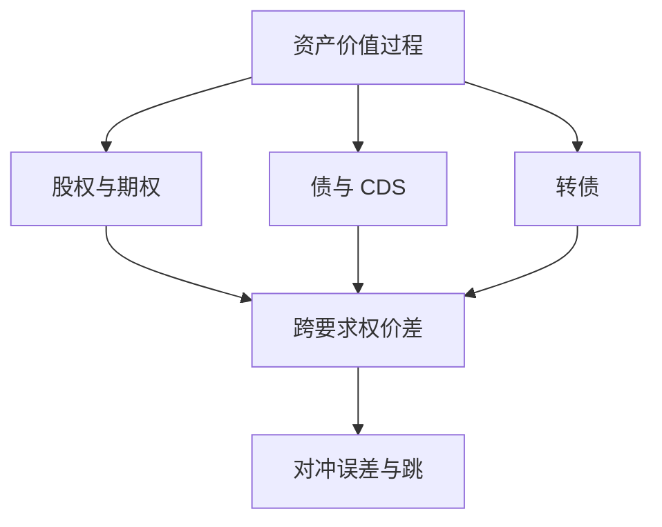

# 资本结构套利

同一家公司的股、债、CDS 与转债是对同一资产过程的不同要求权；相对价值若只存在于模型里，实盘赚到的往往是对冲误差与资本撤离。

<footer>—— 结构映射见 Merton, Journal of Finance, 1974；策略度量见 Yu, Financial Analysts Journal, 2006</footer>

[上一课](/quant/fi-relative-value)的 RV 发生在利率与信用曲线内部。资本结构套利的缺口是**跨要求权**：用 [Merton 结构模型](/quant/merton-structural) 把股权波动映射到信用，再在 CDS、现金债、股票期权与 [可转债](/quant/convertible-credit) 之间做相对价值。主干 [可转债套利](/quant/convertible-arb)、[CDS–债券基差](/quant/cds-bond-basis) 已写两条边。本课给地图：不是再推一遍看涨–看跌，而是问对冲后还剩什么、何时相关变成 1。

## 问题

结构模型说股权是资产看涨、债务是无风险债减看跌。若 CDS 隐含的资产波动与期权隐含波动不一致，理论上可买便宜的保护、卖贵的，或反过来。Yu（2006）的度量是：这种「错价」的收敛慢、回撤深，模型误设与跳跃违约会把纸面套利变成方向性信用。问题是把策略定义成**对冲误差的风险预算**，而不是「Merton 公式算出的免费午餐」。

与纯固收 RV：资本结构腿引入股票跳与借券；与纯股票多空：信用腿引入违约与回收。两边的流动性时钟不同，危机里往往同时变差。

### 对冲比率在跳时失效

连续路径下 delta、DV01、CS01 可以对齐。跳到违约时，股权与 CDS 的缺口不是局部导数能补的。短端利差在 Merton 原文里过低，用它给周频交易定对冲，会系统性卖空短端保护。强度模型与结构模型混用时，要写清哪一条腿在用哪一个核。

转债套利是资本结构套利的一个可交易子集：条款把凸性写死。没有转债条款、只拿 CDS 对股票，对冲误差通常更大。

## 方法

宇宙：有流动 CDS 或转债、可借正股。信号：模型价差、基差、隐含–实现。对冲：股票 delta、指数 CDS、利率。限额：单名跳跃、行业信用、融资。回测必须用可成交的 CDS 惯例与债券融资，不能用结构模型的理论价当成交。

## 机制

同一 $V_t$ 进入不同合约，摩擦与分段资本使价格暂时分叉。策略卖的是「分叉会收」，付的是分叉在去杠杆时扩大。Mitchell–Pedersen–Pulvino 的慢资本故事在转债上已经写过：同类账户同向时，便宜可以更便宜。

## 边界

本课不写如何规避内幕或操纵信用事件。回收率、basket 违约相关、主权是另一套。评价不要用无融资的理论夏普。

## 小结

- 资本结构套利是跨股、债、CDS、转债的相对价值，锚来自结构或强度模型。
- 实盘对象是对冲误差与融资，不是 Merton 公式的残差为零。
- 跳与慢资本让均值回复可以断裂。
- 出处：Merton, *JF*, 1974；Yu, *FAJ*, 2006；转债腿见 Mitchell, Pedersen and Pulvino, *AER*, 2007。
