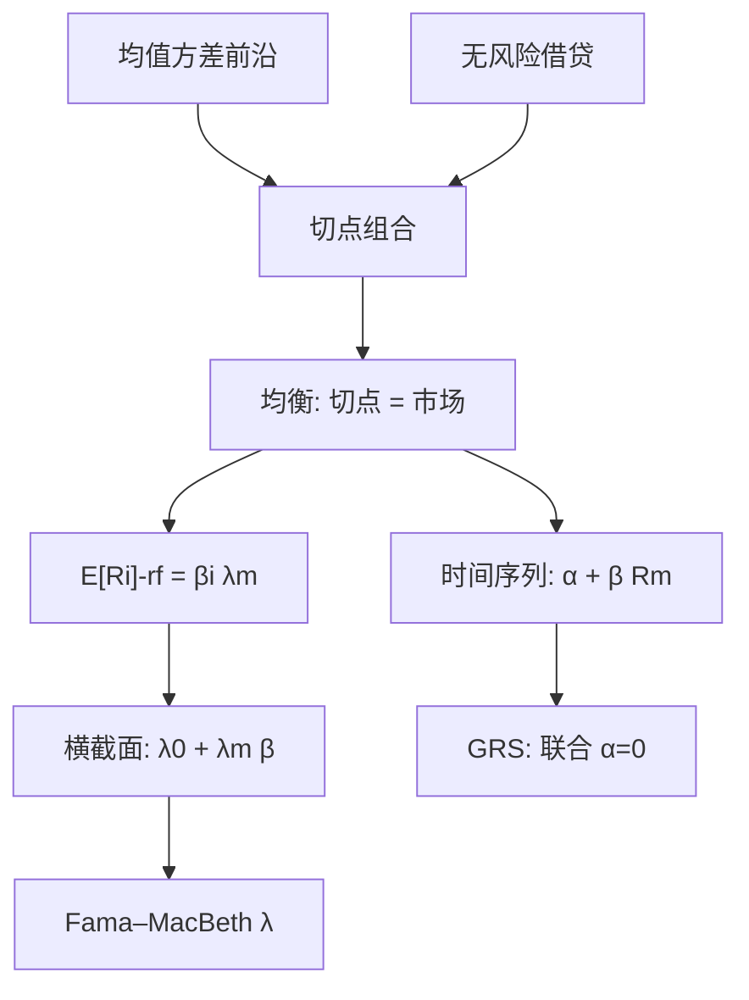

# CAPM 与市场因子

    
若投资者只按均值和方差持有组合，市场组合就落在切点上，个股的期望超额收益与它对市场的 beta 成正比。

    <footer>—— Sharpe, Capital Asset Prices: A Theory of Market Equilibrium under Conditions of Risk, Journal of Finance 1964；Lintner, The Valuation of Risk Assets, Review of Economics and Statistics 1965</footer>

前面各篇处理价格如何被微观结构污染、如何把波动从噪声里取出。资产定价问的是另一层：跨资产的**期望收益**由什么风险补偿决定。Sharpe（1964）与 Lintner（1965）的 **CAPM**（资本资产定价模型）给出最瘦的答案：唯一需要补偿的是不可分散的市场风险，度量是 beta。市场组合的超额收益是那个因子。后续的三因子、五因子、动量，都是在 CAPM 的残差里发现结构之后，把市场因子留下来并往外加。本篇只写 CAPM 与作为因子的市场本身：假设、检验、失败的方式，以及它在工程上仍被当作第一风险的原因。它不是微观结构噪声的低频版，也不是把高频 RV 年化之后的别名。

## 问题

个股收益同期高度相关。若相关来自共同因子，分散化无法去掉那一块，理性投资者会要求补偿。若相关只是噪声，补偿应为零。Markowitz 给出均值方差前沿，但没有说均衡时哪个组合被持有。Sharpe 与 Lintner 补上：同质预期、无摩擦、可按无风险利率借贷（Lintner / Black 的零 beta 版本放宽到可卖空）时，所有人持有同一切点组合与无风险资产的混合，切点即市场组合。于是个股的风险只剩它对市场的回归系数。

要检验的不是「收益能不能被市场解释」——同期 $R^2$ 高几乎是相关结构的重述——而是**截距**：在 $E[R_i]-r_f=\beta_i(E[R_m]-r_f)$ 里，是否还有 $\alpha_i\neq 0$。横截面上，高 beta 是否真的平均收益更高。问题从微观转到宏观：对象是期望，不是某一日的买卖价差。

### 市场组合不可观测

Roll（1977）指出：CAPM 的市场是全部风险资产的价值加权，含人力资本、私有企业、房产、海外。用某个股票指数代替，检验的是「该指数是否均值方差有效」，不是「真正的 CAPM 是否成立」。指数有效则证券在指数上的 $\alpha$ 为零，这是会计；指数无效则可以测出 $\alpha$，也不能否证不可见的真市场。工程上我们仍用可交易的市场因子（CRSP 价值加权、沪深 300、流通市值加权），但必须承认：这是一个可交易因子模型，不是 Roll 意义下的 CAPM 终审。

价值加权与等权市场因子行为不同。等权偏向小盘，本身混进规模。CAPM 的理论市场是价值加权。用等权指数估 beta，再去讨论小盘异象，是把规模从右边挪到了左边。因子定义先于回归。

## 方法

**时间序列检验。** 对资产或组合 $i$，

$$
R_{i,t}-r_{f,t}=\alpha_i+\beta_i(R_{m,t}-r_{f,t})+\epsilon_{i,t}.
$$

CAPM 预测 $\alpha_i=0$。Gibbons, Ross, Shanken（GRS）对一组组合的 $\alpha$ 做联合检验。组合通常按 beta、规模、估值预排序，以降低个股噪声、对准可疑的违反方向。$R_m$ 用价值加权股票市场超额；$r_f$ 用国库券或逆回购利率，货币与样本期要匹配。

**横截面检验。** 先估 $\hat\beta_i$，再回归 $\bar R_i=\lambda_0+\lambda_m\hat\beta_i+u_i$。CAPM 预测 $\lambda_0=r_f$（或零，若左边已是超额），$\lambda_m=E[R_m]-r_f$。Fama–MacBeth 按月做横截面再对 $\lambda$ 时间序列求均值与标准误，处理残差截面相关。$\beta$ 带估计误差，需要误差修正或用组合 beta。

**市场因子作为工程对象。** 即使 $\alpha$ 显著，组合对市场的 $\beta$ 仍是第一风险：它解释收益方差的大头，决定对冲比率、杠杆与主动额度。实务上先把市场中性做成约束，再在残差上找其他因子。CAPM 作为**定价模型**可以失败，作为**风险模型**的第一主成分仍然在。

### Beta 的测量窗与频率

$\beta$ 随窗口变：五年月度、一年日度、对期权用的隔夜/日内拆分，数值不同。日度 beta 受 [微观结构噪声](/quant/microstructure-noise) 和非同步交易影响，薄股票 beta 偏低（Scholes–Williams、Dimson 滞后调整）。用已实现 beta（已实现协方差除以市场 RV）要把噪声修正与 [不等间隔](/quant/irregular-sampling) 考虑进去，否则高频 beta 不是更准的 CAPM beta。隔夜与日内 beta 可以分估，见 [日历效应](/quant/calendar-overnight)；一个数字的 CAPM 假定时段可加。

## 机制

均衡机制是需求加总。投资者按 beta 度量边际风险贡献，高 beta 资产价格被抬到使期望收益正好等于 $\beta\lambda_m$。线性来自均值方差与联合正态（或二次效用）下需求对收益线性。因子是市场本身，因为加总后只有市场风险留在每个人的组合里。

经验上这条直线平了：低 beta 股票平均收益并不低那么多，高 beta 补偿不足，这就是低波动 / BAB 一类异象的 CAPM 版本。机制候选包括杠杆约束（无法借到无风险利率去加杠杆低 beta）、基准与委托、以及市场指数并非有效组合。CAPM 的失败方式是**斜率太平、截距按特征排列**，不是「市场因子不重要」。市场因子的 $\lambda_m$ 在多数样本里仍是最大的一块风险溢价；亏的是它独占期望收益这一句。

Jensen 的 $\alpha$ 是相对市场的主动收益。基金评价里 $\alpha\gt 0$ 不一定否证 CAPM，可能是运气、可能是遗漏因子、可能是基准不是投资者的真实市场。评价与检验共用一个回归，解释权不同。写报告应分开：风险归因 vs 均衡定价。

### 与微观结构篇的接口

CAPM 用低频收益时，可以把微观结构当成测量误差：beta 衰减、隔夜跳、非同步。用日度超额收益做 Fama–MacBeth，通常可忽略 tick 噪声，但不能忽略：停牌、涨跌停使日收益截断；IPO 与退市造成的存活；用收盘中点还是收盘成交。把 PIN 当成「信息风险因子」加进 CAPM，是 Easley–Hvidkjaer–O'Hara 的扩展，已经离开单因子均衡，进入实证多因子——本篇不偷换为 PIN 定价模型。市场因子的构造应先于任何微观结构因子，否则共同波动会被微观指标抢走解释。

## 边界与工程取舍

不要用个股回归的不显著 $\alpha$ 宣称 CAPM 成立：功效极低。应在特征排序组合上做 GRS。不要用样本内最优切点组合当 $R_m$ 再检验 CAPM——那是 Roll 会计，alpha 被构造为零。不要在中国用美股的 $r_f$ 与美元市场因子。不要把行业指数当市场因子还报告「CAPM」。

条件 CAPM（beta 随状态变）可以吸收一部分异象，但需要声明状态变量；无约束的时变 beta 几乎能拟合任何均值，检验失去牙齿。下一篇系列里的规模、价值、动量，应理解为在市场因子之后的增量，而不是 CAPM 的替代品里删掉市场。工程风险模型里市场仍是第一列；定价检验里市场是原假设，不是可以省略的控制。

Sharpe 比率最大化给出切点，CAPM 把切点等同于市场。若投资者有非交易收入、税收、约束，切点不再是可观测指数。实证 CAPM 永远是「对这个可交易市场因子而言，SML 是否成立」。这样写，失败才是可证伪的，而不是被 Roll 一句话取消。

## 小结

- CAPM 由 Sharpe 与 Lintner 给出：均值方差均衡下，期望超额收益与市场 beta 成正比，市场超额是唯一因子。
- 可检验的是组合 $\alpha$ 与证券市场价格线的斜率；Roll 批判表明真市场不可见，实务检验的是可交易市场因子是否有效。
- 市场因子解释方差的大头，定价上斜率往往过平；失败不意味着可以从风险模型里删掉市场。
- Beta 的窗口、频率、隔夜拆分和非同步交易会改变测量；高频已实现 beta 要处理噪声。
- 后续多因子是在这一列之后加列，而不是改写市场因子的定义。
- 出处：Sharpe, *Capital Asset Prices*, Journal of Finance 1964；Lintner, *The Valuation of Risk Assets*, Review of Economics and Statistics 1965；检验与批判见 Black, Jensen, Scholes；Roll, *A Critique of the Asset Pricing Theory's Tests*, Journal of Financial Economics 1977；GRS, Econometrica 1989。
