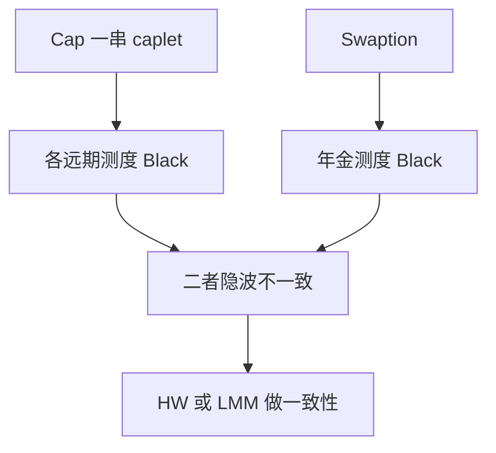

# caps / floors / swaptions

Cap 是一串 caplet；swaption 是对整条互换的期权。二者的隐波不能用同一个对数正态 $F$ 去混用，除非经过一致性模型。

<footer>—— Black, The Pricing of Commodity Contracts 的 caplet 用法；Jamshidian 对欧式 swaption 在 Vasicek 下的分解；市场报价见 ISDA 定义</footer>

[上一课](/quant/inflation-linked)把实际利率曲线立起来。本课回到名义利率期权：cap/floor 与欧式 swaption。主干 [LMM](/quant/lmm)、[Hull–White](/quant/hull-white) 已写模型。缺口是**产品与报价**：caplet 的 Black 公式、swaption 的互换测度、以及两者如何共同约束后课 SABR-LMM。负利率放到下一课移位。

## 问题

Cap 支付 $\sum \delta_i(L_i-K)^+$，每段 caplet 在其自身远期测度下是 Black-76。Floor 对称。Swaption 支付年金乘 $(S-K)^+$，在年金测度下也是 Black。问题是同一 $K$ 的 cap 隐波与对应到期的 swaption 隐波一般不一致：一个吃的是单点远期，一个吃的是互换率（远期的加权）。没有期限结构模型，不能把 cap 曲面「转换成」swaption 曲面去对冲。

物理交割 vs 现金交割（cash-settled swaption 的年金公式）改变测度，欧洲现金交割惯例会让 Black 公式的 $A$ 与实物交割不同。实现必须按确认书选。

### 互换率不是某个 caplet 的 $L$

Jamshidian 在单因子 Hull–White 下把欧式 swaption 写成债券期权的和，从而有闭式。多因子或 LMM 下没有这层分解，要用换测度后的近似（Rebonato 冻结权重）或模拟。把 swaption 当「平均到期的 caplet」，对冲会漏掉曲线形态风险。

Cap 的 ATM 常定义在即期互换率或每段远期自己的 ATM，惯例因币种而异。又是报价课的坐标问题。

## 方法

Caplet 剥离：从最短 cap 开始剥离 caplet 隐波，注意重叠与日计数。Swaption 网格：到期 × 期限。校准 HW：用部分 swaption；校准 LMM：用 swaption 网格为主，cap 为辅或反过来，视簿的产品。对冲：cap 用期货/FRA 与 caplet 桶；swaption 用对应互换 + 曲线桶 + vol 桶。AAD 穿过年金与互换率定义。

微笑：每个 caplet、每个 swaption 格子一个 SABR，下一课再谈如何让 LMM 同时吃下这些微笑。

## 机制

Caplet 是对单点 Libor/RFR 复合率的期权；swaption 是对曲线上一条加权平均的期权。相关：曲线因子若高度相关，二者接近；若曲率因子大，长期限 swaption 与一串 caplet 的差就是曲线形态的期权。这正是为什么需要 [HJM](/quant/hjm)/LMM 而不是一个股式 GBM。

## 边界

RFR 过渡后 cap 写在每日复利的 RFR 上，剥离与日内复合改变有效波动，不能沿用 Libor caplet 代码。负利率使 lognormal Black 爆炸，必须移位或用 Bachelier，见下一课。微笑翼部流动性差，剥离不稳定，要正则化。

## 小结

- Cap 是 caplet 之和，swaption 是互换率期权；隐波不可直接混用。
- 现金与实物交割测度不同；Jamshidian 分解限于单因子。
- 一致性留给 HW/LMM；本课钉产品与报价。
- 出处：Black, *JFE*, 1976（公式在 caplet 上的应用）；Jamshidian, *Finance and Stochastics* 等对债券期权分解的工作。
