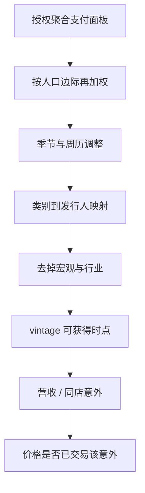

# 信用卡与消费

流动性约束使信用卡余额与利率进入消费决策；卡数据因此能看见收入冲击之后的支出调整，而不仅仅是事后国民账户里的总量。

<footer>—— Gross and Souleles, Do Liquidity Constraints and Interest Rates Matter for Consumer Behavior? Evidence from Credit Card Data, Quarterly Journal of Economics, 2002</footer>

支付与信用卡面板把消费从季度国民账户拉到日、周频率，并带上商户类别与粗地理。Gross 与 Souleles（2002）用发卡行账户证明流动性约束与利率对消费和负债的因果影响。Ganong 与 Noel（2019）用授权的支票账户流水研究失业后的支出路径。Baker、Farrokhnia、Meyer、Pagel 与 Yannelis（2020）以及 Chetty、Friedman、Hendren、Stepner 与 Opportunity Insights 团队在疫情期间把交易数据做成近实时的消费追踪。这些论文的共同点是：**在严格的数据使用协议下研究聚合支出**，回答宏观与家庭金融问题。资产定价侧的延伸是用类别支出的现在时去预测零售、旅游、餐饮等公司的营收意外。本篇只在这一研究传统里写：样本代表性、滞后与修订、以及为什么「卡流水预测同店」常常只是把即将公布的官方系列提前几天，而不是可重复的横截面 alpha。不涉及如何获取个人交易或如何识别持卡人。

## 问题

消费要预测公司基本面，必须跨过三道缝。第一，**样本不是总体**：发卡组织、银行、记账 App 的用户在收入、年龄与线上渗透上有偏；把样本增长率当成普查式零售销售，是把选择偏差写成信号。第二，**商户到股票的映射**：MCC 或聚合商户名对应的是品牌，不是发行人；加盟、电商平台代收、礼品卡与对公卡会把同一笔经济消费记到错误的代码。第三，**信息集**：若信号只是把 Census 零售销售或公司自己的周销售提前到 T−5 日，价格可能已通过管理层点评、渠道调研与供应商数据部分吸收。Mian、Rao 与 Sufi（2013）表明家庭资产负债表冲击通过消费影响经济；那是宏观识别，不是说每一张卡类别 z-score 都有股票 IC。

Agarwal、Chomsisengphet、Mahoney 与 Stroebel（2015）研究信用卡监管如何改变价格与还款，提醒「卡数据」首先是金融合约，其次才是消费温度计。把利率、最低还款与奖励积分导致的刷卡迁移当成实际需求，会把合约设计误读成景气。

### 总量现在时与横截面 alpha 是两份工作

把全国卡消费作成 GDP 或零售销售的 nowcast，评价标准是相对官方序列的实时 RMSE，Galbraith 与 Tkacz 等中央银行研究走这条路。把类别消费作成零售商多空，评价标准是扣费后的[可交易性](/quant/net-edge)与财报窗口的异常收益。前者即使 $R^2$ 可观，后者仍可为零：指数期货已经交易了宏观消费意外，个股相对价值需要的是**公司特异**的消费残差。残差要求从类别增长里拿掉宏观、拿掉季节、拿掉样本漂移，再映射到发行人。步骤越长，过拟合越容易，见[多重检验](/quant/multiple-testing-factors)。

研究使用的卡数据应是机构授权的统计产品或与统计机构合作的匿名聚合。论文贡献在于识别与测量误差，不在于描述原始流水字段。任何需要个人可识别信息才能构造的特征，都不属于本篇的对象。

## 方法

**聚合与季节。** 支出有强星期与节假日模式，以及报税、开学、购物季。应在公司或类别层做同年历对照（同比）或局部季节调整，再看意外。Opportunity Insights 的公开追踪把支出做成相对 2020 年初的指数，为的是可比性；复制时必须固定基期与人口加权，不能每周改权重。

**代表性加权。** 若供应商提供人口统计分层，应按普查边际重加权，承认仍无法纠正「不用这种支付方式的人」。Baker 等人在疫情论文里反复讨论样本覆盖。金融应用至少应报告：信号与官方零售销售、信用卡应收账款、公司同店的相关，以及相关是否只在样本内的危机年份成立。

**映射与滞后。** 特征日期是交易结算日还是授权日，差几天；商户上报延迟会使「实时」变成 T+3。与[卫星](/quant/satellite-geo)一样，必须用 vintage：供应商对历史商户分类的回填会制造前视。对齐到财报时，标签应是营收意外或同店意外，而不是同步的股票收益——否则测到的是情绪与支付的共同因子。

### 从家庭金融识别里学什么

Gross–Souleles 与 Ganong–Noel 的价值是因果：信用额度、失业救济、账户余额如何改变支出路径。股票信号若只是这些宏观冲击的线性变换，它已被债券、就业数据与零售 ETF 交易。有增量的情形更窄：映射到**单一发行人**的类别残差，在分析师覆盖弱、披露滞后的名字上，且持有期对齐下一次披露。即使如此，也要检验相对渠道调研与供应商数据的增量。Chetty 团队把数据用于公共政策与宏观监控，说明高质量支付面板的社会价值不必通过选股来证明。

奖励积分、一次性大额对公支出与欺诈拒付会在日频上制造尖峰。研究应在周频或用稳健统计量，并把尖峰当成测量误差。日频 IC 高几乎总是微观噪声或共同日历，而不是可交易边缘。

## 机制

设类别支出增长 $c_{k,t}$ 与公司营收增长 $g_{i,t}$ 的关系是 $g_{i,t}=\beta_{ik}c_{k,t}+\eta_{i,t}$。$\beta$ 随电商渗透、价格与商户迁移而变。疫情把 $\beta$ 的结构打断：线上替代、刺激支票、出行冻结，Baker 等人记录的是水平与组成同时变。用 2018–2019 估计的 $\beta$ 去交易 2020 年，是典型的体制失效，不是卡数据「突然没用」。

信息吸收：若资金用同一家授权统计产品，拥挤使财报前价格已经含 $c_{k,t}$，公告日 alpha 消失，甚至变号（买入拥挤后的兑现）。这与卫星停车场是同一过渡租金逻辑。支付数据的优势是频率；劣势是样本漂移（某种卡组织份额变化）会表现为虚假趋势，GBDT 会把它当成强特征，见[树模型](/quant/gbdt-alpha)。

与宏观因子的共线：Mian–Sufi 的资产负债表衰退通过消费打击可选消费板块，卡数据此时高度共线于信用利差与就业。横截面 rank 若未对[行业](/quant/industry-neutral)与 beta 中性，多空只是在做空周期。

### 隐私与聚合是方法约束，不是附录

家庭金融文献能发表，是因为数据在协议下匿名、结果以回归系数与图的形式出现，而不是可倒推到账户。量化研究应把特征停在「类别–地区–周」或供应商提供的公司指数上。更细的粒度会迅速变成再识别风险，也超出资产定价所需要的信噪比：公司营收本身就是全国或大区聚合。

## 边界与工程取舍

不要把记账 App 的年轻用户样本当成中国或美国全体消费。不要用未授权的个人流水。不要把同步相关（消费与股市同跌）写成预测。跨境旅游与多币种清算会使商户国家与消费发生地不一致。手续费与汇率使「金额」不等于需求量；在通胀期应尽可能用交易笔数或数量指数作稳健性。

可交易性：即使营收意外可预测，股票在公告前的借券、涨跌停与分析师修订会吃掉收益。应报告公告窗口与普通持有期两套结果，并扣[有效价差](/quant/effective-realized-spread)。

卡数据最稳的研究用途仍是宏观现在时与家庭金融机制。选股只是一个更吵、更拥挤、映射误差更大的下游应用，需要预先指定类别与发行人名单，而不是事后从一千个 MCC 里挑 t 值。

## 小结

- Gross–Souleles（2002）与 Ganong–Noel（2019）说明卡与账户流水能识别流动性约束下的消费；这是家庭金融，不是默认的股票 alpha。
- Baker 等（2020）与 Opportunity Insights / Chetty 等把交易数据用于近实时宏观；评价应先看对官方序列的 nowcast，再问公司特异残差是否存在。
- 样本代表性、商户映射、授权日与结算日、供应商回填，是测量问题；忽略它们会把选择偏差写成因子。
- 宏观消费意外多半已被股票与债券交易；横截面需要行业中性后的发行人残差，且持有期应对齐披露。
- 出处：Gross and Souleles, *QJE*, 2002；Ganong and Noel, *AER*, 2019；Baker, Farrokhnia, Meyer, Pagel and Yannelis, *RFS*, 2020；Mian, Rao and Sufi, *QJE*, 2013；Agarwal, Chomsisengphet, Mahoney and Stroebel, *QJE*, 2015；Chetty, Friedman, Hendren, Stepner and Opportunity Insights。
