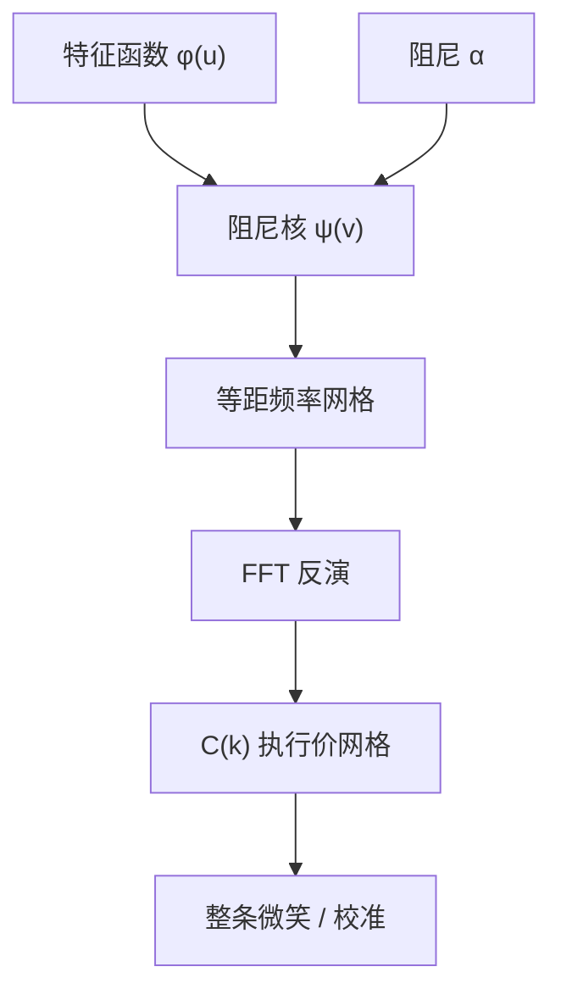

# Carr-Madan FFT 定价

    
欧式看涨对对数执行价的傅里叶变换，在乘上一个指数阻尼之后可积；特征函数代入闭式核，一次 FFT 给出整条执行价网格上的价格。

    <footer>—— Carr and Madan, Option Valuation Using the Fast Fourier Transform, Journal of Computational Finance, 1999</footer>

[上一课](/quant/funding-liquidity)把因子收到融资约束。缺口换成期权曲面的计算引擎：特征函数一次 FFT。[Heston](/quant/heston) 已经把欧式价格写成特征函数的反演，但原文是两条概率积分 $P_1,P_2$，每个执行价单独做振荡积分。Peter Carr 与 Dilip Madan 1999 年指出：若把看涨价格看成对数执行价 $k=\ln K$ 的函数，其傅里叶变换在适当阻尼下有闭式，且对一串等距 $k$ 可以用快速傅里叶变换一次算完。工程对象从此变成「特征函数 + 阻尼 + FFT 网格」，而不是「每个 $K$ 一次求积」。本篇写这条变换，不重推 Heston 的 Riccati；任何仿射或 Levy 模型只要交出 $\phi(u)=\mathbb{E}[e^{iu\ln S_T}]$，就接到同一套核上。蒙特卡洛与 [PDE](/quant/option-pde) 仍服务路径依赖与美式；香草截面的校准，FFT 通常是默认引擎。

## 问题

风险中性下 $C(K)=e^{-rT}\mathbb{E}[(S_T-K)^+]$。当密度未知而特征函数已知，经典路是 Gil-Pelaez 反演分布函数，或 Heston 那种拆成资产或然与现金或然。两条路对每个 $K$ 都要积一次，校准上万个报价时浪费极大，且被积函数在 $u=0$ 附近有 $1/u$ 奇异，数值要小心。

直接对 $C(k)$ 做傅里叶在数学上不合法：$k\to-\infty$ 时看涨趋向远期，函数不属 $L^1$。Carr–Madan 引入阻尼 $c(k)=e^{\alpha k}C(k)$，$\alpha\gt 0$ 使 $c$ 可积，再写

$$
\psi(v)=\int_{-\infty}^{\infty}e^{ivk}c(k)\,dk,
$$

$\psi$ 可用 $\phi$ 表出。反演给出所有 $k$ 上的 $C(k)$。问题收成：选 $\alpha$ 使 $\psi$ 在数值上既不爆炸也不把质量削掉，并把连续积分收成 FFT 能吃的等距和。

### 阻尼核与特征函数

对 $x=\ln S_T$，支付 $(e^x-e^k)^+$ 的变换给出

$$
\psi(v)=\frac{e^{-rT}\phi\bigl(v-(\alpha+1)i\bigr)}{\alpha^2+\alpha-v^2+i(2\alpha+1)v}.
$$

分母是阻尼看涨的二次多项式；分子把特征函数挪到复平面上的一条水平线 $\mathrm{Im}=-(\alpha+1)$。Heston、 Merton 跳跃、方差伽马、CGMY，只要 $\phi$ 在该条带解析，公式原样可用。这与 Heston 原文沿实轴积 $\mathrm{Re}(e^{-iuk}\phi(u)/(iu))$ 是同一信息的不同切片：一条带 $\alpha$ 的解析延拓，换来整条 $K$ 网格与更稳的被积函数。

$\alpha$ 不是「精度参数」那么简单。太小，阻尼不够，$c(k)$ 在左端仍不可积，FFT 泄漏；太大，特征函数被推到远离实轴，Heston 的分支与矩爆炸会先坏。股权香草常用 $\alpha\in[0.75,1.75]$，应用看涨–看跌平价把虚值一侧映到实值核上，避免深虚值看涨去乘很大的 $e^{\alpha k}$。

## 方法

取积分截断 $v_{\max}$、点数 $N=2^n$，步长 $\eta=v_{\max}/N$。对数执行价网格步长 $\lambda=2\pi/(N\eta)$，这是 FFT 的对偶关系：$\eta$ 密则 $K$ 网格疏，反之亦然。Simpson 权修正梯形误差。实现步骤：对 $j=0,\ldots,N-1$ 算 $\psi(j\eta)$，乘阻尼反演前因子与 Simpson 权，做复 FFT，再乘 $e^{-\alpha k}/\pi$ 一类常数，得到 $C(k_m)$。需要的执行价若不在网格上，三次样条即可；校准通常先把市场 $K$ 映到最近网格，或对 $\lambda$ 做一次以 ATM 为中心的平移（此时多一个指数平移定理里的相位）。

虚值看跌用平价从看涨取，或对看跌单独写一版负阻尼。短到期、深虚值时 $\psi(v)$ 衰减慢，要加大 $v_{\max}$；长到期、Heston 强均值回复时衰减快，可减 $N$。与逐点求积比，一次 $N=2^{12}$ 的 FFT 往往覆盖整条微笑，校准循环里应缓存 $\phi$ 在网格上的值。

### 与 Heston 原文反演的关系

Heston（1993）积的是概率，Carr–Madan 积的是阻尼价格。同一 $\phi$，同一价格，数值误差结构不同：前者每个 $K$ 独立、便于单点希腊值；后者整条微笑一致、便于校准目标函数。分支切割、Feller 违反时的矩问题，两种反演都会遇到——那是特征函数实现的问题，见 [Heston](/quant/heston)，不是 FFT 网格的问题。Lewis、Lipton 的积分核、Attari 的简化被积函数，是同一家族的变体；生产代码选一种核并固定 $\alpha$ 与 $N$，不要在校准中途切换。

## 机制

傅里叶变换把卷积型的期望变成乘法。看涨支付在对数执行价上不是平方可积，阻尼相当于把测度改到 $e^{\alpha k}$ 下，使变换存在；反演后再除回去。FFT 只是把这条连续反演收成 $O(N\log N)$ 的等距和，它不引入新的定价理论：无套利、风险中性、特征函数解析延拓，全部发生在 $\psi$ 的公式里。

网格对偶是机制的另一半。想要执行价很密，必须让频率步长 $\eta$ 变大，高频截断变差，翼部振荡；想要积分更准，执行价网格变稀，ATM 附近要插值。这是信号处理里时频测不准在期权上的版本。实践上 $N$、$\eta$、$\alpha$ 与对数现货的锚点一起当成数值规格，用 Black–Scholes 特征函数做回归测试：复现公式到 $10^{-8}$，再换 Heston。

FFT 给出的是欧式香草。美式、障碍、亚式不能把支付塞进同一个 $\psi$。COS、PIDE、[蒙特卡洛](/quant/mc-pricing) 各管一块。不要因为「有特征函数」就认为所有产品都能 FFT。

### 看跌、数字与希腊值

数字期权对应密度，可用 $\phi$ 直接反演，不必走阻尼看涨再对 $K$ 差分——差分会放大 FFT 的高频涟漪。Delta、Vega 可对参数微分 $\phi$ 再走同一核，比价格有限差分干净。Rho 若利率进入贴现与漂移两处，特征函数与前因子都要导。网格上的蝶式应保持正，否则是 $\alpha$ 或截断不足，不是市场在套利。

## 边界与工程取舍

Levy 模型在极短到期的翼部，密度不光滑，FFT 振荡明显，需加大 $N$ 或改 COS。[Heston](/quant/heston) 在深虚值短到期衰减慢，且 $2\kappa\theta\lt \sigma^2$ 时矩可能在有限 $u$ 爆炸，$\alpha$ 把路径推得更近爆炸点。利率与分红若随 $T$ 变化，每个到期单独一条 $\phi$，不要共用一张频率表却混用贴现。

实现上必须用看涨–看跌平价把计算放到实值一侧；必须测试 $\alpha$ 扰动下 ATM 是否稳定；必须把 FFT 的 $k$ 网格与远期对齐，否则「ATM」落在两个节点之间，校准会假弯。Carr–Madan 不解决特征函数的分支：那是模型实现。引用 1999 年论文是为了阻尼变换与 FFT 用法，不是为了 Heston 的闭式。

出处：Carr and Madan, *Journal of Computational Finance*, 1999。Heston 的 $P_1,P_2$ 积分是 1993 年另一条路。Lewis（2001）与 Lipton（2002）给出带围道的等价核。不要把 FFT 的发明年写成期权定价年。

## 小结

- Carr–Madan（1999）对阻尼看涨做傅里叶，核由特征函数闭式给出，FFT 一次得到执行价网格。
- $\alpha$ 使变换可积，却把 $\phi$ 推离实轴；要在泄漏与矩爆炸之间取值。
- 频率步长与执行价步长对偶，校准规格应固定 $N,\eta,\alpha$ 并用 Black–Scholes 回归。
- 与 Heston 原文逐点反演同一信息，适合整条微笑；美式与路径依赖不在此核内。
- 虚值用平价映到实值；希腊值应对 $\phi$ 解析求导再 FFT。
- 出处：Carr and Madan, *JCF*, 1999；特征函数模型见 Heston, *RFS*, 1993；对照 [Heston](/quant/heston) 与 [COS 方法](/quant/cos-method)。
