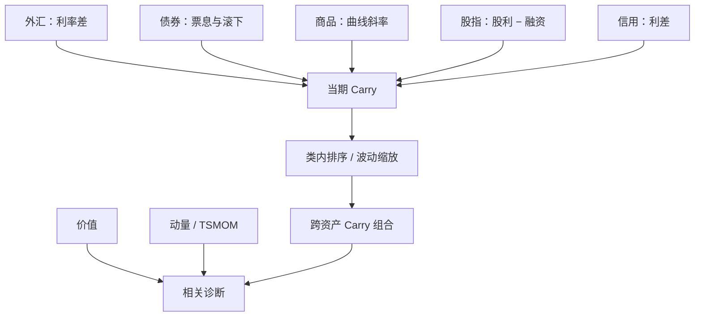

# Carry 跨资产

Carry 是价格不变时持有该资产能得到的收益；它在外汇、债券、股指、信用与商品上都能预测后续收益，却不是价值，也不是动量。

<footer>—— Koijen, Moskowitz, Pedersen & Vrugt, Carry, Journal of Financial Economics, 2018</footer>

外汇里的 Carry 是利率差：做多高息货币、做空低息货币，若汇率不变就赚利差。Koijen、Moskowitz、Pedersen、Vrugt 把同一概念推广：任何资产都可以把收益拆成「价格不变的部分」与「价格变动的部分」，前者定义为 Carry。债券是滚下收益率曲线，商品是期货相对现货的基差，股指是分红减去融资，信用是利差减去预期违约损失的某种会计。本篇写这个统一定义，以及它和[跨资产价值与动量](/quant/value-momentum-everywhere)、[TSMOM](/quant/tsmom) 的分工。

## 问题

若无风险利率平价成立，利率差应被远期升水完全抵消，外汇 Carry 的期望为零。实证上高息货币平均升值不足，Carry 交易赚到正的平均收益，并伴随崩溃风险（1987、1998、2008 的日元、瑞郎挤压）。问题是：其他资产有没有同构的「收入腿」？若有，且同样预测收益，则 Carry 是跨资产风格，而不是外汇特有的比索问题。

第二个问题是识别。商品的 backwardation 既像 Carry（展期赚），又像库存/便利收益的基本面，又常与过去收益相关。债券的期限溢价既像 Carry，又像久期风险。必须先写公式，再谈溢价，否则会和价值、动量、风险平价混成一锅。

### 价格不变时还剩什么

对期货，若合约价格不变，收益来自展期：近月相对远月的斜率。对现货外汇，价格不变指即期汇率不变，收益来自两国利率差。对债券，价格不变可以指到期收益率不变，收益来自票息加滚下。对股票指数，价格不变时还剩股利与回购一类的现金流收益率，再减去融资。统一写法是

$$
\mathrm{Carry}_t=\frac{\text{若价格路径不变的期望收益}}{\text{单位资金或单位风险}}.
$$

预测回归是未来超额收益对当期 Carry。符号预期为正：高 Carry 资产随后收益高。这与价值不同——价值高表示价格已经低；Carry 高表示持有期收入高，价格可以同时很高。

静态 Carry（永远多最高息的五个货币）与动态 Carry（每月重排）不同。原文以动态、截面多空为主，并做波动缩放。把 1990 年代的日元融资当成唯一案例，会低估分散后的样本，也会低估 2008 年全球 Carry 一起崩的尾部。

## 方法

每个资产类内部计算 Carry，截面排序或多空，仓位常按波动缩放，再合成全球 Carry 组合。外汇：远期升水或利率差。商品：近远月价差 / 现货。债券：期限利差或 roll-down。股指：股利收益率相对融资。信用：利差。检验包括：单资产类的预测回归、跨类合成、与价值腿、动量腿的相关，以及崩溃月的偏度。

Carry 与动量：高 Carry 资产不必是过去的赢家（汇率可以高息却在贬值）。Carry 与价值：高股利的股指偏价值，但高息货币常被当成「贵」的投机货币。相关在资产类之间不稳定，这正是分开持有的理由。与 TSMOM：趋势看价格变化的方向，Carry 假定价格不变；两者可以同时为正（趋势加正展期），也可以打架（高息货币正在崩）。

### 把崩溃写进定义，而不是附录

外汇 Carry 的左尾厚，是因为空头低息货币在避险潮里被强制平仓。分散到债券、商品、股指之后，偏度改善，但 2008 年仍出现全球去杠杆：所有高 Carry 的杠杆腿一起被砍。报告均值必须同时报告偏度、最大回撤、以及「去掉若干崩溃月」的敏感性。若去掉崩溃后溢价消失，策略卖的就是尾部；若仍在，才更像持续的收入补偿。

## 机制

风险：高 Carry 资产在坏状态下提供负的收益（避险货币升值、曲线突然变陡、信用利差跳开），投资者要求溢价。这是跨资产版的灾害风险或流动性风险。行为：投资者低估汇率随机游走、高估利率差的持续性，或像追逐股利一样追逐票息。套保：商品生产商支付便利收益，使 backwardation 成为风险转移的价格。三条可以共存：外汇更像灾害与杠杆，商品更像库存与套保，债券更像久期风险。

统一 Carry 的意义是比较静态：不管微观故事是什么，可观测的「收入腿」都预测收益。这对交易的含义是：信号用 Carry，对冲用各资产类自己的灾害因子（VIX、TED、美元、商品波动），而不是用一个股票 HML。

### 不要把 roll 进动量

商品期货的过去十二个月收益含大量展期。若动量用总收益、Carry 用同一段曲线斜率，两条腿会双计。AMP 与 KMPV 同时用时，动量应尽可能用现货或剔除展期的价格动量，Carry 独占曲线。债券上，期限溢价与 Carry 几乎同义，再加一个「债券价值」要用真实收益率水平，而不是再用一遍斜率。

股指 Carry 用股利收益率时，回购与发行会改真实股东收益。净回购高的市场更像[负的净发行](/quant/net-issuance)。把回购算进 Carry 之后，就不要在同一组合里再叠加一层净发行因子而不做相关诊断。

## 边界与工程取舍

融资：外汇与商品 Carry 是杠杆策略，资金利率与保证金是收益的一部分。容量：G10 外汇大，新兴市场利差高但崩溃更狠；商品远月流动性差，曲线测量有噪声。税务：股利 Carry 对税率敏感。A 股股指与商品期货的 Carry 受展期规则与交易限制约束，不能直接套用 CME 的斜率。

不要把风险平价叫做 Carry。不要把高息货币多头的名义收益叫做「alpha」却不减融资。不要在已经持有全球债券久期的同时，把债券 Carry 当成独立的第三利润源。实施上优先波动缩放与资产类预算，避免商品或新兴外汇主导。

出处：Koijen, Moskowitz, Pedersen & Vrugt, *Carry*, Journal of Financial Economics, 2018。外汇 Carry 的经典文献更早（如 Lustig–Roussanov–Verdelhan）。价值与动量的跨资产事实见 Asness, Moskowitz & Pedersen, 2013。不要把 2018 年论文写成外汇 Carry 的首次发现。

## 小结

- Carry 是价格不变时的持有期收益，可在外汇、债券、商品、股指、信用上平行定义。
- 它预测后续收益，与价值、动量相关有限，应分开构造。
- 左尾来自避险与去杠杆；分散能改善但不能删除崩溃。
- 展期、股利与回购的会计必须与动量、净发行划界。
- 出处：Koijen, Moskowitz, Pedersen & Vrugt, Journal of Financial Economics, 2018。
