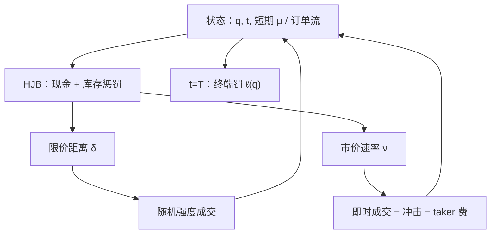

# Cartea-Jaimungal 执行

    
最优执行不必只靠连续的市价速率；限价单的随机成交、订单流的短期方向、以及对漂移的模糊厌恶，都会改写应当多重、应当多重挂的条件策略。

    <footer>—— 据 Cartea, Jaimungal and Penalva, Algorithmic and High-Frequency Trading, 2015；Cartea and Jaimungal 关于限价执行与订单流的系列论文</footer>

[Almgren–Chriss](/quant/almgren-chriss) 把母单收成一条确定性的交易速率，冲击是速率的函数，余量承担布朗风险。[Bertsimas–Lo](/quant/bertsimas-lo) 在离散时间用动态规划消化价格与量的信息，但动作仍接近「这一期吃多少」。Cartea 与 Jaimungal（及与 Penalva 的教科书）把执行放进限价簿的强度模型：你可以挂限价等待被扫，也可以发市价立即成交，状态包括库存、剩余时间、短期 alpha 或订单流不平衡，目标是现金加终端库存惩罚。结果不是一条事先画好的双曲正弦，而是条件于流的买卖距离与市价强度。本篇写这套随机控制与 AC 的差别、短期 alpha 如何进入 HJB，以及它仍不是可直接部署的撮合器。做市侧的近亲是 [GLFT](/quant/glft-market-making)；这里的典型问题是**单向清算或建仓**。

## 问题

要在 $T$ 内把库存从 $q_0$ 收到接近零。纯市价路径付即时价差与临时冲击，方差小。纯限价路径省价差，甚至赚 maker 回扣，但成交是随机的，临近 $T$ 可能被迫市价甩出剩余，缺口的尾部变肥。最优策略在两者之间切换：有利的短期漂移或对侧流涌来时多挂；不利时少挂、加快市价。Cartea–Jaimungal 要给出这套切换的一阶条件，而不是把 POV 的参与率再调一个常数。

状态因此必须超过 $(q,t)$。短期 alpha——可预测的中间价漂移，来自订单流、盘口不平衡或信号衰减——改变等待的期权价值。模糊厌恶（ambiguity aversion）则假设漂移的测度不唯一，策略对最坏测度优化，避免把一个点估计 alpha 当成确定的钱。没有这两项，强度模型会在毒性升高时仍然按无条件 $\lambda$ 挂单，直到库存被知情流打满。

### 限价是控制，市价是另一控制

记限价卖距离为 $\delta_t$，对应强度 $\lambda(\delta_t)$；市价卖速率为 $\nu_t$（或离散的一笔数量）。现金跳的大小不同：限价成交得到 $S+\delta$（再加减费用），市价成交得到 $S$ 减临时冲击。HJB 对 $\delta$ 与 $\nu$ 同时取极值。终端惩罚 $\ell(q_T)$ 保证 $T$ 时刻不想剩货。这与做市的双边控制同构，只是清算问题往往关掉买入侧，或把买入侧仅用于库存越过目标时的修正。

教科书里的指数强度同样是为了闭式。真实填成依赖队列位置、同价位深度与取消，见 [成交概率](/quant/fill-probability)。Cartea–Jaimungal 提供的是「限价与市价都是控制」这一架构，不是可估计的唯一 $\kappa$。

## 方法

**无 alpha 的基准。** 仅库存风险与终端罚时，限价距离随剩余库存与剩余时间收紧：货多、时少则 $\delta$ 变小（更积极），必要时 $\nu$ 升高。形状类似 AC 的前倾或后倾，但实现是随机成交路径，而不是一条 $x_t=\sinh(\cdot)$。期望成本可以与 AC 比较：限价选项降低期望冲击，增加缺口方差——这是另一条有效前沿，轴是「限价混合比例」而不只是「确定速率的 $\lambda_{\mathrm{risk}}$」。

**订单流与短期漂移。** 把中间价写成带漂移 $\mu_t$ 的扩散，$\mu_t$ 由可观测流驱动（例如净市价买入抬高 $\mu$）。价值函数多一个 $\mu$ 坐标。$\mu$ 对你有利（卖出清算时 $\mu\lt 0$）则多等待；不利则提前市价。这与存货偏度正交：即使 $q$ 不大，毒性流也能迫使你停止提供流动性。Cartea、Jaimungal 与 Penalva 把这类条件策略写成可计算的 ODE / PDE 系统，强调校准对象是流的预测而不是又一个冲击系数。

**模糊与模型误设。** 对 $\mu$ 做最坏测度，相当于在 HJB 里多一项对漂移的惩罚，策略更早使用市价、限价更保守。这是对「把回测里的短期 IC 当成确定 alpha」的纠正，与执行层的过拟合是同一担忧。

### 和 Almgren–Chriss、RL 的接口

AC 是确定速率加线性（或二次）冲击的均值—方差，适合把母单拆成时间表、再交给下层。Cartea–Jaimungal 是下层：在给定剩余量与流时选择挂还是吃。不要用 CJ 的 HJB 去替代组合层的风险预算，也不要用 AC 的双曲正弦去替代盘口上的订单类型。强化学习把同一状态—动作问题交给样本，见 [执行 RL](/quant/rl-execution)；CJ 给出可解释的基准与奖励应当含哪些项（现金、库存罚、冲击、alpha）。RL 若奖励只有 VWAP 偏离，会丢掉 CJ 里已经写清的库存与流。

短期 alpha 必须是点-in-time 的可交易预测。用同一笔母单的未来中间价当 $\mu$，HJB 会「预知」该快该慢，这是前视。流特征的滞后与清洗与信号研究同一套纪律。

## 机制

限价提供的是一个被扫的期权：你把可成交权交给市场，换取更好的价格，同时暴露于价格向不利方向扩散与逆向选择。市价买回这个期权。最优混合随期权价值变化：波动高、剩余时间短、流不利，期权价值下降，市价权重上升。库存惩罚使期权价值还依赖 $q$：货越多，越等不起。这与 AS/GLFT 做市的差别是目标不对称——清算者主要关心单向完成，做市者关心双边价差与库存回归。

冲击在 CJ 框架里可以同时出现在市价腿（临时冲击）与中间价（永久冲击或流的价格冲击）。永久项改变剩余库存的标记，使「快交易」部分内生化，类似 AC；但限价成交是否贡献永久冲击，取决于你是否认为自己的被动成交也揭示信息。模型选择会改变挂单积极性。Gatheral 的无动态套利约束在允许来回交易时仍应检查；纯单向清算、禁止买回，套利路径被关掉，约束变松。

### 费用与场所

Maker-taker 直接进入限价腿的现金跳，见 [maker-taker](/quant/maker-taker)。回扣提高 $\delta$ 的最优值（可以挂得更远仍有同等确定性等价），taker 费提高 $\nu$ 的成本，使策略更愿等待。场所路由成为额外控制：同一 $\delta$ 在不同费率与队列下对应不同强度。HJB 若只有一个场所，校准会把路由问题吸收进 $A,\kappa$，换场所即失效。

## 边界与工程取舍

连续时间、指数强度、可无成本改价，与真实 FIFO 簿有缺口。涨跌停、拍卖、T+1 可卖量把动作空间切开，HJB 要按机制分时段，不能一天一个 PDE。多资产清算的交叉冲击与对冲腿，使状态维度迅速上升，数值解需要低维因子或分解成本市价、alpha 限价。

不要把教科书图表上的光滑 $\delta(q,t)$ 当成生产挂单价。层与 tick、保护限价、最小数量会把连续 $\delta$ 量化。也不要把 CJ 的 alpha 项当成可以在全样本上拟合的日内动量：那会把执行模型变成又一次策略搜索，须走 [PBO](/quant/pbo) 与嵌套评估。模拟器里的填成必须对自己的量有弹性，否则限价「总是被扫」会高估限价腿。

Cartea–Jaimungal 不是延迟套利或抢队列的工程。公式不包含消息顺序与共同定位。把「条件于订单流的挂单」写成对客户流的歧视性报价，会进入另一套监管对象；本篇只讨论自营或代理母单在公开簿上的控制。

## 小结

- Cartea–Jaimungal 把执行写成限价强度与市价数量的随机控制，状态含库存、时间与短期流。
- 相对 Almgren–Chriss，路径是随机的，节省价差以缺口尾部为代价；alpha 与模糊厌恶改变挂/吃的切换。
- 短期漂移必须点-in-time；用未来价格当 $\mu$ 是前视。
- 费率、场所与队列进入强度与现金跳，不能吸收进一个与场所无关的 $\kappa$。
- 它是可解释的下层基准，不是生产撮合器，也不替代组合层风险预算。
- 出处：Cartea, Jaimungal and Penalva, *Algorithmic and High-Frequency Trading*, Cambridge, 2015；Cartea and Jaimungal 关于 optimal execution with limit orders、order flow 与 ambiguity 的论文。
