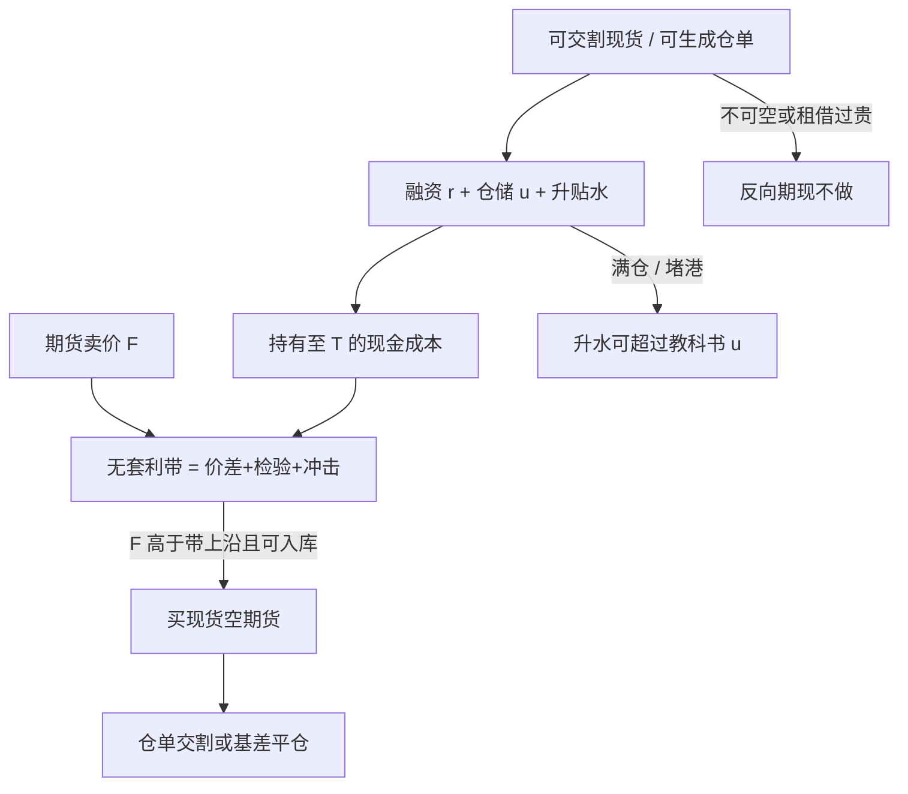

# 期现套利

买现货、入库、空对应期货，是把持有成本变成可检查的现金流；利润边界由仓储、融资、交割品质与地点决定，而不是由曲线看起来「太陡」决定。

<footer>—— Hull, Options, Futures, and Other Derivatives；仓储约束见 Working 的持有费理论</footer>

期现套利（cash-and-carry）在正向市场上的标准形态是：买入可交割现货、支付融资与仓储、卖出期货，到期用仓单交割或在基差收敛时平仓。反向期现（reverse cash-and-carry）是空现货、多期货，依赖借货或现货做空。Hull 把无套利关系写成现货与持有成本；Working 提醒持有费本身是库存的函数，库存紧时「应该有的升水」不会出现，因为现货有便利收益。商品上的期现比股指[指数套利](/quant/index-arb)更硬：现货有品质与地点、仓库有容量与升贴水、交割有通知与检验。Fama 与 French 检验仓储理论时，用的也是可观测基差与库存，而不是一条永远可锁的等式。把 contango 当成期现利润，忽略了你可能买不到交割品、或买到了却进不了指定仓库。

## 问题

理想关系是

$$
F_{t,T} \ge (S_t + U)\,e^{r(T-t)}
$$

一类不等式（离散仓储 $U$ 或连续 $u$ 只是会计），违反上界则买现货空期货；反向不等式在现货可空时触发反向期现。真实市场的 $S$ 必须是可交割规格在可交割地点的价格，不是价格指数。原油有不同品质与交货港，金属有不同品牌注册，农产品有蛋白、水分与产地升贴水。用指数现货去减期货得到的「套利空间」，常常是品质基差。第二层问题是仓储不是无限弹性：满仓时边际 $U$ 跳升，表面巨大的升水只是在描写「已经无处可存」。第三层是融资：$r$ 是商品贸易融资与保证金贷款，不是国债；压力期 $r$ 上升会让本已边缘的期现变成亏损，看起来像模型坏了，其实是资金腿。

Brennan 的仓储供给把库存与期望基差连在一起；Telser 对棉花与小麦的讨论说明商业库存行为会改变可套利的带。期现不是统计套利：没有到期交割或可替代的 EFP/仓单通道，基差不必回来。

### 现货腿不可复制时没有套利

反向期现要求能借到或卖空现货。许多商品现货市场没有干净的证券借贷，只有租借（lease）或回购式安排，费率就是便利收益的可交易版本。租借贵，说明 $y$ 高，曲线该贴水；此时强行按「期货低于现货所以买期货卖现货」会在租借腿上把利润付光。贵金属的 lease rate、铜的精炼与品牌注册、原油的船货与管道提名，都是现货腿的制度细节。没有这些，账上的期现只是方向性基差交易。

交割品必须同时满足期货合约的品质、地点与时间选择权。你在现货市场买到的便宜货，若不能生成仓单，对空头期货没有交割价值。套利规格应写成「可生成仓单的库存」，而不是「任何现货」。

## 方法

检查单。第一，确认可交割清单与升贴水表，计算每一种交割选择下的净持有成本，取真正能交的最便宜方案——商品版的 CTD 思维，国债上的严格版本见[最便宜可交割](/quant/ctd-cheapest)。第二，锁定仓储：库容、入库费、出库费、保险、损耗、以及升贴水是否在持有期内调整。第三，锁定融资与保证金：现货货款、期货初始与维持保证金、汇率若有。第四，把往返价差、检验与运输计进带的半宽。第五，只有当期货卖价高于「现货加全成本加半宽」才开正向期现，并假设仓库拒绝入库或检验失败的退出。

执行上，现货与期货很少能在同一毫秒锁定价差。贸易商用 EFP、场外基差合同把现货价与期货价写成同一谈判；交易所期现则面临现货成交与期货成交的时滞。部分成交时，未锁的一腿是方向性风险。容量由可入库吨数、可借货数量与交割月期货深度的最小者决定，不是由期货未平仓量决定。拥挤时，同一仓库、同一交割月被多家贸易商盯住，升水会在你入库完成前消失。

### 与指数期现、ETF 期现的差别

股指期现的现货是股票篮子，仓储接近借券与股利，见[指数套利](/quant/index-arb)。商品期现的仓储是物理的，失败模式是满仓、堵港、品质不合格。商品 ETF 若用期货复制，并不做现金加仓储；它做的是[展期收益](/quant/roll-yield)路径。用 ETF 价格当现货去套期货，会把 ETF 的展期与份额溢价写进基差，对象错了。正确的现货是仓单或可交割船货。

## 机制

正向期现的收敛机制是交割：到期空头提交仓单，多头付款收货，期现价差被合同强制对齐到交割规格（仍可能留下地点与品质的升贴水）。提前平仓的收敛来自其他套利资本与商业库存调整。Working 的机制解释为什么升水有上界也有时没有下界：高库存时持有费被期货升水补偿，否则存货会抛售；低库存时现货可以持续贵于期货，反向期现做不成，贴水持久。这正是 [Contango 与 Backwardation](/quant/contango-backwardation) 与仓储理论的交点。

资金与保证金把期现变成有追保的策略。现货价格大跌时，空头期货盈利，但现货存货减值、贷款人要求补抵押；现货大涨时，期货亏损要追加保证金，而存货尚未出售。两边都可能在「理论仍赚钱」时被资金踢出。这与国债基差交易相同，只是商品存货更难快速变现。Hull 对期货盯市的处理，在这里变成真实的现金流错配，细节见[保证金与盯市](/quant/futures-margin)。

### 破裂：满仓、挤仓、品质与地点

仓库满或注册仓单不足时，正向期现无法完成入库，升水可以超过教科书持有成本。挤仓时近月期货被拉离现货，空头期货的期现者被迫在期货上止损，现货未必能按期货涨幅出售——地点错了。品质检验失败使仓单作废，现货腿变成普通存货。交割月流动性向次近月迁移时，你用来对锁的合约可能不是流动性最好的那张，平仓滑点大于开仓时估算的半宽。监管或交易所可以改交割规则、停注册、调升贴水，收敛机制是或有的。

把历史 contango 的平均值当成期现的期望利润，忽略了仓储供给的状态。升水大的时候往往是库存高、马上要做的人也多，容量短、利润薄；升水小或贴水时，理论期现不该开，强开是在做空便利收益。

## 边界与工程取舍

不要用价格指数、不可交割现货或错误地点的报价算「现金加持有」。不要假设反向期现在农产品与能源上像股票一样可做。不要把跨期价差的利润算进期现：那是[跨期套利](/quant/calendar-spread-arb)，现货腿不同。成本必须含入库失败的期权式损失，而不是只含成功路径的仓储费。

会计上，存货按现货盯市、期货按交易所盯市，基差盈利在实现前是纸面的，审计与风险系统若只看期货腿会误报对冲有效性。税收与增值税、进出口配额会在某些市场把理论上的期现变成不可执行。报告应给出：可交割库存、库容利用率、融资利率、以及带外开仓后的实现交割成功率。成功率低时，策略是基差投机，应按方向性风险预算，而不是按套利风险预算。

Hull 的例题里仓储费是常数。商品实务里仓储费、升贴水与保险是阶梯函数，且在交割月窗口重定价。用常数 $u$ 校准全年的无套利带，会在收获后与取暖季系统性地错。

## 小结

- 期现套利把曲线升水变成买现货、入库、空期货的现金流；现货必须是可生成仓单的交割品。
- Working 的持有费与便利收益决定升水何时存在、贴水何时无法被反向期现抹平；Hull 给出无套利会计。
- 带的宽度含仓储阶梯、融资、检验、运输与保证金错配；满仓与挤仓是破裂模式。
- 容量由库容、借货与交割月深度的最小者决定；价格指数不是现货腿。
- 出处：Hull, *Options, Futures, and Other Derivatives*；Working, *AER*, 1949 与 *Journal of Farm Economics*, 1948；Brennan, *AER*, 1958；Telser, *JPE*, 1958；Fama and French, *Journal of Business*, 1987；Gorton, Hayashi and Rouwenhorst, *Review of Finance*, 2013。
