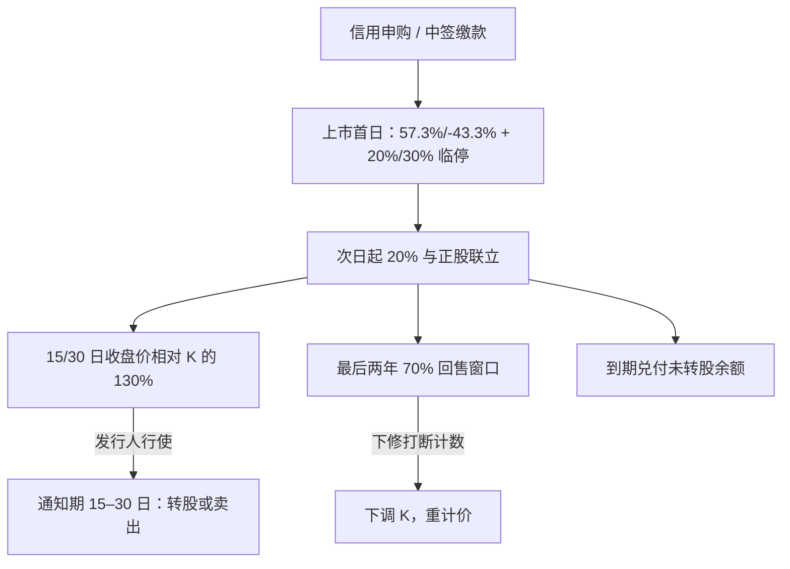

# 可转债打新与赎回

向不特定对象发行的可转债上市首日涨幅比例为百分之五十七点三、跌幅比例为百分之四十三点三，并实施百分之二十、百分之三十两档盘中临时停牌；次日起涨跌幅比例为百分之二十。有条件赎回与回售以募集说明书约定的计次窗口为准。

<footer>—— 《上海证券交易所可转换公司债券交易实施细则》；上市公司可转债募集说明书中的赎回与回售条款</footer>

可转债的「打新」是信用申购与中签缴款，不是预缴资金的无风险配售；赎回则是发行人在转股价值持续高于赎回价时，用通知期把持有人推向转股。二者都是条款与交易规则上的定价问题：申购中签得到的是带首日涨跌幅与临停约束的债券，赎回公告把有效到期压缩到十五至三十个交易日。本篇写申购机制、上市首日价格带、有条件赎回、回售与下修如何改写期权，不把中签率当成「稳赚不赔」的发行故事。与正股的日常联立见[转债与正股联立](/quant/cb-equity-link)，信用与赎回权的定价核见[可转债与信用混合](/quant/convertible-credit)。

## 问题

公开发行可转债实行信用申购：投资者在申购日按规则顶格或按额度申报，无需预缴全额保证金，中签后再缴款。中签率由网上发行规模与有效申购量决定，并受投资者适当性约束——开通转债交易权限通常要求申请前二十个交易日日均资产不低于十万元且具备二十四个月交易经验（以当时适当性细则为准）。中签却缴款失败会进入监管与券商的失信处理，下一次申购资格受损。因此「打新」的期望收益是

$$
\mathbb{E}[\text{中签份额}\times (C_{\mathrm{list}}-100)_+] - \text{缴款占用与失败成本},
$$

其中 $C_{\mathrm{list}}$ 受上市首日 57.3% / −43.3% 的硬顶，不是无限上涨的彩票。把历史首日涨幅的无条件均值当成未来期望，忽略了正股质地、条款（下修空间、评级）、发行规模与适当性实施后的中签率变化。

赎回是发行人的美式权利，不是到期兑付。典型有条件赎回：转股期内，正股在任意连续三十个交易日中至少十五个交易日的收盘价不低于当期转股价的 130%，发行人有权按面值加当期应计利息赎回未转股余额。触发后须公告是否行使；一旦行使，赎回条件触发日与赎回日的间隔不少于十五个交易日且不超过三十个交易日（以交易所与募集说明书为准）。通知期内持有人仍可转股或卖出。赎回价远低于此时的平价，理性持有人转股或卖出，剩余规模在赎回登记日附近收敛到零。把「强赎」理解成发行人按 100 元买回高价券，是把强制转股写成了现金收购。

### 上市首日价格带与临停

首日以前一日（发行价）为前收盘，涨跌幅 57.3% 与 43.3%，盘中成交价相对发行价首次涨跌达 20% 停牌 30 分钟，达 30% 停牌至 14:57，跨越 14:57 则于 14:57 复牌再走收盘集合。次日起 20% 日限，不再走首日临停。首日定价因此是带两道冷却的受限拍卖，而不是连续的期权结算。中签持有人若把期望建立在「开盘直接封 57.3%」，会在 20% 临停复牌后的回撤上把纸面利润还回去。最后交易日证券简称加「Z」，提示到期或赎回前的最后撮合，流动性与溢价行为与存续期中段不同。

信用申购取消预缴，降低了资金门槛，也提高了无效申购与缴款违约的可能。期望收益必须扣掉中签后的缴款失败惩罚与资金在缴款到上市之间的占用，不能只用「中签率 × 平均首日涨幅」。

## 方法

申购估值应分三步。第一，用正股价格、转股价、评级与下修条款估计上市后的合理全价区间，而不是用历史打新均值。第二，把首日合法价格带与临停当成执行约束，模拟开盘集合与 20%/30% 冷却后的可成交路径。第三，乘以中签率及缴款成功率，得到每股（每张）期望，再与资金占用天数比较。适当性实施后个人投资者数量变化会改变中签率，样本须从规则生效日切开。

赎回估值把通知期写成强制转股期权。一旦发行人公告行使，转债的有效到期变为赎回日，$C$ 应向 $\max(P^{\mathrm{parity}},C_{\mathrm{call}})$ 收敛，且 $C_{\mathrm{call}}\approx 100$。对冲上，delta 升向转股比例，正股供给在转股登记后增加，稀释落在公告后的正股路径里。未公告但已进入 15/30 计数的阶段，市场会给一个「发行人是否行使」的二元树：同一发行人可能为了保债或等待更高转股比例而暂不赎回，历史行使频率不能当成法定义务。

### 回售、下修与到期兑付

有条件回售通常在最后两个计息年度：正股连续三十个交易日收盘价低于转股价的 70%，持有人有权按面值加应计利息回售。下修正是发行人用来打断这条计数的工具：下调转股价后，回售窗口重新起算，平价被抬高，回售被推远。下修须经股东大会等程序，持有人回避规则以募集说明书为准。到期未转股则按面值加最后一期利息兑付（或条款约定的到期赎回价）。三条退出——强赎转股、回售兑现、到期兑付——对应正股高、正股低且发行人未下修、以及时间耗尽。定价必须同时打开三条边界，不能只校准首日涨幅。

## 机制

打新的供给是发行规模，需求是适当性过滤后的有效申购。中签率低时，单户期望张数可以小于 1，方差来自中签伯努利而不是转债波动。上市后首日的买家包含未中签却看好条款的资金，价格发现在临停里分段完成。此后转债进入与正股联立的日常交易，打新的增量信息消失。

强赎公告把博弈从「会不会赎回」切换到「通知期内正股是否掉回转股价附近」。若正股大跌，持有人可能宁愿被赎回也不转股，发行人得到的转股稀释小于预期，转债价格会向赎回价而不是平价收敛。这是公告后常见的波动来源，不是「条款被破坏」。下修公告则使 $K$ 下降、平价上升，转债相对旧平价的溢价跳降，相对新平价重新定价。用旧 $K$ 去算公告日溢价变化，会把一次条款重估写成崩盘。

赎回通知期不少于十五个交易日，是持有人转股的操作窗口，也是正股与转债的事件窗口。窗口内两边往往放量。把公告日单日收益当成全部事件收益，会漏掉通知期内向平价收敛的剩余路径。

### 与美式赎回权模型的接口

理论模型里的最优赎回发生在转股价值足够高于赎回价、且发行人仍能承受转股稀释的区域。监管与募集说明书把「足够高」写成 130% 与 15/30 计次，把通知期写成 15–30 个交易日，使连续时间的最优停时变成离散计次加强制窗口。校准 A 股转债赎回，应把这套管制定成障碍条件，而不是用无约束的美式赎回去拟合。信用差的发行人可能满足计次却选择不赎回，模型需要「行使强度」而不是 100% 行使假设。

## 边界与工程取舍

不要把可转债打新写成无风险收益或发行套利教程。不要忽略首日涨跌幅与临停对上限的截断。不要在赎回公告后仍用原剩余年限做债底久期。不要把下修当成确定性的持有人福利——下修须表决，失败则回售风险上升。定向可转债、可交换债的申购与赎回不适用同一套公开发行细则。

容量上，网上打新的期望张数随发行规模与账户数变化，不能线性外推。强赎窗口的对冲容量受正股涨跌停与转债 20% 日限约束，事件日两边可能同时封板。报告应分开：申购期望（含中签与首日带）、存续期赎回/回售/下修事件收益、以及最后交易日「Z」标识后的收敛误差。

到期赎回与有条件赎回不是同一现金流。前者是债券到期兑付，后者是发行人在 130% 计次满足后的选择权。用「赎回」一个词覆盖两者，会把到期债底写成强赎冲击。

## 小结

- 打新是信用申购加中签缴款，期望收益须扣中签率、缴款失败与首日价格带，不是无风险配售。
- 上市首日 57.3% / −43.3% 与 20%、30% 临停限制了价格发现路径。
- 有条件赎回通过 130% 与 15/30 计次触发，通知期内以强制转股为主，赎回价不是持有人的最优现金流。
- 回售与下修互为对手：下修打断 70% 计数并改写平价。
- 到期兑付、强赎转股、回售是三条不同边界，须同时进入条款日历。
- 出处：沪深交易所可转债交易实施细则（含 2022 年 8 月施行及后续修订）；《上市公司证券发行注册管理办法》关于转股价格修正与赎回的规定；具体计次与通知期以各券募集说明书为准。
