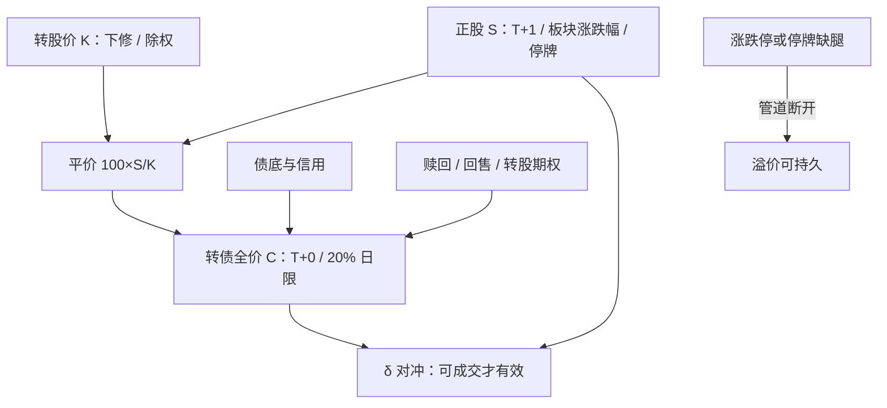

# 转债与正股联立

向不特定对象发行的可转债采用匹配成交，实行当日回转交易，并以全价申报；上市次日起涨跌幅比例为百分之二十。正股仍受股票交易规则约束。二者不是同一交易对象。

<footer>—— 《上海证券交易所可转换公司债券交易实施细则》（2025年3月修订）；《深圳证券交易所可转换公司债券交易实施细则》</footer>

[上一课](/quant/star-chinext)把科创板与创业板的 20% 走廊、适当性与申报单位写成板块标签，回测须按生效日切换。缺口是同一发行人还有一张可当日回转的转债：正股 T+1、两套涨跌停、停牌不同步，转债不是正股的固定杠杆。联立要回答的是平价、溢价与可成交的 $S$、$C$ 两个状态，哪一段是可对冲的 delta。本课写交易所规则下的联立交易，不重写两板适当性。定价核见 [可转债与信用混合](/quant/convertible-credit)。

## 问题

转股价值（平价）按面值 100 元计为

$$
P^{\mathrm{parity}}_t = 100 \times \frac{S_t}{K_t},
$$

其中 $S_t$ 为正股价格，$K_t$ 为当期转股价格。转股溢价率 $\pi_t = C_t / P^{\mathrm{parity}}_t - 1$，$C_t$ 为转债全价。理论下限是债底与平价的较大者再扣掉提前赎回等发行人期权；市场报价在此附近波动，但波动的幅度被两套涨跌幅切开。主板正股日涨跌幅 10%，科创板与创业板 20%；转债次日起 20%。正股封涨停时，转债仍可在自身 20% 限制内继续交易，溢价会被「正股买不到、转债买得到」抬高。反过来，正股跌停、转债未跌停，溢价被压缩甚至转负，并不等于无风险回归：你未必能同时成交两边。

信用账户与普通账户的约束也不对称。正股融资买入受保证金与标的名单限制，转债本身多数不可融资融券，却可以当日回转。于是同一发行人的股权暴露，在股票账户和转债账户里的持有成本、冲击与可逆性都不同。联立系统必须把「可成交的 $S$」和「可成交的 $C$」当成两个状态，而不是一个价格加一个固定乘数。

### 平价、溢价与不可同步的涨跌停

深度实值（$\pi$ 接近 0 甚至为负）时，转债近似 $n$ 份正股加少量债底，delta 接近转股比例；虚值时转债更像信用债加虚值权证，对 $S$ 的弹性小，对利率与信用敏感。问题出在中间带：平价 80–130 元、溢价 5%–25% 的票，表面「跟股」，一旦正股触及涨跌停或盘中停牌，转债的连续路径断开。交易所对转债上市首日另设 57.3% / −43.3% 的幅度及 20%、30% 两档盘中临时停牌，次日起才是 20% 日限；正股没有这套债券临停。用同一分钟的 $C$ 与 $S$ 去回归 hedge ratio，会把停牌分钟的零成交写成稳定相关。

转债以全价申报，应计利息含在报价里；正股除权除息会同时触发转股价调整。用未复权正股对全价转债做回归，会把一次派息写成「溢价跳变」。联立必须对齐除权日与转股价修正公告，而不是对齐日历日。

## 方法

可执行的联立从三张表出发。第一张是条款日历：转股期起算（通常发行结束六个月后）、有条件赎回与回售的计数窗口、下修股东大会、到期兑付。第二张是交易约束：转债 10 张面额为常见申报单位、当日回转、最后交易日证券简称加「Z」标识；正股 T+1、涨跌停、是否融资融券标的、是否停牌。第三张是对冲比率：用当日可成交的报价而不是收盘指数，

$$
\delta_t \approx \frac{\partial C}{\partial S} \approx \frac{100}{K_t}\cdot \Delta_{\mathrm{opt}}(S_t,K_t,\sigma,T_{\mathrm{eff}}),
$$

其中有效到期 $T_{\mathrm{eff}}$ 在强赎临近时被压缩到通知期，而不是债券剩余年限。实务上常用「溢价对冲」：卖 $\delta$ 份正股、买 1 张转债，或反向做折价。只有当两边都能成交、且转股或赎回路径仍然开着时，这个 $\delta$ 才是风险对冲而不是方向性残差。

现金流入也不对称。转股申报后，转债被冻结，股票通常下一交易日才记入账户，再受 T+1 约束；卖出转债是当日回转。多转债空正股的盒子在转股执行日会露出一天的裸空或裸多。模型若假设连续对冲、瞬时转股，会低估这一天的缺口。

### 停牌、涨停与篮子里的单腿

正股因重大事项停牌时，转债未必同步停牌。此时平价用的是停牌前的 $S$，IOPV 式的「理论价值」是陈旧的。继续按旧 $\delta$ 去调正股腿，等于在交易一个停着的标的。正股涨停买不到，空头对冲无法加仓，转债若仍在涨，账面 delta 会被动升高。处理是：把不可成交的腿从可交易集合里拿掉，把剩余暴露记为方向性风险，而不是继续把溢价均值回归当成统计套利。这与[指数套利](/quant/index-arb)里涨跌停缺腿是同一类约束，只是这里缺的是单只正股而不是一揽子。

## 机制

联立的传导链是：正股成交价 → 平价 → 转债报价围绕平价加期权与信用溢价 → 若溢价过高，持有人可转股或卖出转债买正股；若折价过大，可买转债卖正股（融券或已有底仓）。闭环依赖三条管道同时通：正股可买可卖、转债可买可卖、转股通道开着。任意一条被涨跌停、停牌、转股期未到或最后交易日临近切断，溢价就可以停在「看起来不合理」的水平。

强赎计数会改变有效到期。当正股收盘价在转股价 130% 以上的天数进入「三十日中十五日」窗口，市场会提前把 $T_{\mathrm{eff}}$ 缩短，转债向平价收敛，delta 上升。下修预期则相反：下调 $K$ 提高平价，转债相对旧平价的溢价会跳降，但那是条款重定价，不是正股涨了。把下修公告日的溢价变化归因于股票因子，是把发行人期权算进了股票 alpha。

转债当日回转并不等于「免费的 T+0 股票」。回转的是债券本身；要换成股票，仍须走转股与股份上市。用转债当正股的日内轮盘，赚的是债券微观结构，赔的是溢价、强赎与信用跳变，三者不是同一量纲。

### 信用、股性与对冲误差的分解

价格变化可以拆成：正股驱动的平价变动、隐含波动与条款触发引起的期权价值变动、信用利差引起的债底变动、以及涨跌停与流动性引起的基差。股性区间第一项主导，可以用正股对冲；债性区间第三项主导，正股对冲会在下跌时不够、在反弹时过量。中间区三项同时动，回归出来的 $\delta$ 不稳定。工程上应按平价分桶估计 $\delta$，并在强赎、回售、下修窗口单独切样本，而不是全样本一条 OLS。

## 边界与工程取舍

不要用收盘价溢价的日频均值回归去暗示日内可锁利润。不要在正股停牌时仍把转债当对冲工具加仓。不要忽略转股冻结与 T+1 造成的结算日缺口。不要把科创板、创业板正股 20% 涨跌幅与转债 20% 当成「两边一样」——开盘集合、有效申报范围、临时停牌触发并不相同。投资者适当性、最后交易日「Z」标识、异常波动停牌核查，都会突然切断可交易性。

容量受转债本身的成交与正股借券（若做空）约束。大票、高平价、临近强赎的转债表面上最好跟股，也最容易在公告日出现跳空。报告应分开：可同时成交样本上的对冲残差、涨跌停样本上的单腿残差、条款公告日的事件残差。把三者平均成一个「转债 beta」，会在最需要风控的日子失效。

债底不是同发行人公募债的市价拷贝。赎回、回售与下修改变发行人最优行为，即使当前深度虚值，条款仍可能被正股路径点亮。用一张普通信用债去减得到「期权价值」，会把条款凸性误标成股票弹性。

## 小结

- 转债与正股联立的状态是可成交价格、条款日历与两套涨跌停，而不是一个固定杠杆。
- 平价 $100\times S/K$ 是锚；溢价含期权、信用与微观结构，只有两边可同时成交时才可对冲。
- 转债当日回转、正股 T+1，转股还有冻结与股份到账时滞，连续对冲假设不成立。
- 强赎窗口压缩有效到期、下修改写 $K$，都会让历史 $\delta$ 失效。
- 正股停牌或涨跌停时，应把剩余腿记为方向性风险，而不是加大溢价回归。
- 出处：《上海证券交易所可转换公司债券交易实施细则》（2025年3月修订）；深圳证券交易所对应细则；转股价格修正与赎回、回售以募集说明书及《上市公司证券发行注册管理办法》相关条款为准；定价理论见 [可转债与信用混合](/quant/convertible-credit)。
