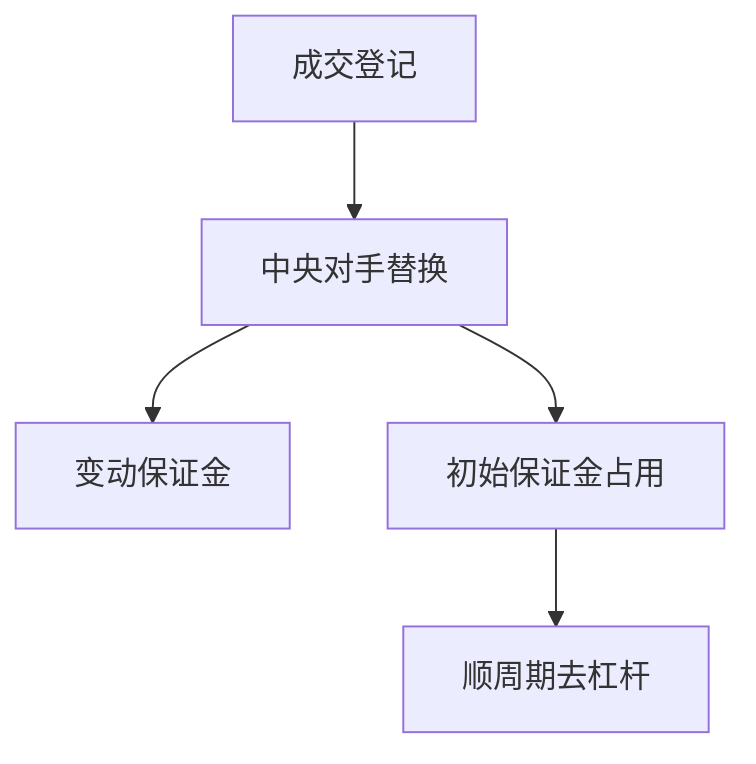

# 中央对手清算

CCP 把双边对手方换成中央对手：交易成功后，你面对清算所，不是面对原来的买方或卖方。保证金与违约基金是为了让这个替换可信，不是为了消灭价格风险。

<footer>—— 据 Duffie, Singh 等对 CCP 与担保品的讨论；ISDA 与 CPMI-IOSCO 对中央清算的原则整理</footer>

上一课[回购与抵押品](/quant/repo-collateral)在双边或三方回购里谈 haircut。标准化衍生品与部分回购进入中央对手清算（CCP）后，保证金规则由清算所统一，违约时走违约基金与分层损失分摊。本课补回测里常被忽略的一层：成交之后还有清算会员资格、变动保证金与附加保证金。不重写 haircut 定义，不把结算周期提前讲完。

## 问题

许多回测在「成交」处停止，好像券和现金已经换手。对清算产品，成交只是向 CCP 登记：你每日付变动保证金（mark-to-market），并缴初始保证金。波动上升时 CCP 上调初始保证金，效果与回购 haircut 上调相同——杠杆被抽走——但触发方是清算所规则，不是双边谈判。缺口是把 CCP 保证金日程写进资金状态机，否则期货、清算 CDS、清算利率互换的危机路径又是满仓纸面。

ISDA 文档区分清算与非清算：非清算走双边 CSA 抵押，规则更散。回测不得把清算产品当成无抵押 OTC。

### 中央对手不是把风险送出世界

CCP 消灭的是原对手方违约对你的直接暴露，换成清算所违约与互助化损失的尾部。会员违约时，先用该会员保证金，再违约基金，再可能向存续会员分摊。把 CCP 当成零对手方风险，会在压力情景里漏掉保证金骤增与分摊。本课要的是资金占用，不是评级故事。

Duffie 强调合格抵押品与保证金顺周期：压力中大家同时需要现金去缴保证金，融资流动性更紧。这与 Brunnermeier–Pedersen 是同一螺旋的清算所版本。

## 方法

对清算头寸每日计算：变动保证金现金流、初始保证金占用、可能的日内追加。占用从可投资现金里扣除，与股票维持保证金并列，不可互相替代（期货保证金不能拿去当股票维持）。CCP 规则变更按公告生效日进入，$t$ 日不得使用 $t$ 之后才提高的保证金参数——又一次 PIT。没有会员资格或超过限额的账户，头寸规模要被截断，不能按交易所全体持仓限额当自己的限额。

变动保证金是现金流，不是估值调整。期货多头盈利若尚未到账、股票腿保证金却要当日现金，账户仍可能被强平。回测把 VM 与 IM 分列：VM 进现金流水，IM 进占用。清算所上调 IM 从公告生效日起，不得在压力月用「事后知道会调」的参数提前去杠杆来美化路径。

## 机制

变动保证金把价格变化变成当日现金，减少未实现盈亏堆积，但也制造现金流波动：盈利未到账、亏损当日付。策略若在事件日两侧持有期货对冲，可能因 VM 在跳空日被抽干现金，现货腿还在。这是缺口风险在清算产品上的日常化。后课结算周期处理的是证券交收日；CCP 保证金是每个营业日甚至日内，两者时钟不同。

不要在此进入期权定价或限价簿。CCP 只改资金与对手方结构；行权交割是后面日历课。

清算头寸日终扣初始保证金、日内或日终结算变动保证金。IM 参数按清算所当时公告，危机中的上调从生效日开始。期货与股票保证金分户，不可把期货账户盈余自动当成股票维持现金，除非你的托管规则真的允许且写进回测。没有清算会员通道的账户，规模按经纪商限额截断，不得用市场持仓限额当自己的容量。

## 边界

不抄各家清算所手册，不估计违约基金最优规模。下一课[结算周期](/quant/settlement-cycle)转向证券与资金的交收日。后课默认：清算产品占用 CCP 保证金且按当时参数；成交 ≠ 资金已自由。

后课结算周期是现货交收日；CCP 是每个营业日甚至日内的现金。两条时钟在危机里同时要钱。本课禁止把清算产品当成成交即结束。IM 参数 PIT，会员限额截断规模。变动保证金把期货对冲的「账面对冲」变成现金流对冲，现金不够时现货腿仍在。

后课默认清算产品占用当时 CCP 保证金；成交不等于资金已自由，VM 与 IM 分列记账。

合格抵押品清单收紧时，用来缴 IM 的券可能突然不合格，必须换成现金或其他券，这是 haircut 之外的又一次抽流动性。回测把合格清单当作时间序列，不得用今日清单回填压力月。

## 小结

- CCP 替换对手方，用保证金与违约基金支撑替换。
- 变动保证金是每日现金；初始保证金是占用。
- 保证金上调在压力中抽杠杆，必须按公告日 PIT。
- 清算产品不得按无抵押 OTC 回测。
- 中央对手不是零风险，而是互助化尾部与顺周期占用。
- 出处：Duffie 等对 CCP；ISDA；CPMI-IOSCO 清算原则。
