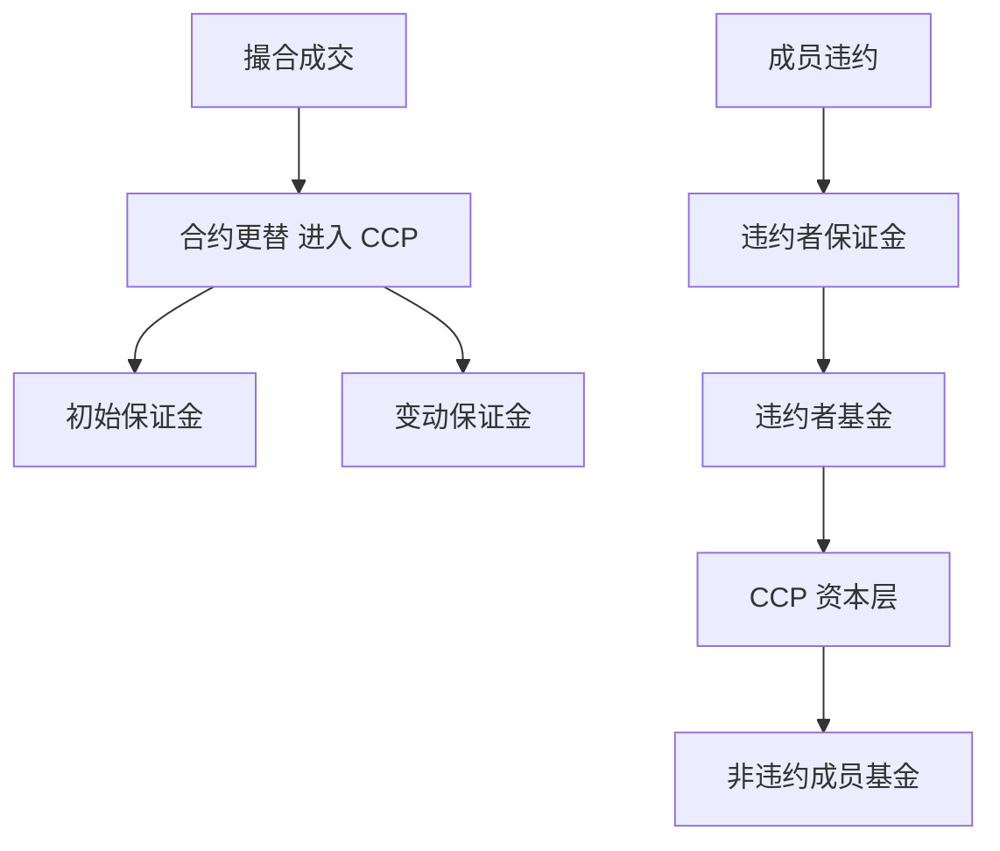

# 中央对手方与违约瀑布

成交一旦进入中央对手方，你的对手变成 CCP：它用保证金、违约基金与瀑布规则吸收成员违约。瀑布保护的是系统，不是你的策略夏普。

<footer>—— CPSS-IOSCO, Principles for Financial Market Infrastructures, 2012；Duffie and Zhu, Does a Central Clearing Counterparty Reduce Counterparty Risk?, RFS, 2011；对照各 CCP 公开的违约管理文件</footer>

[上一课](/quant/exchange-outages)把「成交是否发生」停在引擎与对账。本课的缺口是**成交之后的对手方是谁**。中央对手方（CCP）通过合约更替（novation）成为每笔已接受成交的买方之卖方、卖方之买方。CPSS-IOSCO《金融市场基础设施原则》（PFMI）把保证金、违约基金、压力测试写成国际标准。Duffie 与 Zhu（2011）问 CCP 是否真降低对手方风险——答案取决于净额、分割与是否把风险集中到少数成员。后课结算失败是瀑布尚未触发时的日常摩擦。

## 问题

双边 OTC 下，你跟踪每个对手的信用。集中清算后，你跟踪：初始保证金、变动保证金、违约基金贡献、以及「若某成员违约，损失按什么顺序吃」。瀑布通常自上而下：违约者自己的保证金 → 其违约基金 → CCP 资本的一部分 → 非违约成员违约基金 → 可能的评估权（assessment）与变现工具。问题是策略容量与杠杆受这套水位约束：保证金上调会强制减仓，与 alpha 无关。把期货当「无对手方风险」忽略了成员资格、分仓与连带。

净额是 CCP 的微观基础：同一成员、同一合约的多空轧差后再收保证金。跨合约组合保证金（SPAN 一类）进一步按情景收。净额降低总量，但把风险从「许多双边暴露」改成「对单一 CCP 的集中暴露」。Duffie–Zhu 指出：多个 CCP 分割同一经济风险时，净额效率下降，总抵押可能上升。研究跨币种、跨所对冲，必须问两腿是否在同一 CCP 净额池。

### 变动保证金是日内流动性

盯市亏损通过变动保证金（VM）当日或盘中划转。这与[股指期货保证金](/quant/cn-index-fut-basis)在 A 股的实现同构：方向对称的现金抽血。策略在压力日的约束往往是 VM 而不是初始保证金——现金调拨失败会把未违约账户拖进运营违约。瀑布是极端；VM 是日常。回测只扣初始保证金、忽略 VM 路径，会低估杠杆策略的爆仓概率。

隔离（segregation）决定违约时客户资产是否被用来填其他客户的坑。规则因司法辖区与账户类型而异。研究「CCP 安全」必须落到账户层级，不能停在「有中央对手方」一句。

## 方法

把清算状态写入持仓对象：`ccp`、账户类型（客户/自营）、初始保证金、VM、违约基金预估。压力测试用 CCP 公开的情景或历史压力日（2015 股指、2020 国债、2022 金属），看 VM 路径是否打穿备付。跨所对冲：若两腿不同 CCP，保证金是两套，基差风险不在组合净额里。成员违约不是你的回测默认路径，但「保证金上调 50%」是可观测的政策路径，应进情景。

违约管理拍卖：CCP 把违约组合拍卖给幸存成员。价格可以远离模型中点，幸存做市商的资本被临时占用。这不是你的策略能「优化」的对象；它解释为何压力日流动性供给收缩——成员在为瀑布预留资金。

### 与撮合核的边界

核保证成交事实；CCP 保证（在规则内）清算事实。错误成交 bust 发生在两者之间的窗口，可能改变是否进入 novation。工程上成交回报 ≠ 终局；终局以清算确认为准。量化库存应有 `matched / cleared / settled` 三态，与[美国 T+1](/quant/us-t1-settlement) 的交收钟分开但可对齐。

## 机制

novation 把双边信用换成对 CCP 的信用加上成员间的互助。互助通过违约基金产生关联：你从未交易过的成员违约，也能抽走你的基金贡献。这是系统性保险费。瀑布越深，保险越厚，成员的或有杠杆越大。监管要求 Cover-2 一类压力（同时倒两家最大成员）决定基金规模；规模随波动调整，于是「市场中性」组合仍会在保证金周期上被去杠杆。

A 股期货的 CCP 是中金所等期货交易所清算；股票竞价经中国结算。股票与期货的保证金、净额、违约处置不是同一瀑布。跨市场中性必须分列两套清算约束，见后课中性策略。

## 边界

不提供利用客户保证金挪用、或在违约拍卖中操纵价格的方法。瀑布细节以各 CCP 现行规则为准，本课只给结构。双边清算仍占部分 OTC 市场；不要把所有衍生品都写成已集中清算。

## 小结

- CCP 通过 novation 与净额改变对手方，同时集中风险并创造成员互助。
- 日常约束是变动保证金路径；极端约束是瀑布与评估权。
- 跨 CCP 对冲没有组合净额；股票与期货清算机构不同。
- 出处：CPSS-IOSCO PFMI, 2012；Duffie and Zhu, *RFS*, 2011。
