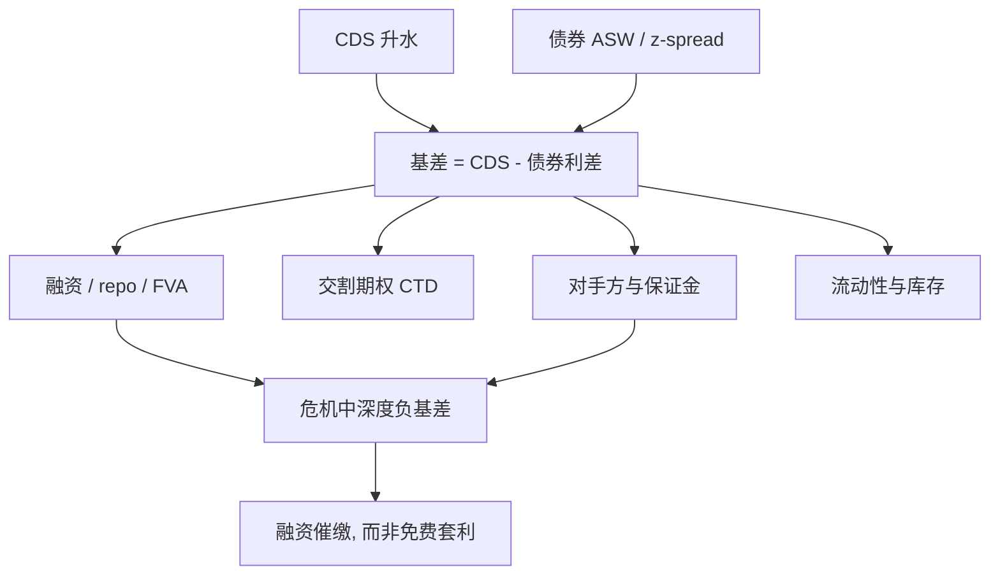

# CDS-债券基差

    
同一名字的 CDS 升水与现金债信用利差应当大致对齐，却经常不对齐：基差衡量的是两份合约在融资、交割、对手方与流动性上的差别，而不是定价公式算错了。

    <footer>—— 对照 Duffie, Credit Swap Valuation, 1999；以及危机期间负基差的市场实践</footer>

把 [CDS 升水](/quant/cds-pricing) 减现金债的信用利差，得到 CDS–债券基差。正基差表示保护相对贵、债券相对贵不那么多；负基差表示债券便宜、买债同时买保护可以「锁定」正利差。教科书里无摩擦时基差应接近零（再扣掉一些应计与曲线细节）。2008 年前后，大量投资级名字的基差深度为负，负基差交易却无法无风险地收割——融资消失、回购与 CTD、对手方风险同时炸开。本篇写基差怎么定义、负基差交易的现金流，以及哪些因子会让「同一信用」的两份合约分叉。

## 问题

现金债的信用利差有多套：z-spread、资产互换利差（ASW）、期权调整利差。CDS 有平价升水与标准票息下的升水。常用的 par-par 基差是 CDS 平价升水减资产互换利差；也有人用 z-spread。到期、货币、债项优先级必须对齐，否则比较的是两个不同的信用包。可交割篮子里往往有多只债，CDS 保护买到的是篮子里最便宜的那只，债券头寸却是特定 ISIN。

问题是解释残差，而不是强迫两个数字相等。即使强度模型对 CDS 与公司债用同一 $\lambda$，债券价格还含融资（repo / 无风险贴现之外的资金）、税收、嵌入期权与流动性。基差是这些摩擦的市场价格。研究与交易若把基差当套利后的零，会把融资危机读成模型失效，或把模型噪声读成可交易边缘。

### 负基差不是免费的信用中性

经典负基差：买入折价或平价附近的债券，同时买入同等名义、相近到期的 CDS。若持有到期且名字违约，CDS 补偿债券的信用损失；若名字生存，债券的利差收入超过 CDS 费用，看起来是正的「无信用」carry。缺的是：买入债券要融资，融资利率在压力里飙升；CDS 有对手方与保证金；债券可能被召回、被降级踢出指数、或在 CTD 意义下并不是保护所对的那只。2008 年许多负基差账户死于融资与盯市，而不是死于参考实体违约。

合成多头（卖 CDS）对现金多头（买债）也有基差。正基差时，卖保护、做空债券在教科书上对称，但做空公司债的借券成本与可获得性往往比回购融资更差，所以正基差的「反向交易」更难规模化。

## 方法

定义要先固定利差口径。资产互换把债券换成浮动加利差，与 CDS 的非资金、季付形式更接近，故 ASW 基差常用。计算步骤：取可交割优先债（或最便宜一只）的全价，剥离利率得到 ASW 或 z-spread，再减同到期 CDS 升水（注意符号约定：有的系统报债券减 CDS）。曲线插值、工作日与回收假设必须与 CDS 定价器一致，否则基差里会混进几个基点的惯例差。

把基差分解成可命名的块，比报一个数有用：（1）融资：债券的 repo 特殊与无抵押融资超出 OIS 的部分；（2）交割期权：CDS 的 CTD 价值，折价债越多、期权越贵，CDS 升水应更高，基差更正；（3）对手方与保证金：无抵押 CDS 含 CVA/FVA，有 CSA 的双边与清算后不同；（4）流动性与库存：单名 CDS 买卖价差、债券深度；（5）重组与契约：旧重组条款扩大可交割集合。回收假设若两边不一致，基差会被人为平移，见 [回收率假设](/quant/recovery-assumption)。

### 从单名到指数的基差

指数 CDS（CDX / iTraxx）相对一篮子现金债还有一层：[指数报价](/quant/cdx-vs-single) 对单名内在价值的偏离（skew），以及指数与单名的流动性差。用指数对冲一篮子债券，基差里会留下构成权重、滚动与单名残差。危机里指数往往比单名更容易交易，负基差会先表现在指数对 ETF 或对一篮子现金上，再传导到单名。

## 机制

无摩擦时，买入债券并买入 CDS 近似一个「违约时回收面值、生存时收回本金」的包装，其超额收益应接近融资利率。基差非零，是因为包装并不完美。融资腿把利率风险与信用风险拆不开：资金压力时，信用看起来变便宜的债券其实是融资变贵。CTD 让保护买方在违约后选择最便宜的债，等价于卖方在卖一份期权，CDS 升水含期权费，现金债没有。对手方风险让「买保护」在你最需要它时变弱——AIG 与单名保护的故事是对手方，不是参考实体。

盯市机制放大融资约束。基差走阔时，即使信用没违约，CDS 与债券的相对价值变动也会催缴保证金；债券融资的 haircut 同时上升。两条催缴同向，把名义上「信用中性」的账簿变成流动性漏洞。这与 Brunnermeier 描述的螺旋是同一类对象，只是发生在基差账户上。

违约后的基差交易并不自动关闭成无风险：拍卖回收、交割失败、债券应计与 CDS 应计的日计数都可能留下残渣。把回测写成「违约则基差收敛到零」会高估历史夏普。

### 风险中性强度对齐之后仍会剩残差

用同一 $\lambda$ 给 CDS 与债券定价，再把债券侧加一个便利收益或融资利差，是结构化解释基差的标准做法。残差若仍随名字、评级、是否 on-the-run 变化，说明流动性与契约没有被一个利差因子吸干。不要把残差全部归因于「CDS 定价器」：更多时候是债券选用了错误的基准债、或忽略了嵌入赎回。

## 边界与工程取舍

不要在没有稳定融资承诺时把深度负基差当套利。不要用主权美元债与本币债的利差去减本币报价的主权 CDS，而不处理货币与重建条款，见 [主权 CDS](/quant/sovereign-cds)。不要把可转债的信用利差直接与优先债 CDS 比，股权期权会污染利差。高收益的现金价格远离面值时，par-par 基差的经济含义变差，应改用对久期或对先行预付的度量。

数据上，债券与 CDS 的报价时点经常不同步，日终基差序列含大量微观结构噪声。交易决策应用可成交双边价，研究可用中价但要声明。会计与资本：合成对冲未必被承认为风险转移，负基差的「锁定利差」不一定降低资本。工程上应把可交割清单、融资 haircut、清算状态做成与定价器相连的主数据，否则风险系统里的基差和前台不是同一个数。

「买便宜的、对冲贵的」在信用里经常是在买融资与流动性。把基差因子放进信用风险模型当 alpha，而不把杠杆与融资期限写进回测，是在用隐藏的流动性溢价冒充违约时机选择。

## 小结

- CDS–债券基差是两份不同合约的价差：非资金保护对融资后的现金信用，而不是同一公式的两个输出。
- 口径必须对齐到期、币种、优先级与利差定义；CTD 使 CDS 对着篮子、债券对着单只 ISIN。
- 负基差交易在无摩擦时有正 carry，真实约束是融资、保证金、对手方与交割残渣；2008 年是这些约束同时收紧的样本。
- 分解基差比把残差当定价错误更有用；指数对冲还会叠上 skew 与滚动。
- 出处：Duffie, *Credit Swap Valuation*, Financial Analysts Journal, 1999；Duffie and Singleton, *Credit Risk*, 2003；基差交易与危机中的融资约束见当时市场实践及 Brunnermeier 对流动性螺旋的叙述。
