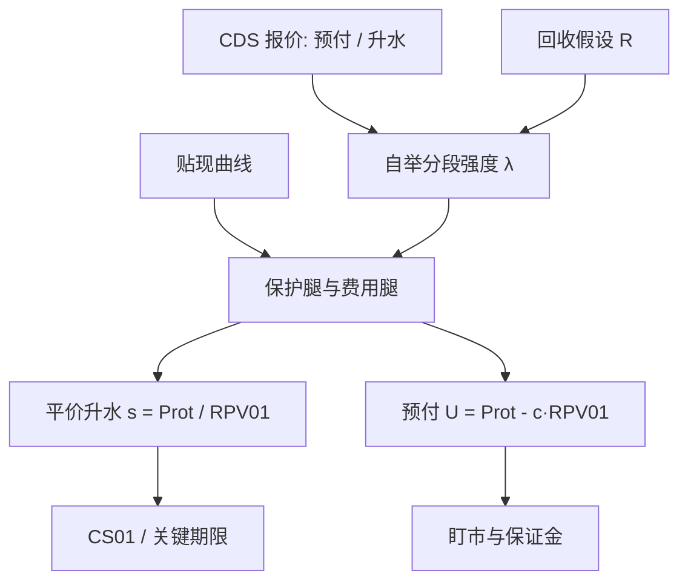

# CDS 定价与升水

    
信用违约互换把违约损失换成可交易的升水：保护腿是回收不足额的或有支付，费用腿是在生存期内按名义计提的年金；使两腿现值相等的那个费率，就是市场上报出的 CDS 升水。

    <footer>—— Duffie, Credit Swap Valuation, Financial Analysts Journal, 1999；以及 Duffie and Singleton, Credit Risk, 2003</footer>

[上一课](/quant/reduced-form-intensity)把违约写成强度点过程，生存概率是 $\exp(-\int\lambda)$ 的期望，短端利差可按 CDS 钉住。缺口是合约本身：升水如何从保护腿与费用腿解出，以及它与债券利差、对手方估值不是同一件事。本课写 CDS 定价与标准票息约定。不重推仿射强度。后课基差默认已经读完：$\lambda$ 由 CDS 校准，不是由评级迁移频率直接代入。

## 问题

记参考实体违约时点为 $\tau$，回收率为 $R$（通常对优先债取常数），贴现因子为 $D(t)$。保护腿在 $\tau\le T$ 时支付 $(1-R)$（现金结算）或交付可交割债换面值（实物）。费用腿按票息 $c$ 在支付日计提，并在违约时补一段应计。平价升水 $s$ 是使两腿现值相等的那个 $c$。市场上看到的「CDS 曲线」是不同到期的 $s(T)$，或大爆炸后的预付 $U$ 加标准票息（投资级常为 100 bp，高收益常为 500 bp）。

问题不是「违约会不会发生」的历史频率，而是风险中性测度下违约的期限结构。强度模型把生存概率写成 $Q(\tau\gt t)=\exp\bigl(-\int_0^t\lambda_u\mathrm{d}u\bigr)$。$\lambda$ 由 CDS 升水校准，不是由评级迁移频率直接代入——评级是物理测度上的离散状态，见 [评级迁移矩阵](/quant/rating-migration)。升水里还嵌着回收假设：单条 CDS 曲线无法同时识别 $\lambda$ 与 $R$，这是 [回收率假设](/quant/recovery-assumption) 要单独处理的原因。

### 升水是价格，不是违约概率

把 100 bp 的五年升水读成「每年 1% 违约」只有在回收为零、利率为零、强度平坦且忽略应计时才近似成立。更接近的拇指规则是 $s\approx(1-R)\lambda$，于是 $R=40\%$ 时 100 bp 对应大约 1.67% 的年化风险中性强度。利率、期限结构弯曲、前端预付、应计与工作日，都会让这个近似偏离几个基点到几十个基点。交易与风险应使用完整的两腿现值，而不是把升水当违约概率报价。

大爆炸之后，升水曲线上的点往往是「标准票息下的预付」再换成约定的平价升水。对账时必须声明是 par spread、quoted spread 还是 upfront。把预付除以久期当成升水，与 ISDA 标准转换在曲线陡峭时并不相同。

## 方法

标准定价把保护腿写成对违约密度的积分。分段常数强度下，

$$
\mathrm{Prot}=(1-R)\sum_i D(t_i)\,Q(\tau\in(t_{i-1},t_i]),
$$

费用腿是票息乘风险年金（risky PV01 / RPV01）：在每个付息日按生存概率贴现，加上违约时的应计。平价升水

$$
s=\frac{\mathrm{Prot}}{\mathrm{RPV01}}.
$$

给定标准票息 $c$，预付（对保护买方为正表示买方要先付钱）为 $U=\mathrm{Prot}-c\cdot\mathrm{RPV01}$。ISDA CDS 标准模型用这块公式：回收常数、强度在 CDS 到期点之间分段常数、贴现用 LIBOR/OIS 一类互换曲线、信用事件按合约日历。Markit 的转换与多数前台实现共用这一约定，以便不同券商报的预付能对上。

校准是自举：最短到期的 CDS 定第一段 $\lambda$，再逐段往长端走。曲线需要插值约定（分段平坦强度是默认），以及前端短到期是否用预付或短期限 CDS。对没有单名 CDS 的名字，实务用指数、评级与行业曲线映射，那已经不是定价公式内部的事，而是曲线输入的质量。

### 风险：CS01、回收与跳跃到期

升水变动一个基点对盯市的影响是 CS01（或信用 DV01），约等于 RPV01。曲线非平行时要用关键期限 CS01。回收 $R$ 若与用来校准的假设不一致，同一条市场升水会推出不同的 $\lambda$，保护腿在深度价内（预付接近 $1-R$）时对 $R$ 极敏感。跳跃到期（jump-to-default）：若名字明天违约，PnL 近似为保护的剩余价值减应计，不是 CS01 乘升水变动。风险报告必须同时有利差希腊值与瞬时违约损失，后者直接用 $(1-R)$ 减当前盯市。

## 机制

经济上，CDS 升水是「租用信用保护」的租金。强度图景里，瞬时租金补偿瞬时违约损失：$\lambda_t(1-R)$ 与费用流在补偿意义下匹配。这与 Duffie–Singleton 把公司债写成「违约调整后的贴现」是同一套风险中性强度，只是债券还叠加了融资、税收与交割期权，所以债券利差通常不等于 CDS 升水，差额正是基差。

大爆炸把流动性从「每条到期一个非整票息」改成「少数标准票息加可交易预付」，让指数与单名可以在同一票息网格上轧差。预付可以很大：高收益名字的五年保护经常要先付几十个点。此时「升水」作为报价语言仍然有用，但资本与保证金看的是预付加未来费用腿的全价值。对手方违约会截断这张互换本身，CVA 要把对手方强度与参考实体强度的相关放进同一模拟，见对手方信用；单名 CDS 的标准定价通常先假设保护卖方无风险，再把 CVA 当调整。

实物交割下，保护买方交付的是最便宜可交割债（CTD）。升水因此含一份交割期权。现金结算用拍卖定最终价格，拍卖机制在 2009 年后成为主路径，但合约仍可能留下交割选择。把 CDS 当成严格的 $(1-R)$ 数字期权，会忽略这份期权的价值。

### 与债券、贷款和总收益互换的差别

债券买的是融资后的信用：你先掏本金。CDS 是非资金（unfunded）保护，资产负债表与回购融资不在公式里。贷款 CDS（LCDS）的信用事件与回收定义不同。总收益互换把票息与价格变动整包转移，包含利率与市场风险。用债券 z-spread 去「验证」CDS 定价，比较的是两个不同的合约，必须先把基差因子剥离，否则会误判曲线校准错误。

## 边界与工程取舍

不要用历史违约频率当 $\lambda$ 去「公平定价」CDS：市场升水含风险溢价、流动性与经销商库存。不要在回收 40% 的标准模型里，对已经在拍卖预期回收 20% 的困境名字报同一套希腊值——应改用困境定价（把 $R$ 当市场变量）或锁定回收扫强度。短到期升水对强度的识别很差，噪声会被自举放大到长端；前端需要更多报价或平滑。

合约细节会改支付：重组条款（旧的 Mod-Mod R 与后来的无重组）、继承事件、政府干预、金融名称的特定定义。主权 CDS 的信用事件与 CACs 更特殊，见 [主权 CDS](/quant/sovereign-cds)。指数 CDS 不是单名的简单平均，见 [指数 vs 单名](/quant/cdx-vs-single)。工程上，曲线应与抵押品贴现、支付日历、重构日（roll）一起版本化；用过期的转换惯例去对今天的预付，会出现「模型对、市场不对」的假差异。

单名 CDS 的流动性远差于指数。校准用的中价可能并不可成交，买卖价差在高收益与长到期上可以吃掉几个点的「模型边界」。把中价曲线当成可执行的公平升水，会高估套利精度。

## 小结

- CDS 升水是使保护腿与费用腿现值相等的费率；大爆炸后市场以标准票息加预付交易，再转换成升水。
- Duffie 的强度框架下，生存概率由 $\lambda$ 决定，保护腿是 $(1-R)$ 对违约密度的贴现；ISDA 标准模型用分段常数强度与常数回收做市场惯例。
- 拇指规则 $s\approx(1-R)\lambda$ 只用于量级；定价、希腊值与跳跃违约要用完整两腿。
- $\lambda$ 与 $R$ 不能从单条 CDS 同时识别；曲线是风险中性对象，不是历史违约率。
- 债券利差、对手方 CVA、交割期权与流动性都在标准升水之外，需要单独的基差与调整。
- 出处：Duffie, *Credit Swap Valuation*, Financial Analysts Journal, 1999；Duffie and Singleton, *Credit Risk: Pricing, Measurement, and Management*, 2003；市场惯例见 ISDA CDS 标准模型与 2009 年 Big Bang / Small Bang 协议。
