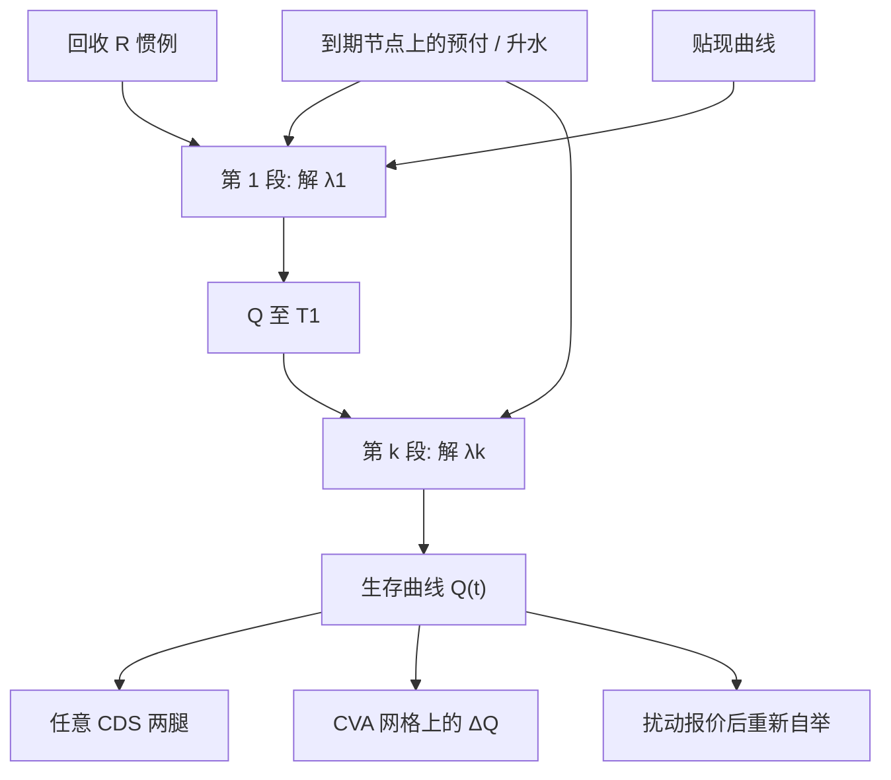

# CDS 生存曲线自举

分段常数强度把每张标准 CDS 变成对下一段危险率的方程；自举是按到期逐段解开生存概率，而不是把升水曲线拿去平滑当违约概率用。

<footer>—— 对照 Duffie 的 CDS 两腿估值，以及 ISDA 标准 CDS 模型把分段危险率与常数回收写成市场惯例的做法</footer>

[CDS 定价与升水](/quant/cds-pricing) 给出保护腿、费用腿与平价升水 $s=\mathrm{Prot}/\mathrm{RPV01}$。本篇写输入是一排市场报价时，如何唯一（在约定下）解开生存曲线 $Q(t)=\mathbb{Q}(\tau\gt t)$。自举是信用曲线的「折现因子剥离」：最短到期定第一段危险率，再往长端推进，每一步用已经固定的短端 $Q$ 把新合约多出来的保护与年金归因到新区间。ISDA 标准模型把危险率在 CDS 到期点之间取分段常数、回收取常数、贴现用约定互换曲线，以便不同券商的预付能对账。它与 [简化形式](/quant/reduced-form-intensity) 的仿射动态不是同一层：自举产出的是今日初值 $Q(0,\cdot)$，波动与相关留给混合模型与期权。

## 问题

市场给的是有限个到期 $\{T_k\}$ 上的预付 $U_k$ 或平价升水 $s_k$，加上标准票息 $c$（投资级常 100bp，高收益常 500bp）。未知是函数 $Q(t)$ 或危险率 $\lambda(t)$。无限维对象、有限个价格，必须加插值约定，否则不可识别。分段常数 $\lambda$ 在 $(T_{k-1},T_k]$ 上等于 $\lambda_k$，参数个数等于可交易到期数，正好逐段求解。问题立刻变成：节点是否用 IMM 标准到期、短端空缺如何补、报价是中价还是可成交、以及 $R$ 与 $\lambda$ 的捆绑——改回收会改整条自举，见 [回收率假设](/quant/recovery-assumption)。

第二问题是误差传播。短到期 CDS 流动性差、升水噪声大，第一段 $\lambda_1$ 不稳，会通过生存乘积进到所有长段。长端若再对稀报价做分段常数，危险率会出现阶梯，RPV01 与 CS01 在节点处跳跃。自举纪律是：先固定惯例，再谈平滑；用核平滑把阶梯抹掉却不声明，前台与风控的 $Q$ 会对不上。

### 一段危险率对应一张合约的方程

设 $T_{k-1}$ 以前的 $Q$ 已知。第 $k$ 张 CDS 的保护腿与费用腿都是 $\lambda_k$ 的单调函数：$\lambda_k$ 上升，生存下降，保护腿变贵，风险年金变小。给定市场预付 $U_k$ 与票息 $c$，

$$
U_k = \mathrm{Prot}(\lambda_k;Q|_{t\le T_{k-1}}) - c\cdot\mathrm{RPV01}(\lambda_k;Q|_{t\le T_{k-1}}).
$$

左端市场已知，右端对 $\lambda_k$ 严格单调（在标准回收与正贴现下），一维根寻找即可，不必对整条曲线做全局优化。这是「自举」一词的含义：与利率互换剥离零息同一逻辑。若输入是平价升水，则令 $U=0$、$c=s_k$ 解同一方程。大爆炸之后对账必须声明输入是 upfront 还是 par spread，转换本身已嵌入标准模型。

把五年升水除以 $1-R$ 当成 $\lambda$ 再指数写出 $Q$，只在平坦危险率、零利率、忽略应计时成立。自举的全部意义就是保留期限结构弯曲、贴现与应计；拇指规则只用来检查根找是否跑飞。

## 方法

**惯例。** ISDA 标准 CDS 模型：回收常数（优先常 40%）、危险率在相邻 CDS 到期之间分段平坦、年分数与日历按合同、违约可发生在连续时间或按模型离散付息网格、应计在违约时支付。贴现曲线与信用曲线分开输入。节点通常是标准 IMM 到期（3月20日等）。实现应对齐 Markit 转换的日期生成，否则同一中价会剥出不同 $Q$。

**根找。** 对 $k=1,2,\ldots$，在 $\lambda_k\gt 0$ 上用 Brent 一类求解，使模型预付等于市场。保护腿

$$
\mathrm{Prot}=(1-R)\sum_i D(t_i)\bigl(Q(t_{i-1})-Q(t_i)\bigr)
$$

在分段常数下 $Q(t)=Q(T_{k-1})\exp(-\lambda_k(t-T_{k-1}))$（在第 $k$ 段内）。费用腿对每个付息日累加 $c\,\tau_i D(t_i)Q(t_i)$ 加违约应计。短端若没有 6M 或 1Y 报价，常用假设：前端危险率等于第一段、或插入一个政策性短到期、或用指数/前置预付。空缺处理必须文档化，它是短端 CS01 的第一来源。

**插值与使用。** 自举完成后，定价任意 $T$ 的生存：在节点内用该段指数衰减；节点外（长于最长 CDS）需外推——平坦危险率、平坦升水或接到主权/行业曲线。CVA 引擎读取的是 $Q(t)$ 在暴露网格上的值，见 [暴露剖面](/quant/cva-exposure-profile)；不要把升水曲线线性插值再当场转 $\lambda$，那会与自举 $Q$ 不一致。指数 CDS 不是单名平均，自举对象应是单名或指数自身的互换，见指数与单名的分工。

### 回收、预付与困境名字

同一排升水，把 $R$ 从 40% 改到 20%，自举出的 $\lambda$ 下降，但保护腿在接近违约时的上限变成 $1-R$ 更大。困境名字预付接近 $1-R$，根找对 $R$ 极度敏感，分段平坦可能给出荒谬的前端 $\lambda$。此时应改用困境定价：把 $R$ 当市场变量、或锁定回收扫强度、或直接用拍卖预期，而不是强迫标准自举收敛。前端噪声还会让某段 $\lambda_k\lt 0$（若允许）或大到使 $Q$ 在下一段之前爆到零；应拒绝并回查报价、转换惯例与贴现曲线日期。

CS01 是把节点升水扰动一个基点、重新自举、看盯市变化。关键期限 CS01 必须重做自举，而不是只扰动 $\lambda_k$ 却不动相邻段的连续性——有人只 bump 危险率，得到的并不是市场可交易的关键点风险。跳跃违约则是 $Q$ 立刻到 0 的瞬时损失，与 CS01 分列。

## 机制

经济上，自举把「租用保护的期限结构」翻译成风险中性生存。分段常数 $\lambda$ 表示市场在该段内把违约密度看成均匀（在约定网格上），这不是对物理违约时间的信念，而是让每张合约有一个残差为零的参数。生存 $Q(t)$ 是左端已经锁定的短合约与本段密度的乘积，因此长端 $Q$ 包含所有短端信息：短端升水跳 10bp，十年保护的模型预付也会动——即使十年报价没动。这解释了为何 CVA 对短端 CDS 流动性如此敏感：暴露网格的前端密度被短合约钉死。

与利率自举的平行：互换剥离用逐段远期；CDS 剥离用逐段危险率。差别是回收把密度乘上 $(1-R)$，以及费用腿是风险年金而非无风险年金。债券不能替代 CDS 做这段自举，因为债券含融资与基差，见 [CDS–债券基差](/quant/cds-bond-basis)。评级迁移频率更不能替代：那是物理测度。

对数线性插值 $Q$ 与分段平坦 $\lambda$ 在节点之间等价；对 $\log Q$ 做样条则不是标准模型，会导致局部负密度或与 ISDA 转换不一致。对账以标准模型为准，样条只用于内部风险的光滑希腊值，且须披露。

### 映射曲线与无单名报价

没有单名 CDS 时，实务用评级×行业×区域的映射曲线自举，再加内部利差调整。自举算法不变，输入质量变了：映射曲线的节点可能来自指数分解或代理篮子，短端更不可靠。CVA 应把映射曲线的平行与斜率作为独立敏感度，而不是只报一个 $Q$。主权与公司的日历、重组条款不同，不能把公司自举器直接套主权报价，见 [主权 CDS](/quant/sovereign-cds)。

## 边界与工程取舍

不要用历史违约频率当 $\lambda_k$。不要在贴现曲线用错 OIS/LIBOR 版本后解释「自举不稳」。不要把预付除以久期当平价升水再自举，与标准转换在陡峭曲线上有差。不要平滑危险率却仍声称 ISDA 标准。工程上，曲线对象应与回收、票息、日历、贴现曲线版本号绑在一起；只存 $Q$ 的采样点而不存惯例，第二天无法复现。

流动性：单名中价可能不可成交，买卖价差在长到期与高收益上可吃掉数个点。自举应对买卖分别做或对中价加不确定带，避免把噪声阶梯当成可交易的前沿。短到期与最长到期的外推是模型风险，应在 CS01 报告里单独两列。

本篇的对象是今日 $Q(t)$ 的剥离，不是强度的随机动态。随机 $\lambda$ 用于信用期权与混合定价，见 [利率-信用混合](/quant/rates-credit-hybrid)；今日自举曲线仍是那些模型的初值，正如 $P(0,T)$ 是 Hull–White 的初值。

## 小结

- 生存曲线自举按 CDS 到期逐段解分段常数危险率，使每张标准合约的模型预付等于市场。
- ISDA 标准模型固定回收、日历与分段平坦 $\lambda$，目的是跨券商对账，不是描述物理违约。
- 短端噪声会传入整条 $Q$；CS01 必须扰动市场节点并重自举，跳跃违约与 CS01 分列。
- 回收、$R$ 与困境预付会破坏标准根找，应改困境定价而不是强迫收敛。
- 映射曲线不改变算法，只改变输入质量，敏感度应单独报告。
- 出处：Duffie, *Credit Swap Valuation*, FAJ, 1999；Duffie & Singleton, *Credit Risk*, 2003；市场惯例见 ISDA CDS 标准模型与 2009 年 Big Bang 转换。
