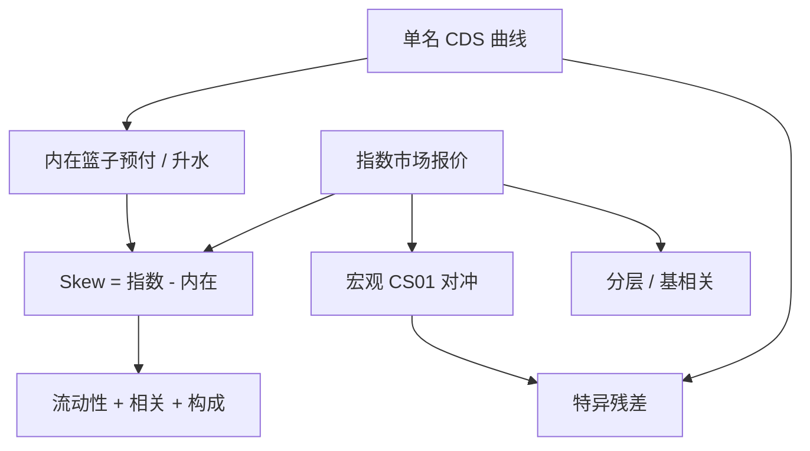

# 指数 vs 单名

    
指数 CDS 报的是一篮子同等名义的组合保护，不是单名升水的算术平均；流动性、构成滚动与相关性会使指数相对内在价值出现持续的 skew。

    <footer>—— 对照 CDX / iTraxx 市场惯例与指数–单名基差的交易实践</footer>

北美的 CDX 与欧洲的 iTraxx 把几十到一百多个单名打包成可交易的指数 CDS：投资级、高收益、交叉与特定行业系列，按季或按规则滚动。单名是对一个参考实体的保护；指数是对当前系列里每一名字同等名义的保护（违约后该名字从指数中剔除，名义下降）。交易台用指数对冲组合信用、用单名表达特异性观点。两者的升水经常对不齐：把单名按指数权重合成的内在升水，与指数报价之差称为指数 skew。本篇写指数合约如何运作、内在价值怎么算、以及为什么对冲要用哪一层——并接到 [高斯 Copula](/quant/gaussian-copula-cdo) 的分层产品。

## 问题

指数报价便捷，却回答不了「篮子里每一个名字值多少」。内在价值（intrinsic / theoretical）通常用各单名的同一到期升水或预付，按指数规则合成：等权、考虑已违约名字、用标准票息与回收假设把预付加总。指数市场价可以比内在更贵或更便宜。正 skew（指数比内在贵）表示组合保护的需求高于单名加总，常见于对冲压力、单名流动性枯竭、或市场在买相关性。负 skew 则可能来自经销商用指数对冲单名库存的反向。

第二个问题是对冲误差。用 CDX IG 对冲一个不等权、行业偏斜的信用组合，剩下的是构成差异、评级迁移进出指数、以及特异违约。指数只对「系列里等权的那些名字」提供保护。滚动时 on-the-run 与 off-the-run 会分裂成两条曲线，旧系列逐渐变成更像一篮子静态单名。

### 指数不是违约相关的充分统计

未分层的指数升水主要对违约强度的平均水平敏感，对名字之间的相关不那么敏感：一阶上它接近单名保护的组合。相关进入价格的主战场是分层（tranche）：股权层吃前几笔违约，超优先层吃相关升上去之后的共同违约。用指数升水去推断「市场隐含相关」是信息不足的；那是 tranche 与基相关（base correlation）的工作。把 CDX 当成「系统性信用因子」可以，把它当成 CDO 相关的观测不行。

指数系列有固定的构成日。新系列会丢掉已恶化或已升到另一评级篮子的名字，加入新名字。用跨系列的升水时间序列当同一指数，会把构成效应当成利差变动。研究必须按系列编号对齐，或使用发行人匹配的单名组合。

## 方法

**内在价值。** 对每个存活名字计算标准票息下的 CDS 预付（或平价升水再转预付），等权加总，按指数惯例处理已触发名字的固定回收结算。得到的组合预付再转成指数升水，与市场报价比较，差为 skew。单名缺失时要用代理曲线，代理误差会直接进入「假 skew」。

**对冲。** 宏观对冲：用 on-the-run 指数对冲组合的 CS01，再按行业或评级用子指数或单名补残差。复制：买/卖指数、对冲掉每一个单名，做的是 skew 交易。滚动：在滚动窗口把旧系列换成新系列，滚动价差本身是流动性与构成的价格。分层对冲：用指数对冲分层的 delta，相关风险留在 vega / 基相关上。

**压缩与清算。** 指数比单名更容易进入中央清算与压缩周期，保证金更标准化。这会把一部分对手方与资金优势写进指数价格，使 skew 含清算便利，而不只是违约相关。

### 从等权篮子到交易簿的 CS01

组合的信用 CS01 按发行人权衡；指数的 CS01 按等权。对冲比是两条 CS01 向量的投影，不是名义相等。高收益组合用 IG 指数对冲，会留下质量和凸性残差：利差走阔时 HY 的 CS01 上升更快。应定期重算对冲比，并限制单名相对指数的残余集中度。

## 机制

指数流动性来自标准化：同一个系列、同一套票息、大量对手方在同一工具上做市。单名是分散的 OTC 曲线，许多名字几天没有可成交报价。于是系统性冲击先打在指数上，再缓慢传到单名，skew 在压力里可以迅速拉大。这与股票里指数期货对一篮子现货的基差同构，只是信用的「现货」更不流动。

构成滚动制造一个机械的质量偏置：定期踢出最差的名字，指数会比「曾经在篮子里的那些发行人」的长期组合更干净。长期用 on-the-run 升水当信用周期指标，会低估真实信贷恶化——恶化的名字已经被滚出样本。这与股票指数的幸存者问题同类，见信用研究里对 [评级迁移](/quant/rating-migration) 与样本选择的讨论。

违约后指数名义下降，剩余保护对着还活着的名字。把指数当成固定名义的「平均 CDS」会在一连串违约后算错 CS01。风险系统必须按当前因子（factor）与剩余名义重定价。

### Skew 作为相关与流动性的混合物

Skew 在相关冲击里会动：交易员买指数保护、卖单名保护（或反向）来表达「违约会更一起发生」。但同样的价差也会被单名买卖价差、指数轧差便利、系列切换库存推动。没有分层报价时，不要把 skew 的全部变动写成隐含相关。有分层时，应把指数、单名与 tranche 放在同一日历上对账，否则相关表面会吞掉同步误差。

## 边界与工程取舍

不要用指数升水去标定每一个单名的 $\lambda$，除非声明这是映射。不要在篮子与指数构成差了二十个名字时，还把残差 PnL 叫做 alpha。不要忽略滚动：回测若总是用最新系列，实际交易却常被迫留在旧系列上，成本和升水都不同。主权与公司指数的规则、重组条款、可交割定义不同，不能共用一套转换。

单名保护在困境里可能完全没有出价，指数仍可交易：此时「内在价值」用的是过时或宽价差的单名，skew 会假得很大。工程上应对缺失单名做标记（staleness），并在 skew 交易上加流动性折扣。指数期权、收盘拍卖与 Markit 定价服务会提供额外的结算锚，但它们不是可执行的单名曲线。

用指数做空信用、用少数单名做多「精选」信用，是常见的相对价值形态。它的主要风险往往是 skew 与滚动，而不是你选中的那几个基本面故事。归因时应把指数腿单独拆出来。

## 小结

- 指数 CDS 是等权篮子的标准化保护，流动性远好于单名，但构成随系列滚动而变。
- 内在价值由单名按指数规则合成；与指数报价之差是 skew，混有流动性、清算便利与相关需求。
- 未分层指数对平均强度敏感，对相关不充分；相关主要由 tranche 与基相关交易。
- 用指数对冲组合必须按 CS01 投影并管理构成、质量与滚动残差。
- 出处：CDX / iTraxx 指数规则与 ISDA 标准 CDS 模型；定价框架承接 Duffie 的单名 CDS 估值；分层定价的相关部分见 Li 的高斯 Copula 及其后的基相关惯例。
