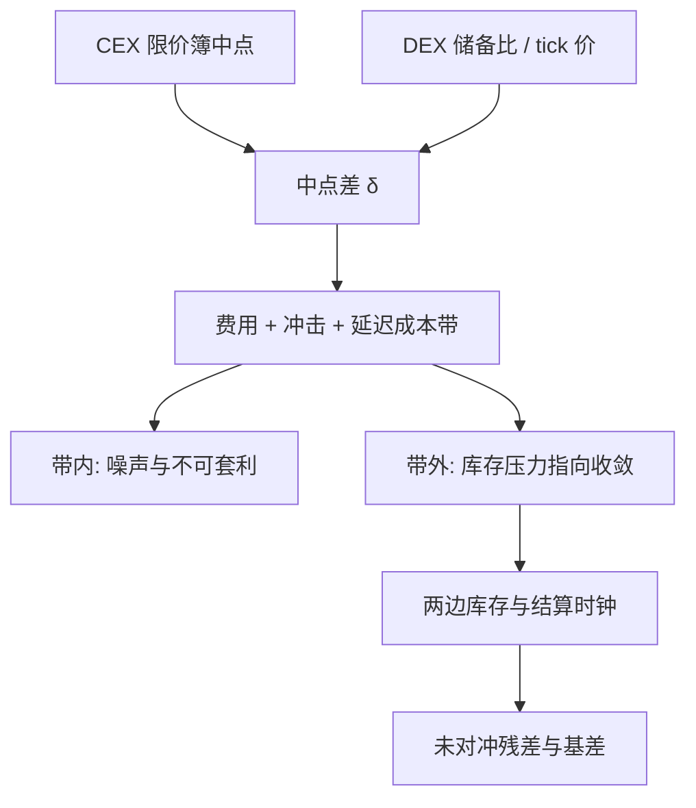

# CEX-DEX 套利

    
同一资产在限价簿中点与 AMM 储备比上可以暂时不一致；当偏离超过费用、冲击、提现与库存成本，公开的经济压力是把两边的价格重新钉进一条带里，而不是某处存在免费的确定性利润。

    <footer>—— 一价定律与空间套利的市场微观结构；DEX 侧价格见 Adams 等 Uniswap 白皮书；排序租金背景见 Daian et al., Flash Boys 2.0</footer>

中心化交易所（CEX）用连续限价簿报价，去中心化交易所（DEX）用 [恒定乘积](/quant/uniswap-cpmm) 或 [集中流动性](/quant/uniswap-v3-clmm) 把价格写成储备状态。同一代币相对同一报价资产（美元稳定币或以太），两边的可观察中点经常不一致。这不是新资产类别特有的神秘现象：只要两处市场不同步更新、准入与结算时钟不同、费用与冲击不同，一价定律就只以**带状**成立。本篇写这条带如何被费用与延迟撑开、价格压力在经济上如何指向收敛，以及为何把带内噪声当成可锁定价差会把库存与基差做成伪 alpha。对象是公开的价格发现与持有成本，不是跨所执行路径、接口或资金搬运步骤。Daian 等人在 *Flash Boys 2.0* 里把 DEX 上的套利列为矿工可提取价值的一类，那是因为链上腿对排序敏感；CEX 腿仍然服从传统微观结构。两边合在一起，是空间套利加上两条完全不同的时钟。

## 问题

记 CEX 中间价为 $S_{\mathrm{c}}$（买卖价中点），DEX 现货为 $p=y/x$（或 v3 当前 tick 的边际价）。粗偏离

$$
\delta=\ln(p/S_{\mathrm{c}})
$$

在零费用、无限深度、瞬时双向结算的世界里应被立刻打到零。真实世界里 $\delta$ 可以在一个正宽度里随机游走：DEX 成交稀疏时 $p$ 停滞，CEX 先反映信息；或反过来，链上大单先推动 $p$，CEX 尚未跟上。问题是把 $\delta$ 分解成：**不可套利的成本带**、**带外的经济压力**、以及**不能用中点计算的冲击与结算风险**。忽略后两项，任何历史 $|\delta|$ 的均值都会看起来像「年化收益」。

成本带不是常数。它至少包含：DEX 费率与 CEX 的 taker/maker 费，见 [maker-taker](/quant/maker-taker)；AMM 曲线冲击与 CEX 簿的档位冲击；链上资源费；充提、托管或跨系统库存无法瞬时对冲时的价格风险；稳定币或计价资产本身的折溢价，见 [脱锚](/quant/stablecoin-depeg)。带的宽度随波动、深度与拥堵变化。公开研究与做市会计要估的是带，不是某一刻 $\delta$ 的符号。

### 中点差不等于可成交价差

$S_{\mathrm{c}}$ 是买卖中点，$p$ 是曲线切线。可成交的是 CEX 的可立即成交价（卖一/买一或更深的加权）与 DEX 沿曲线的**均价**。大额时两边冲击可以吞掉全部 $\delta$。Uniswap v2/v3 白皮书给出的正是均价如何随数量恶化；限价簿则按档位累加。用两个中点的历史差做回测，等价于假设自己永远是无穷小且永远吃到中点——这在任何市场上都不是可交易的 P&amp;L。正确的经济比较是两条**供给曲线**之间的面积，扣掉费用与失败/延迟的期权价值。

「CEX-DEX 套利」在媒体里常被说成无风险。空间套利的经典结论是：风险在搬运与库存上。一边成交、另一边尚未成交，残留的是方向性敞口；链上腿还对区块排序敏感。把这种敞口写成零，只是把风险藏进了假设。

## 方法

度量。同步时钟下记录 $S_{\mathrm{c}}(t)$ 与 $p(t)$，但要承认 $t$ 在 CEX 是撮合引擎时钟，在 DEX 是区块时钟，二者不可逐毫秒对齐。公开做法是：以区块为 DEX 的观察点，取该时刻前后一个极短窗的 CEX 报价做区间，而不是假装存在共同的连续时间。然后在若干标准规模上计算两边的可成交均价，得到规模依赖的 $\delta(q)$。只有 $\delta(q)$ 仍超出费用与预估延迟成本时，经济压力才被定义为「带外」。带外并不等于利润已实现，它只说明：若有人已经同时拥有两边的库存与通道，其最优是把库存从贵的一侧挪到便宜的一侧，直到 $\delta(q)$ 回到带内。

收敛机制。DEX 侧，外部价格持续偏离会吸引与 [CPMM](/quant/uniswap-cpmm) 节所述同一方向的库存交易，把 $p$ 推向 $S_{\mathrm{c}}$；CEX 侧，同样的库存交易改变簿的中点。两边都动，分担发现。若 DEX 深度相对 CEX 极薄，几乎全部调整发生在 $p$；若某代币的价格发现主要在链上，则 $S_{\mathrm{c}}$ 会跟。Hasbrouck 信息份额的逻辑在此适用：哪一侧先动、哪一侧跟，是经验问题，随币对与时段而变，不能先验写成「CEX 永远领先」。

### 资金费率、充提闸门与计价资产

永续合约与现货 CEX、链上现货之间还有第三种价格，见 [资金费](/quant/crypto-perp-funding) 与 [期现基差](/quant/crypto-basis-trade)。把永续中点与 AMM 现货直接相减，混进了资金与杠杆溢价，不是纯现货空间差。充提暂停、链拥堵、稳定币临时折价，会把「理论上可搬运」变成不可搬运，带的宽度瞬时爆炸，$\delta$ 可以长时间停在带外而不构成可锁定价差——因为锁价所需的第二条腿不存在。会计上这是基差风险，与外汇无法交割时的 NDF 类似。公开规则（暂停充提、保证金参数、池的费率档）是状态变量，应进入带的估计，而不是当作异常值删掉。

## 机制

经济压力的方向总是：在定价偏贵的场所减少多头库存（或增加空头），在定价偏便宜的场所增加多头。CPMM 上这意味着沿曲线与外部中点相反的方向交易；限价簿上这意味着吃掉过时的档或挂到新的中点。压力使 $\delta$ 均值回复，回复速度由两边深度、到达率与链上包含延迟决定。波动升高时，信息到达快于搬运，带外时间变长，这不是「alpha 更好」，而是风险更高：残差敞口的方差同时上升。

Daian 等人指出，DEX 腿若来自公开内存池，则这组库存交易自身对排序敏感，其利润可能被优先费竞争耗散，成为 MEV 的一部分。CEX 腿若在传统撮合里，则面对的是 [延迟套利](/quant/latency-arbitrage) 与队列。跨系统套利因此有两套微观结构税。社会层面，带外压力有价格发现功能：它把孤立池的过时储备比拉向更有信息的报价。私人层面，税后期望可以接近零，尤其当竞争者同样观察到公开的 $\delta$。把历史带外幅度的一半当成策略收益，忽略的正是这一耗散。

### 为何「看起来能套利」经常不可交割

教科书套利要求同时、反向、可交割。CEX 与 DEX 的同时性被区块时间破坏；反向被借贷、做空规则与保证金破坏；交割被充提配额与合规账户破坏。剩余的是统计上的均值回复交易：有库存、有失败率、有尾部。失败率在拥堵与波动共发时上升，而这正是 $|\delta|$ 最大的时候——样本内最大的「价差」与最差的执行条件绑定。这与期货 [期现](/quant/cash-and-carry) 在交割通道关闭时基差可以乱涨是同一类制度约束。公开分析应报告条件期望：在充提正常、两边都可成交的子样本里，带外压力如何衰减；而不是无条件地平均所有 $|\delta|$。

一价定律约束的是可转移的、同质的索取权。被包裹的代币、不同链上的「同名」资产、以及脱锚中的稳定币计价，都可能只是名字相同。$\delta$ 必须以可互换的结算资产来定义，否则比较的是两种东西。

## 边界与工程取舍

本篇不把任何历史价差写成可实施策略，也不讨论如何连接两个系统。有意义的研究输出是：规模依赖的成本带、信息份额、带外持续时间的分布、以及制度状态（拥堵、暂停、脱锚）对带的调制。Uniswap 白皮书提供 DEX 价格与冲击的公式；限价簿微观结构提供 CEX 侧冲击；*Flash Boys 2.0* 提供链上腿与排序权的背景。三者合起来仍只是价格经济学。

稳定币作为计价单位时，$\delta$ 会吸收脱锚，见下一篇。集中流动性使 DEX 冲击呈阶梯状，小规模带可能很窄、大规模带突然变宽，用单一基点价差概括 v3 池会误导。跨多个 DEX 的三角关系（同一资产的若干池）是另一张图上的一价定律，机制相同，时钟仍是区块时间。不要用 CEX 的永续深度去推断 DEX 现货的可套利规模，也不要用 DEX 的瞬时 $p$ 去标记 CEX 的全部风险。

回测若在 CEX 用最后成交、在 DEX 用区块末状态，二者都不是可下单价格。应使用当时的可成交曲线（簿与 AMM 状态）并计入随后一个间隔的价格移动作为延迟成本。这是执行会计，不是寻找漏洞。

## 小结

- CEX 中点与 DEX 储备比的差，首先应被解释为带有宽度的一价定律，宽度由费用、冲击、时钟与搬运约束决定。
- 经济压力在带外指向收敛，但收敛靠库存移动，残留敞口与结算失败使它不是锁定价差。
- 中点差高估可成交空间；规模依赖的均价差才是比较对象。
- 链上腿对排序敏感，部分表面价差会在优先费中耗散，见 Daian 等人对 DEX 套利作为 MEV 的讨论。
- 出处：Adams 等 Uniswap v2/v3 白皮书中的价格与冲击；Daian et al., *Flash Boys 2.0*, 2020；空间套利与信息份额属标准市场微观结构。
