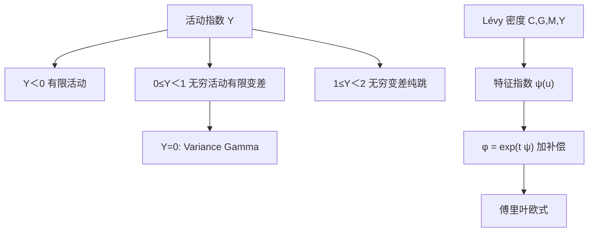

# CGMY

    
用带指数衰减的幂律 Lévy 密度同时描述正负跳，一个活动指数 $Y$ 就能在有限活动、无穷活动有限变差与无穷变差之间切换，从而把收益的精细结构写成可估计的四参数纯跳过程。

    <footer>—— Carr, Geman, Madan and Yor, The Fine Structure of Asset Returns: An Empirical Investigation, Journal of Business, 2002</footer>

[Variance Gamma](/quant/variance-gamma) 把活动性钉死在「无穷活动、有限变差」这一档。真实收益的小跳可以更猛，猛到路径像布朗运动那样无穷变差，却仍没有扩散项；也可以更稀，稀到接近复合泊松。Peter Carr、Hélyette Geman、Dilip Madan 与 Marc Yor 在 2002 年 *Journal of Business* 把 tempered stable 写成方便的四参数密度，称为 CGMY：水平 $C$、左右衰减 $G,M$、活动指数 $Y$。欧式仍靠 Lévy–Khintchine 的特征函数做傅里叶定价。本篇写这一族如何嵌套 VG 与有限活动，以及它仍然解决不了独立增量与波动聚类的冲突；随机波动对照见 [Heston](/quant/heston)。

## 问题

Lévy 过程由三元组刻画：漂移、扩散系数、Lévy 测度 $\Pi$。经验要回答的精细结构是：有没有连续部分？小跳是否无穷多？小跳的二次变差是否发散？这些问题被一个指数 $Y$ 参数化之后，可以用期权或历史收益去估，而不必先验选定 Merton 或 VG。CGMY 的 Lévy 密度在正负半轴上为

$$
\Pi(x)=\begin{cases}
C\,\mathrm{e}^{-G|x|}/|x|^{1+Y}, & x\lt 0,\\
C\,\mathrm{e}^{-M x}/x^{1+Y}, & x\gt 0,
\end{cases}
$$

$C\gt 0$，$G,M\gt 0$，$Y\lt 2$。指数衰减保证大跳有矩，幂律决定零附近的活动。问题是把 $\Pi$ 积成特征函数，并解释 $Y$ 的分界：为何 $Y=0$ 回到 VG，为何 $Y\ge 1$ 使变差无穷，为何 $Y\to 2$ 开始像扩散。

Carr 等人用期权与时间序列对照：风险中性 $Y$ 与物理 $Y$ 不必相同，左右衰减 $G,M$ 的不对称对应偏斜。这是「精细结构」的含义——不是再拟合一个 ATM，而是看跳的活动档位。

### $Y$ 的三档

$Y\lt 0$ 时 $\int \Pi(\mathrm{d}x)\lt \infty$，有限活动，像带形状的复合泊松（与 Merton 同类，但幅度不是对数正态）。$0\le Y\lt 1$：无穷活动、有限变差，VG 是 $Y=0$ 的特例。$1\le Y\lt 2$：无穷活动、无穷变差，路径在小尺度上更「糙」，二次变差的跳部分发散的方式更接近扩散，但仍无布朗项。$Y\to 2^-$ 时，经过适当缩放，小跳像高斯；模型接近扩散加少量大跳。估计 $Y$ 因此是在选机制，而不只是多一个弯曲参数。

$C$ 不是 Merton 的 $\lambda$。有限活动时可以把强度从 $\Pi$ 积出来；无穷活动时强度无穷，$C$ 只是密度的水平。把估出的 $C$ 说成「每年跳几次」只在 $Y\lt 0$ 时勉强可讲。

## 方法

特征指数由 Lévy–Khintchine 积出：

$$
\psi(u)=C\,\Gamma(-Y)\bigl[(M-iu)^Y-M^Y+(G+iu)^Y-G^Y\bigr],
$$

$Y\neq 0,1$；在 $0$ 与 $1$ 取极限得到对数与 VG 形式。特征函数 $\phi(u)=\exp(t\psi(u))$，再乘鞅补偿使 $\phi(-i)=\mathrm{e}^{(r-q)t}$ 或等价地在漂移里扣 $\psi(-i)$。欧式定价与 VG、Heston 共用 FFT/COS 外壳。$Y$ 非整数时 $(M-iu)^Y$ 的复幂要固定分支，使 $\psi$ 在实 $u$ 上连续，难度低于 Heston 的 Riccati 对数，但仍不能调用实数 `pow`。

无扩散的 CGMY 是纯跳。文献有时加一个独立布朗项变成 CGMYD，用以吸收「真的连续波动」；那是五参数，识别上 $Y$ 接近 2 时与 $\sigma\mathrm{d}W$ 共线。原文经验调查以纯跳为主，不要默认市场上每个人都加了扩散项。

### 与 VG、Merton 的嵌套

适当参数下 $Y=0$ 的 CGMY 即方差伽马，$(C,G,M)$ 与 $(\sigma,\nu,\theta)$ 可换算。Merton 不是精确子模型，但 $Y\lt 0$ 且衰减很快时，行为接近有限次跳。校准单切片：$C$ 水平，$G,M$ 左右翼，$Y$ 管近端曲率与活动档。四参数对单到期往往过度灵活，需用多到期联合、或冻结 $Y$ 只估其余。独立增量再次锁定期限结构：$\psi$ 乘 $t$，长端仍被拉向正态，速度取决于 $Y$ 与衰减。要用 CGMY 去贴整张 [曲面](/quant/vol-surface)，常见做法是 $C(T)$ 或时变 $Y$，即已经不是齐次 Lévy。

模拟：有限变差可按泊松点过程配拒绝或级数；无穷变差要用截断小跳加高斯近似（Asmussen–Rosinski 一类），截断水平进入弱误差。障碍与触及对截断敏感：扔掉的小跳改变局部振荡，连续障碍的敲入率会被数值格式污染。

## 机制

指数 tempering 把稳定过程的幂律尾切成指数尾，大跳有矩、期权价格有限，这是相对 $\alpha$-stable 的关键。左右不同的 $G,M$ 产生偏斜：$M\lt G$ 通常对应更肥的左尾（符号约定随 $x$ 的方向，实现时要对着特征函数的虚部检查）。没有随机时钟以外的状态变量——CGMY 本身已是 Lévy，时钟是日历时间。波动聚类必须来自额外的随机时间或随机 $C_t$，那是后续的时变 Lévy 或 OU 型强度，不是 2002 年这篇精细结构估计。

相对 [Dupire](/quant/dupire)，CGMY 不拟合任意边际的期限族，只给出无穷可分的一条曲线。相对 Heston，短端可以由 $Y$ 与 $C$ 做得很陡，且没有 Feller 问题；代价是没有 $v_t$，远期起动与 cliquet 的未来微笑被独立增量抹平。相对 Bates，CGMY 用无穷活动替代「Heston + 稀疏跳」的两层故事，参数更少，动态更穷。

### 物理测度与风险中性测度

同一篇文章同时看收益与期权：两边估出的 $Y$、$G$、$M$ 往往不同。期权隐含更肥的尾或不同的活动档，差额是跳风险溢价的一种表现。把历史 CGMY 参数塞进定价 $\phi$，等于假设溢价为零，通常低估虚值看跌。反过来，把期权 $Y$ 当成高频跳检验的真值，会与 [BN–S](/quant/jump-tests) 的有限活动原假设冲突——若 $Y\gt 0$，双幂次的稳健性假设已经不成立。两套工具回答的不是同一测度、同一活动档。

$\Gamma(-Y)$ 在 $Y$ 接近正整数时发散，公式要改用极限形式。优化器若把 $Y$ 走到 0 或 1 附近，应切换解析延拓，而不是让 $\Gamma$ 溢出后当惩罚。

## 边界

齐次 Lévy 不能表达波动率的期限结构与聚类；这是 CGMY 作为「收益精细结构」模型的边界，不是四参数不够细。加扩散项后与 $Y\approx 2$ 识别崩溃。多资产需要 Lévy copula 或共同时间变换，原文是单资产。路径依赖产品对小跳截断、栅格与观察频率的依赖，比欧式大一个数量级，校准只对香草不够。

Carr–Geman–Madan–Yor（2002）的贡献是把 tempered stable 写成可估的 $\Pi$，并用数据讨论活动档；不是给出障碍的闭式，也不是随机波动。后续 CGMY 配随机时钟、配局部波动，应另引。实现应对标：退化为 VG 的参数点、鞅补偿后的远期、以及 $C\to 0$ 时的 Black（若另加扩散）或纯漂移。

名称 CGMY 就是四位作者姓氏首字母，不是某个希腊参数。论文里 $C,G,M,Y$ 同时是符号，引用时写全名一次，避免与 CIR 的 $C$ 函数或 Heston 的 $C(\tau,u)$ 混在同一段公式里。

## 小结

- CGMY（2002）用四参数 tempered stable 密度刻画纯跳 Lévy，$Y$ 在有限活动、VG 型有限变差与无穷变差之间切换。
- 特征指数含 $\Gamma(-Y)$ 与复幂，欧式走傅里叶；鞅补偿不可省。
- $Y=0$ 嵌套方差伽马；$Y\lt 0$ 接近有限次跳，但幅度律仍是幂律加指数衰减，不是 Merton 对数正态。
- 独立增量决定了期限结构与无聚类；精细结构估计不能替代 Heston/Bergomi 的动态。
- 风险中性与物理参数通常不同，跳溢价表现在 $C,G,M,Y$ 的测度差。
- 出处：Carr, Geman, Madan and Yor, *Journal of Business*, 2002；VG 见 Madan, Carr and Chang, 1998；有限活动对照 Merton, 1976。
