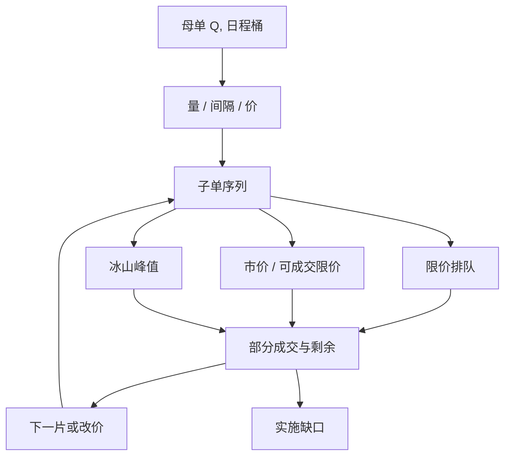

# 子单切片

    
母单是决策，子单是把该决策接到限价簿上的一串指令；切片规定每片的量、间隔与订单类型，从而决定冲击路径，而不是决定要不要交易。

    <footer>—— 据 Harris, Trading and Exchanges 对展示数量、拆单与指令接口的论述整理</footer>

[TWAP / VWAP / POV](/quant/twap-vwap-pov) 给出桶与桶之间的目标量；真正进入交易所的是子单（child orders）。切片要回答三件事：每片多大（clip size）、片与片隔多久、每片用限价、市价还是冰山。母单可以是「买 20 万股、今天下午完成」；子单是随后几十到几百条具体指令，带价格、数量、有效期。Bertsimas 与 Lo、Almgren–Chriss 优化的是连续速率，工程必须把它离散成子单，并接受排队、部分成交与撤单。切片太整、太均匀，容易被识别为算法流；太随机，进度方差变大，完成风险上升。本篇写切片维度、与 [成交概率](/quant/fill-probability) 的接口、以及可观测的规律化痕迹，对象是自己的执行设计，不是去探测或干扰他人母单。

## 问题

连续速率 $v_t$ 在数学里可以任意细。交易所要求整数股或整手、价格落在最小变动价位、同一价位时间优先。于是 $v_t$ 必须变成点过程：在离散时刻提交有限数量。片太大，单笔吃多层或在队列里暴露大尺寸，瞬时冲击与泄露同时上升；片太小，消息量、排队次数与被夹击的次数上升，费用与错过可能增加。间隔太规则，成交与撤单在时间上出现周期，成为 [冰山探测](/quant/iceberg-detection) 一类公开测量的输入；间隔完全随机，则桶目标的完成变成随机游走，[自适应 POV](/quant/adaptive-pov) 的进度项会频繁触发。问题是在冲击、泄露、消息成本与进度方差之间选一套可重复的离散化。

第二句话是订单类型。同样的量曲线，全限价与全市价的实施缺口可以差出一个价差量级。限价子单把时机交给队列消耗，实际速率随机偏离日程；市价子单锁定数量、支付即时性。切片规格若只写数量不写类型，回测不可复现。

### 切片是三维的：量、时、价

量维：固定 clip、按剩余量递减、或按当时深度的一个分数。时维：固定时钟间隔、成交量时钟间隔、或随机化间隔（例如均匀或截断指数）。价维：触及（市价或可立即成交限价）、排队在己方最优、或更深一档。三维独立指定时，组合爆炸；实务上通常先由日程定本桶总量，再在桶内用一种量规则加一种时规则，价规则随是否落后切换。把三维缩成「每 30 秒市价 500 股」是可审计的；把三维交给未记录的智能路由，母单研究无法归因。

随机化的目的是降低规律化痕迹，不是提高期望成交价。期望上，随机间隔相对固定间隔近似中性，方差更大。用短fall 去证明「随机切片 alpha」通常是样本噪声；应报告的是被识别概率的代理（间隔熵、尺寸熵）与进度方差的权衡。

## 方法

由日程得到本桶目标 $q_i$。选择 clip $c$（或 $c$ 的分布），子单数约 $q_i/c$。间隔 $\Delta t$ 使桶时长内期望能把片子打完，并留出撤单与重挂的时间。限价子单的成交是随机的：用队列模型给出的成交概率 $p_{\mathrm{fill}}$ 去定超报率——提交量可以大于 $c$，预期成交为 $c$，见 Lo–MacKinlay–Zhang 的限价执行时间。未成交则撤、改价或转市价，规则必须在桶结束前收敛，否则余量滚入下一桶或尾盘清扫。

尺寸规则的两个常用锚：ADV 或当时最优档量的分数。前者跨日稳定、适合合规限额；后者适应盘口，但在深度被撤光时会把 clip 自动缩小到接近零，进度停滞。应设 $c_{\min}$ 与 $c_{\max}$。U 形成交量下，开盘与收盘桶的 clip 可以更大，中间更小，这是 VWAP 日程在片内的延伸，不是另一套 alpha。

### 规律化如何进入公开数据

固定间隔、固定尺寸、固定价距，会在逐笔里留下周期谱：每隔 $\Delta t$ 出现一笔同向、近同量的主动或被动成交。这是算法执行的已知指纹，学术上用来估计隐藏母单的存在，不是漏洞利用。降低指纹的公开做法是：间隔与尺寸加噪声、偶发暂停、限价档位在己方最优与次优之间切换。噪声幅度要与 clip 成比例，否则大单上的「抖动」仍可忽略。过度随机化会提高部分成交率，使母单标记（哪些子单属于同一决策）变难——而母单标记错误会污染冲击估计，见 [瞬时与永久冲击](/quant/temp-perm-impact)。

冰山是切片的交易所原生版：同一价位上峰值可见、余量隐藏。它减少展示尺寸，但不减少成交路径上的补量指纹。切片与冰山可以叠加：子单本身是冰山，子单之间仍有间隔。叠加后参数更多，审计更重要。不要把冰山当成「没有切片」：峰值耗尽后的补量仍是一串子事件。

## 机制

切片的机制是把可能引起非线性瞬时冲击的母单，投影到局部近似线性的区域：每片落在可见深度的一小段，让 [传播核](/quant/transient-impact-kernel) 有时间衰减再叠加下一片。间隔的选择就是在等核落下与承担价格扩散之间权衡。间隔相对核的半衰期过短，片与片的瞬时项重叠，总冲击接近一次大单；过长，则 [Huberman–Stanzl](/quant/huberman-stanzl) 意义下的永久项不变，时机风险上升。因此最优间隔不是「越碎越好」，它应由 $G(\tau)$ 的短端决定。

泄露的机制是可预测性。对手方若能从规律切片推断剩余母单，会提前撤同向流动性或反向抢价，使后续子单的有效深度下降。这是执行成本的信息渠道，与知情交易的 Kyle 渠道不同：泄露的是**你还要买多少**，不一定是基本面。随机化降低这一渠道的信噪比，但不可能降到零——方向持续本身就是信息。合规上，切片必须保持真实交易意向，不能为了「看起来随机」而插入反向自成交。

部分成交后的剩余量如何处理，比首片子单的尺寸更影响指纹。总是把剩余立刻补到同一价位，等于冰山补量；总是把剩余并入下一时钟片，等于扩大下一片尺寸。两种规则在数据里可区分，规格应写死一种。

### 与路由、多场所的关系

多场所时，切片还包含「下一片去哪」。智能路由把同一 clip 拆到若干交易所，显示尺寸更小，但合成轨迹仍可能在时间上规律。评价应以母单到达价为基准，而不是以每一场所的局部 VWAP：场所间跳来跳去可以每处都「跑赢」当地均价，总和仍很差。A 股原则上一个连续竞价场所，切片主要是时间与价格；科创板盘后固定价格是另一段，不应把连续时段未完成用同一 clip 规则塞进盘后。涨跌停附近深度是配给而非价格，切片应停止市价、改用排队或放弃，见 [涨跌停与集合竞价](/quant/cn-limit-auction)。

## 边界与工程取舍

最小变动价位与整手约束使极小 clip 无意义：小到一手且每秒一笔，消息成本主导。费用函数含每笔收费时，最优 clip 有下界。回测若忽略交易所流量费与系统延迟，会偏好过碎的切片。延迟使「按当时盘口定 clip」变成过时信息：你提交时深度已变。应在模拟器里加延迟，否则自适应尺寸会显得过分有效。

不要用切片去实现 Huberman–Stanzl 禁止的非线性永久套利：先大后小或先小后大若被优化器当成降低永久成本的手段，应拒绝该目标函数。切片只应减少瞬时重叠与泄露，不改变 $G(\infty)$ 对总量的线性写入。不要把未记录的人工改单与算法切片混在同一母单里标记，否则冲击回归的残差是操作噪声。

跨资产同步切片（同时卖一篮子）会在指数成分上制造对齐的时间指纹，冲击有交叉项。应在篮子层随机化偏移，而不是每只股票独立但使用同一 $\Delta t$——同一 $\Delta t$ 会在指数期货与成分股之间对上时钟。

本篇讨论如何把己方母单离散成可审计的子单，不提供识别、抢跑或干扰他人切片的方法。公开文献中的母单识别是测量问题；把它翻成交易对手的攻击，不属于执行架构。

## 小结

- 子单切片把连续速率变成点过程，三维是尺寸、间隔与订单类型；只写日程不写切片，执行不可复现。
- 片太整则冲击与泄露升，太碎则消息、排队与进度方差升；间隔应对照冲击核短端，而不是越碎越好。
- 随机化降低规律化指纹、增加进度方差，期望短fall 近似中性，不应当成 alpha。
- 限价切片的实际速率由成交概率决定，需超报、撤改与桶末收敛规则。
- 部分成交后的补量规则本身会留下冰山式指纹，必须在规格里写死。
- 切片用于摊开瞬时冲击，不能用来制造非线性永久项上的模型利润。
- 出处：Harris, *Trading and Exchanges*；Bertsimas and Lo, *Journal of Financial Markets*, 1998；Almgren and Chriss, *Journal of Risk*, 2000/2001；Lo, MacKinlay and Zhang, *Journal of Financial Economics*, 2002；Cont, Stoikov and Talreja, *Operations Research*, 2010。
