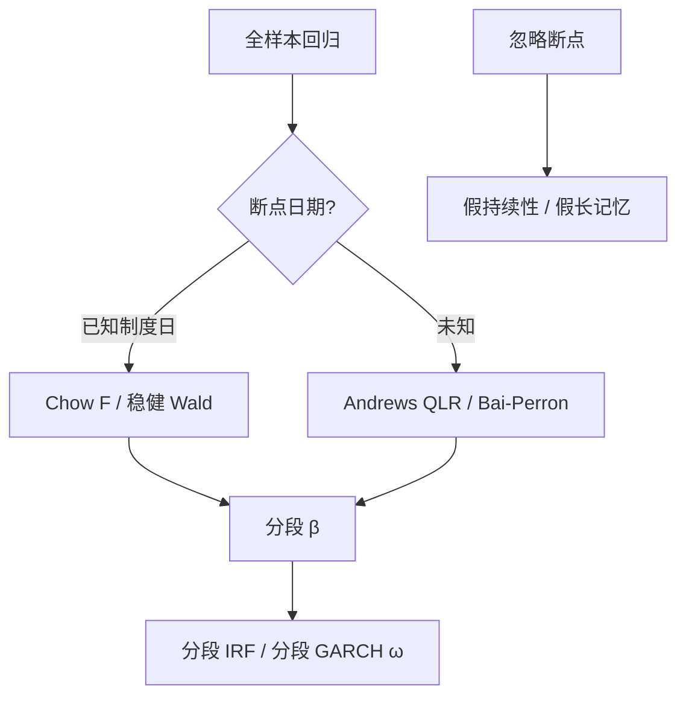

# Chow 断点检验

若斜率在某一已知日期前后不是同一组参数，把样本绑在一次回归里估的是两段体制的加权；用分段残差平方和对照，可以检验这个断裂。

<footer>—— Chow, Tests of Equality Between Sets of Coefficients in Two Linear Regressions, Econometrica, 1960</footer>

[Kalman 平滑](/quant/state-space-kalman-smoother) 让参数慢慢游走，会把真的政策日、改革日、危机日抹成斜坡。Chow 问的是**已知日期**上的一次性断裂：$\beta$ 在 $t_0$ 前后是否相同。Andrews、Bai–Perron 把日期未知时的上确界检验与多断点写成后续。本课缺口：VAR/GARCH/HAR 的全样本系数在有断点时持续被高估、IRF 被污染。下一课 ARFIMA 处理的是缓慢衰减的记忆，容易与未建模断点互相假扮——先把断点检验钉住。

## 问题

线性回归，预指定 $t_0$，Chow 的 $F$ 比较全样本 RSS 与两段分别 RSS。原假设：$\beta_1=\beta_2$。金融里 $t_0$ 常常「看起来像」：金融危机、涨跌停改革、QFII、熔断。用数据找最大 $F$ 再当 Chow，临界值不再是普通 $F$——那是 Andrews 的 Quandt 似然比，须用上确界分布。

问题分两层：日期已知（制度公告）用 Chow；日期未知用 QLR/Bai–Perron。把第二层假装成第一层，会过度拒绝。对象是**均值方程（或给定方差模型）的参数稳定**，不是波动水平的一切变化——方差断裂应有专门检验。

### 与 CUSUM 的分工

[CUSUM/MOSUM](/quant/cusum-mosum) 对递归残差累积，善于探测逐渐漂移。Chow/QLR 善于一次性水平跳。两者应并列：改革日附近用 Chow，缓慢自由化用 CUSUM。Kalman 随机游走 $\beta_t$ 是第三种：每个时点都在变，没有「两段」。先选对象再选检验。

在最大 $t$ 的那一天标断点，再讲故事，是设定搜索。预登记候选日期（官方实施日），或用 Bai–Perron 并把置信区间一起报。

## 方法

**已知日期。** Chow $F$；异方差用稳健 Wald 的分段版本；小样本、肥尾用自助（在原假设下抽残差，保持 GARCH 则块自助）。两段 $T$ 极不对称时，短段系数方差大，$F$ 功效低。

**未知日期。** Andrews QLR：对中间 70% 样本扫 $t_0$，取最大统计量，用 Andrews 临界值。Bai–Perron 允许多个断点，用信息准则或序列检验定个数，给出日期的置信区间。残差相关时须 HAC 版本。

**GARCH 持续性。** Lamoureux–Lastrapes：忽略方差水平的断裂会把 $\alpha+\beta$ 推向 1。对波动模型，应允许 $\omega$ 分段，再估持续性——这是 Chow 思想在方差方程，不是把收益均值切两段就完。

### VAR 与 IRF

全样本 VAR 在断点后 $\Phi$ 变了，IRF 是混合物。应分段估 IRF，或把断点写成已知的交互项。Granger 全样本显著若只来自一段，分段后消失——应报告。

## 机制

Chow 是线性约束的 $F$：把「一段参数」对「两段参数」的拟合改善，按自由度标准化。机制要求断点外参数恒定、误差同分布。若其实是三断点，两段 Chow 会误设，RSS 改善不够或把错误 $t_0$ 当断点。QLR 的机制是多重检验的上确界：在很多候选日里看最极端的 $F$，临界值因此更高。

未建模断点与长记忆的外观相似：均值或方差的几次水平跳，会让 ACF 拖尾。这就是下一课必须先做断点再谈 ARFIMA 的原因。Diebold–Inoue 等讨论过这种假长记忆。

事件研究的 $t=0$ 是均值的一次跳，通常不把 $\beta$ 当断裂。Chow 的对象是斜率/截距体制，不是单日 AR。单日用事件窗，体制用分段。

### 内生断点与政策

若 $t_0$ 是因为 $y$ 已经崩了才宣布的政策，断点内生，Chow 的分布更麻烦。应用公告准备期之外的日期，或工具化政策。这与 IV 课的排除是同一识别问题在时间上的版本。

## 边界与工程取舍

多重断点 + 短样本，Bai–Perron 会切出没有经济含义的碎段。异方差、GARCH、跳跃让经典 $F$ 过度拒绝，须稳健或自助。面板断点（各公司不同 $t_0$）是另一文献，不要对混合 OLS 做一次 Chow 宣称「市场断了」。

工程：预登记制度日做 Chow；探索性用 QLR 并报日期置信区间；波动模型允许水平分段。不要用 Chow 替代 [稳健回归](/quant/robust-regression-outliers) 去「删危机」。不要在同一序列上搜完断点再估 ARFIMA 还声称发现长记忆而不报告断点步骤。下一课：在断点处理之后，若 ACF 仍双曲线衰减，才轮到分整。

## 小结

- Chow 检验已知日期上的参数断裂；用数据搜日期须改用 QLR/Bai–Perron 的上确界临界值。
- 与 CUSUM（渐变）、Kalman（每期游走）对象不同，应先选机制再选检验。
- 忽略方差水平断裂会抬高 GARCH 持续性；忽略均值断裂会制造假长记忆外观。
- 内生政策日、肥尾、GARCH 都要求稳健或自助，而不是教科书 $F$。
- 出处：Chow, *Econometrica*, 1960；未知日期见 Andrews, *Econometrica*, 1993；多断点见 Bai and Perron, *Econometrica*, 1998。
