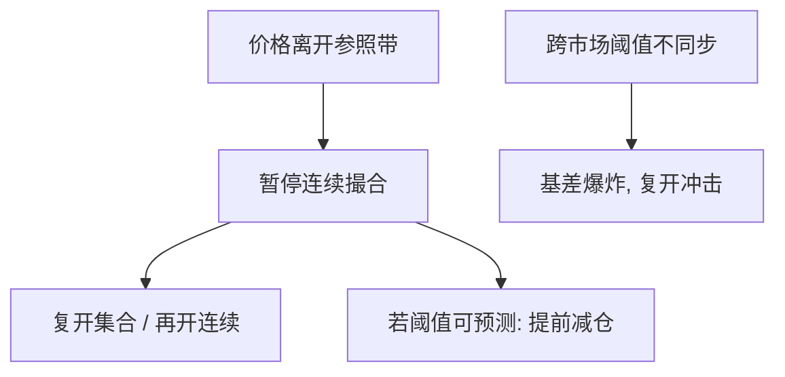

# 熔断机制设计

熔断买的是一段强制同步的停顿：让报价、库存与信息集合重新对齐。它也能变成磁铁——价格尚未到阈值，减仓已经把阈值写成自我实现的目标。

<footer>—— Subrahmanyam, Circuit breakers and market volatility, Journal of Finance, 1994；对照 SEC/CFTC 对 2010 年 5 月 6 日市场事件的调查发现</footer>

[Tick Size Pilot](/quant/tick-size-pilot) 改的是连续协议里的格子。[闪电崩盘](/quant/flash-crash-2010) 留下的缺口是：连续协议本身要不要被暂停。[做市撤退](/quant/mm-obligations-withdrawal) 与 [波动–流动性反馈](/quant/vol-liquidity-feedback) 已经说明供给可以在几分钟内消失。本课写熔断作为市场设计：个股 LULD、市场宽幅熔断、暂停时长与重开拍卖如何切开螺旋。回测里的不可交易状态见 [停牌与涨跌停](/quant/trading-halts)，本课不重写那一套会计，也不把 A 股重大事项停牌当成同一对象。

## 问题

连续限价簿假定两侧供给还在。空簿时冲击路径没有上界，直到碰到远期挂单、有人愿意接、或规则停机。Subrahmanyam（1994）指出熔断的两面：暂停可降低知情交易的短期优势、给做市商补库存，也可能把交易挤到暂停前、提高阈值附近的波动。设计参数至少有四：参照价（谁的、多长窗口）、带宽（百分比还是点数）、暂停长度、重开是集合竞价还是直接恢复连续。问题不是「要不要熔断」，而是这四个旋钮如何改变磁铁、跨品种传导与发现延迟。

2010 年之后美国把个股 Limit Up–Limit Down 与标普 500 挂钩的市场宽幅熔断分层：个股带宽处理错误报价与单名跳空，市场层处理系统性抛售。两者的同步失败——期货先到、现货后到、ETF 中间卡住——正是跨市场设计问题。

### 磁铁与跨市场不同步

阈值若可预测，提前减仓把阈值变成吸引子。2016 年 A 股 5%/7% 市场熔断在数日内反复触发后被叫停，是磁铁加反馈的近样本：规则成为价格的状态变量。个股 LULD 的参照若滞后，带宽会在趋势里被一次次撞开；参照若太敏感，正常发现也会被暂停。期货、期权、ETF 若阈值与时钟不一致，熔断切开的是一条腿，另一条腿继续交易，基差爆炸，复开时冲击更大。

冷却叙事期望暂停后波动下降。Lee、Ready 与 Seguin（1994）在 NYSE 个股停牌上看到复牌量与波动上升。设计必须按「延迟发现」来评估，不能按「停掉波动」来宣传。

## 方法

把熔断写成状态机：进入条件、暂停期不可撤或可撤、重开匹配规则、失败后是否延长。质量指标对准用途：错误报价是否被拦截、螺旋是否被切开、复开后的暂时成分（随后回复）与永久成分（信息）、跨市场基差在暂停窗的路径。对照：无暂停的连续空簿（2010 年若干分钟）、带宽过窄的市场熔断（2016 年 A 股）、仅个股停而指数衍生品不停。

与 [收盘拍卖](/quant/closing-auction-design) 的联系：复开几乎总是一次短批次。批次厚度决定熔断是公共品还是另一场截止竞赛。义务做市商常被要求参加复开，是压力义务的瞬时版。

## 机制

熔断切断的是 $\mathrm{Var}(y)$ 的瞬时路径，让 Grossman–Miller 意义上的外部资本有时间进场，让过时报价被撤掉而不是被扫穿。它不消灭信息：该重新定价的风险溢价在复开时仍应进入价格。LULD 针对单名与错误 tick，市场宽幅针对共同因子抛售；混用会要么过度停机、要么该停不停。相对速度在暂停前被放大（抢在熔断前成交），在暂停中被清零，在复开时变成拍卖里的信息竞争。

对执行：螺旋期用历史 $\lambda$ 做轨迹是错的。状态机应识别「带宽内 / 暂停 / 复开」；暂停期把意图留给拍卖，而不是假设限价仍会被扫到。

## 边界

涨跌停是全天单侧封顶，熔断是短暂双边暂停，机制不要混。[中国停复牌](/quant/cn-halt-resume) 是信息披露窗口，不是 LULD。加密与部分外汇没有同类公共熔断，空簿路径更长。本课不给出某交易所现行档位表——档位会改，设计逻辑不变。下一课：官方收盘之后交易往往仍在继续，熔断与保护报价的时钟在盘前盘后并不自动延伸。

把熔断日从风险样本里删掉再报 VaR，删的正是规则要处理的尾部。

## 小结

- 熔断是强制同步停顿加复开批次，切开空簿路径，也制造磁铁与跨市场基差。
- 个股带宽与市场宽幅是不同对象；评估应对准错误报价、螺旋与发现延迟，而不是「波动被停掉」。
- 复开质量取决于拍卖厚度与义务是否仍在。
- 可预测阈值会诱使熔断前抢跑；跨市场若只停一处，压力转到领先的未停场所。
- 出处：Subrahmanyam, *Journal of Financial and Quantitative Analysis*, 1994；Lee, Ready and Seguin, *Journal of Finance*, 1994；事件背景见 CFTC–SEC, *Findings Regarding the Market Events of May 6, 2010*。
