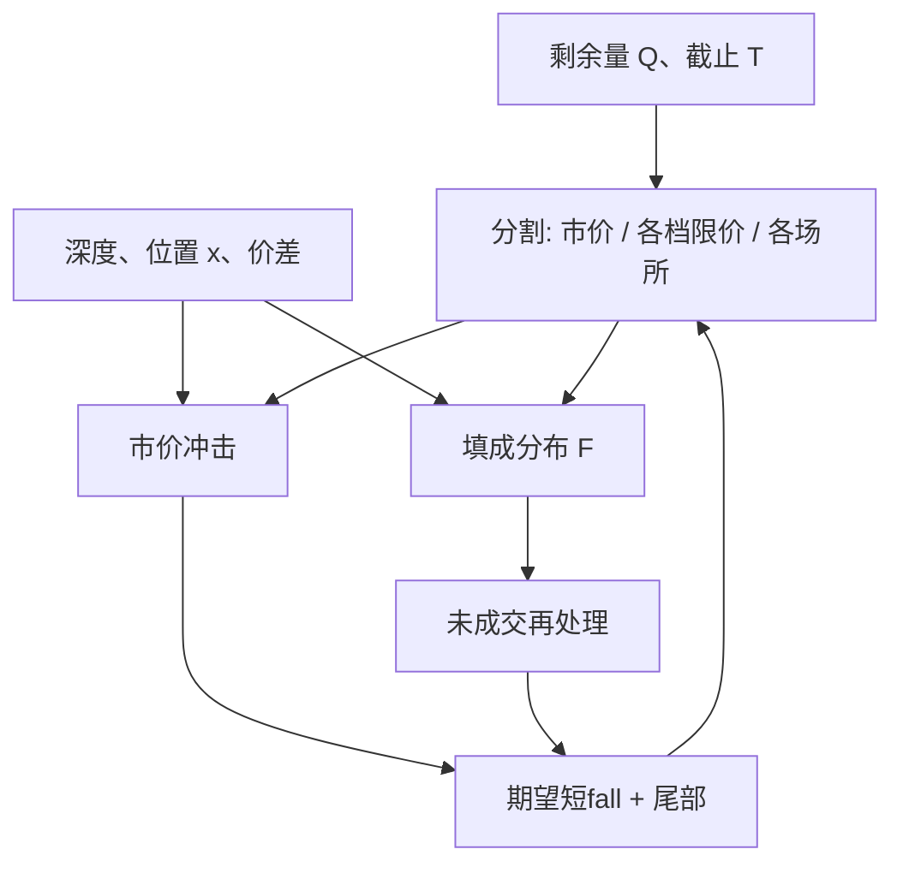

# Cont–Kukanov–Stoikov 最优挂单

母单不必整笔变成市价：一部分可以挂在若干价位与场所上等填成，一部分立刻吃簿；最优分割权衡的是价差节省、冲击、以及限价未成交时的机会成本。

<footer>—— Cont and Kukanov, Optimal order placement in limit order markets, Quantitative Finance, 2017；队列与簿事件语言见 Cont, Stoikov and Talreja (2010) 以及 Cont, Kukanov and Stoikov (2014)</footer>

[Avellaneda–Stoikov](/quant/avellaneda-stoikov) 回答做市商应把买卖报价放在离中点多远；执行台的问题常常更窄：已经决定要买 $Q$，在现在这笔里，多少用市价、多少挂在最优买（或更深），若有多个场所又如何分。Cont 与 Kukanov 把这写成最优下单（optimal order placement）：在限价成交的随机性与市价的确定冲击之间做静态或短视分割。队列动力学来自 Cont–Stoikov–Talreja 的生灭簿，短窗价格冲击的会计来自 Cont–Kukanov–Stoikov 的 [OFI](/quant/ofi-cont)。本篇把这三篇合成一条「在给定母单下把量放到哪」的执行语言，不把公式写成保证更省钱的机器人，也不讨论如何抢撮合时序。

## 问题

只走市价：立刻得到货，付半价差加吃档冲击，还可能留下持久影响。只走限价：可能省下价差，但 [成交概率](/quant/fill-probability) 小于一，未成交部分要么在截止时间改市价（往往更贵），要么放弃、留下跟踪误差。真实选择是向量：各场所、各价位上的限价量，加上一笔市价。目标通常是期望执行短fall，有时加短fall 方差。问题的状态包括：当前价差与深度、自己的队列位置、剩余时间和剩余量。

Cont–Kukanov 强调跨场所：同一经济价位上，填成相关性并不完美，把量拆到两个簿可以降低「全都没排到」的风险，也会引入各自的排队与费用。Stoikov 一侧提供的是填成环境：没有队列模型，限价的成功就只是一个外生概率 $p$，最优解会对 $p$ 过度敏感。把 CST 的生灭与 CKS 的事件冲击接进来，是为了让 $p$ 和冲击都来自同一张簿，而不是两个不相干的校准。

### 市价腿与限价腿的成本分解

一笔买的期望成本可以粗写成

$$
\mathbb{E}[C]
= \underbrace{c_{\mathrm{m}}(q_{\mathrm{m}})}_{\text{市价：价差 + 冲击}}
+ \underbrace{\mathbb{E}[c_{\ell}(q_{\ell},F)]}_{\text{限价：费用 − 价差节省，条件于填成 }F}
+ \underbrace{\mathbb{E}[c_{\mathrm{u}}(q_{\ell}-F)]}_{\text{未成交再处理}}.
$$

$c_{\mathrm{m}}$ 对 $q_{\mathrm{m}}$ 通常凸，因为吃得越深冲击越超线性；限价腿的边际成本在填成率高时可以低于市价，在队尾且临近截止时可以高于市价。最优解往往是角点加内点：先用限价去「便宜的填成」，再用市价补齐约束。这与连续做市的 HJB 不同，这里 $Q$ 的符号已定，不做双边报价。

「最优」是给定冲击函数、填成概率和截止时间的规划结果。换一套 $\lambda(q)$ 或换一个费用表，分割会变。没有与真实短fall 核对的放置模型，只是把假设写成了看起来很准的整数规划。

## 方法

**填成。** 用当前档深度 $q$ 与位置 $x$ 估计到截止时间 $T$ 的成交量分布。常数强度泊松给出封闭的缺口概率；[Queue-reactive](/quant/queue-reactive) 让强度随 $q$ 变，需要模拟或把 $q$ 离散后做小马尔可夫链。多场所则要对各簿的市价流建模，并允许相关性：宏观到达会同时抬高两处的消耗。

**冲击。** 市价腿用吃可见档的会计，或用 OFI 回归的 $\beta$ 把即将提交的市价事件翻译成中点移动。限价腿若排在队中，自己的成交对中点的瞬时冲击较小，但若排到队头被知情流选中，事后中点可能继续走。短视模型常常忽略后一项，于是过度偏好贴 BBO。校正办法是在目标里加一项实现价差或毒性惩罚，而不是把填成率当唯一分数。

**规划。** 静态一次放置：在 $t=0$ 选择向量 $(q_{\mathrm{m}},q_{\ell,1},\ldots)$，直到 $T$ 不再改。动态改单更接近实务，但状态爆炸；实务近似是每隔一段事件时间重新解静态问题，并把已有队列位置当作沉没资本——已经靠前的限价不要仅仅因为模型微调就撤掉重挂，见 [撤单与队列位置](/quant/cancel-queue-position)。

### 跨场所分配与费用

Cont–Kukanov 的核心洞察之一是：即使两个场所的期望填成率相同，只要未成交事件不完全相关，分散就能降低「必须在最后时刻用市价扫货」的尾部。费用与回扣会扭转这个结论：maker 回扣高的场所值得排更长的队；taker 费高的场所，市价腿应更克制。延迟不同时，你看见的深度不是你吃到的深度，静态模型会高估市价腿的确定性。方法上应把延迟写成：决策用 $t$ 的快照，成交用 $t+\Delta$ 的簿，这是执行回放的标准，不是微观结构之外的工程边角。

## 机制

机制是流动性的供给与需求在价格网格上的分工。市价购买的是立即性，限价出售立即性、购买价差。最优放置是在立即性的边际价格等于未成交风险的边际成本之处切开。队列越长，立即性越贵（限价更难成交），最优市价份额上升；价差越宽，限价的节省越大，最优限价份额上升——直到宽价差其实是毒性或即将跳价的信号，那时限价会被逆向选择，表面节省是假的。CKS 的 OFI 线性冲击提醒：你的市价腿本身改变中点，限价腿的参考价在你下单后不再是下单前的中点。闭环里「先挂后吃」与「先吃后挂」的短fall 可以不同，静态分割只是一阶近似。

与做市模型的差别：做市同时卖出两侧立即性并管理库存；这里库存目标是外生的 $Q$，通常单边。把 Avellaneda–Stoikov 的 $\delta^\ast$ 直接当执行挂单价，会忽略截止时间与未成交惩罚，往往挂得太远。

### 未成交的机会成本从哪来

若基准是到达时中点，限价未成交后改市价，成本里包含这段时间中点的漂移。漂移若对你不利（买入时价格上涨），机会成本是正的，也正是限价被选中的那一类世界——逆向选择。若漂移随机且均值为零，未成交仍浪费了时间，波动使截止时的市价冲击分布更宽。因此目标函数里应出现 $\mathbb{E}[C]$ 与某种尾部，而不是只最小化期望价差。只优化期望的放置会在公告前看起来很美，在跳价日把未成交集中爆掉。

多场所「最优路由」在公开研究里是费用、深度、填成相关的规划。它不包括对专用通道、队列插队或未公开接口的利用。那些不在本篇对象里。

## 边界

静态放置忽略你自己对 $\lambda(q)$ 的影响：你在某档加厚，别人的市价强度与撤销强度会按 QR 改变。大 $Q$ 时这个反馈是一阶的，必须把自身订单写进模拟簿。隐藏量让可见深度下的市价腿成本被低估。涨跌停使市价腿可能完全不可行，问题变成「能否排到板上」，而不是价差与冲击的光滑权衡。

不要把 OFI 回归的 $\beta$ 当成母单永久冲击去给全天 $Q$ 定价，那是短窗会计，容量应回到 [线性与平方根冲击](/quant/sqrt-impact)。不要在比例分配规则的合约上用 FIFO 位置算填成。估计填成若用含自己取消的历史当「未成交」，会把主动撤单当成市场没来，概率偏误的方向取决于你问的是哪一个反事实。

论文里的最优分割对参数光滑，生产里对延迟、费用日更表和涨跌停更敏感。先把约束与数据口径做对，再谈 $\lambda$ 的小数点。

## 小结

- Cont–Kukanov 的放置问题是：在市价的确定冲击与限价的随机填成之间分割母单，并可跨场所分散未成交风险。
- 填成环境来自 Cont–Stoikov–Talreja 一类队列动力学；短窗冲击会计来自 Cont–Kukanov–Stoikov 的 OFI。
- 目标必须包含未成交之后的市价补救与逆向选择，不能只最大化填成率。
- 已有队列位置是沉没资本，动态重挂要付名次代价。
- 大单闭环、隐藏量、费用、延迟与涨跌停使光滑最优解破裂。
- 出处：Cont and Kukanov, *Quantitative Finance*, 2017；Cont, Stoikov and Talreja, *Operations Research*, 2010；Cont, Kukanov and Stoikov, *Journal of Financial Econometrics*, 2014。
