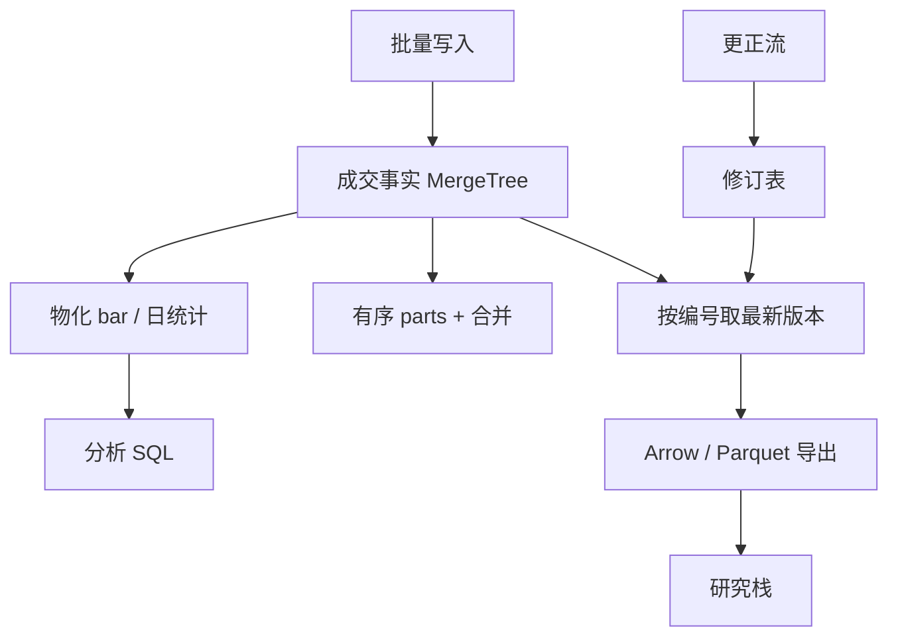

# ClickHouse 金融时序

    
MergeTree 把数据按主键排序后切成不可变的 parts，后台再合并——它对金融时序友好的部分是「追加」与「按时间扫描」；不友好的部分是「改一行」与「按事件做有状态的复杂窗口」。

    <footer>—— 据 ClickHouse 对 MergeTree 家族、分区与投影的文档；金融场景是对该引擎的用法，而不是另一种行情协议</footer>

研究集群常常已经为日志与产品分析跑着 ClickHouse。把成交与报价也放进去，可以让同一套权限、同一套 SQL、同一套物化视图服务交易与非交易用户。这与 [kdb+](/quant/kdb-plus)、[DolphinDB](/quant/dolphindb) 的定位不同：ClickHouse 先是分析型 OLAP，后被用来存 tick，而不是从 tickerplant 长出来的进程。本篇写金融时序在 MergeTree 上怎么分区、怎么排序、怎么处理更正，以及它何时不该替代内存行情库。交换格式仍应尽量走 [Apache Arrow](/quant/apache-arrow)，以免 SQL 结果在客户端被拆成行。它不是低延迟撮合引擎，也不提供交易通道。

## 问题

Tick 的查询以扫描为主：某标的某日的全部成交、一段日期上的分钟聚合、跨品种的简单连接。MergeTree 的 parts 按主键有序，主键若以 `(symbol, timestamp)` 或 `(date, symbol, timestamp)` 开头，这类扫描可以只读少量 parts，并在 part 内做有序归并。问题有三。第一，排序键不是二级索引的无穷集合：选错之后，第二种访问模式会变成全表读。第二，金融数据有更正与晚到，而 MergeTree 的默认路径是追加；`ALTER UPDATE` 是重写 parts 的昂贵操作。第三，ClickHouse 的分布式表把查询发到分片再聚合，分片键若与查询无关，网络会被 tick 填满。

与专用时序库相比，ClickHouse 的 SQL 生态与物化视图更强，流式有状态计算更弱。架构上要回答的不是「能不能存」，而是「哪一类查询以它为真源，哪一类仍必须留在 RDB」。

### 排序键、分区与粒度

分区（`PARTITION BY`）建议用交易日或月份：丢弃某日、优先压缩某日、限制合并范围。排序键（`ORDER BY`）决定 part 内布局。若查询几乎总是「单标的 + 时间范围」，`(symbol, ts)` 合适；若几乎总是「某日全市场扫描」，`(toDate(ts), symbol, ts)` 或按日分区后再 `(symbol, ts)` 更合适。同时要两种极致访问的机构，往往需要两张表或投影（projection）：一张服务盘后研究扫描，一张服务按标的的点查。不要指望一个排序键打天下。

主键稀疏索引标记的是 granule，不是每一行。点查某一毫秒的某一笔，未必比扫描该标的该分钟更便宜。需要订单编号点查时，应另建字典或把编号放进排序键的前缀，并接受写入变慢。

## 方法

表设计按「不可变事实 + 修订流」拆。成交事实表只追加：交易所时间、到达时间、符号、价、量、成交编号、场所。更正写入修订表，带原编号与新值。读时用 `ReplacingMergeTree` 或查询端 `argMax` 按编号取最新版本——两者都必须声明最终一致性窗口：合并完成前，同一编号可能看见旧行。对研究，日终做一次强制合并或物化「已对账日」表，与 [迟到对账](/quant/late-data-recon) 对齐。对仪表盘，接受短暂双版本，并在文档里写明。

聚合不要每次从 tick 现场算。物化视图把分钟 bar、品种日统计写成宽表；视图的时钟必须与研究脚本的 bar 函数一致，包括是否包含当前未完成分钟、午休是否断开。ClickHouse 的 `AggregatingMergeTree` 适合增量状态，但状态函数的可交换性要核对：某些分位数状态与「先过滤后聚合」不可交换，不能把盘中过滤逻辑偷偷塞进未声明的视图。

### 写入路径与小 parts

高频写入会产生大量小 parts，合并跟不上则查询变慢、文件句柄爆炸。缓冲层（批量 insert、Kafka 引擎、或上游先在内存攒批）是金融接入的常规。批次过大增加延迟，过小增加 parts——这是分析库的延迟/吞吐权衡，不要用它去追 tickerplant 的单条延迟。去重：恰好一次投递在跨进程里几乎没有，主键去重应在表引擎层声明，并在对账作业里再做一次计数交叉。

与 Arrow 的衔接：`INSERT` 与 `SELECT` 尽量用列式块。JDBC 一行行拉会把 OLAP 变成 OLTP 客户端。研究作业用分区裁剪的 `SELECT` 写出 Parquet/Arrow 文件，再交给 Qlib 或自研特征，而不是让笔记本对集群做交互式全表 join。

## 机制

MergeTree 的机制是不可变 parts + 后台归并。追加快，是因为不更新旧文件；读快，是因为有序扫描与稀疏索引。金融更正之所以别扭，是因为「改历史」违反了不可变假设，只能靠新 part 里的新版本在合并时覆盖。理解这一点，就不会在盘中对 tick 表做行级 `UPDATE`。Replacing/Collapsing 族把版本语义编码进引擎，查询仍须 `FINAL` 或等价聚合才能在合并前看到终态——`FINAL` 有代价，不能当默认。

分布式查询的机制是：协调节点把过滤下推到分片，再二次聚合。分片按 `sipHash(symbol)` 还是按日期，决定「单标的历史」会不会打到所有节点。金融时序更常按符号分片、按日期分区：单标的走少分片，某日全市场可以并行。反过来按时间轮询分片，单标的查询会变成广播。这些选择一旦写入几年数据，迁移成本接近重建。

### 何时它不是行情库

ClickHouse 不维护「当前簿」的可变状态，也不提供 q 那种与内存表绑定的订阅回调。你可以用它存 L2 快照，但不能指望它成为队列位置模拟的主循环。低延迟告警、盘中风控限额，应落在流系统或专用 RDB；ClickHouse 承接的是扫描、共享分析与跨团队 SQL。把两者职责写进同一张图，比争论「谁更快」更有用。

物化视图是写放大。每一条 tick 若触发三张下游表，磁盘与合并队列一起涨。视图应只保留真的有读者的粒度；实验性特征走离线作业，不要永久挂在写入路径上。

## 边界

ClickHouse 的一致性不是金融级账本：副本是异步的，`FINAL` 不是快照隔离的替代。不要用它做资金账。时区设置、`DateTime64` 精度与客户端会话时区会制造难以察觉的错位，应在表上固定 UTC 或交易所时区，并禁止隐式转换。字符串符号没有 kdb+ 那种枚举保证，高基数 `LowCardinality` 要测内存。A 股午休、夜盘交易日切分，仍是日历表问题，引擎不知道 21:00 属于下一个交易日。

不要把 MergeTree 当消息队列。不要用 `OPTIMIZE FINAL` 当日常更正手段。不要在排序键里放高基数的无过滤列。跨机房查询要把分区裁剪当作正确性检查：计划里若出现全表读，应失败而不是默默跑四小时。

基准测试若用未压缩的随机字符串、或不按日期过滤的 `count()`，测到的不是金融负载。应用真实的符号基数、时间局部性与列投影，再和 kdb+/DolphinDB 比。

## 小结

- ClickHouse 用 MergeTree 的有序 parts 服务追加型扫描，适合作为共享分析库中的金融时序存储。
- 分区按日、排序键按主导查询；更正走版本表或 Replacing，而不是行级改写。
- 物化视图有写放大，只保留有读者的粒度；小 parts 必须用批量写入控制。
- 它不替代内存行情库与事件驱动撮合；职责应在架构图上拆开。
- 与 Arrow 批式交接，避免把 OLAP 结果行式化。
- 出处：ClickHouse MergeTree 家族、分区、投影与物化视图文档；金融时序是该引擎上的表设计，而非单独产品。
