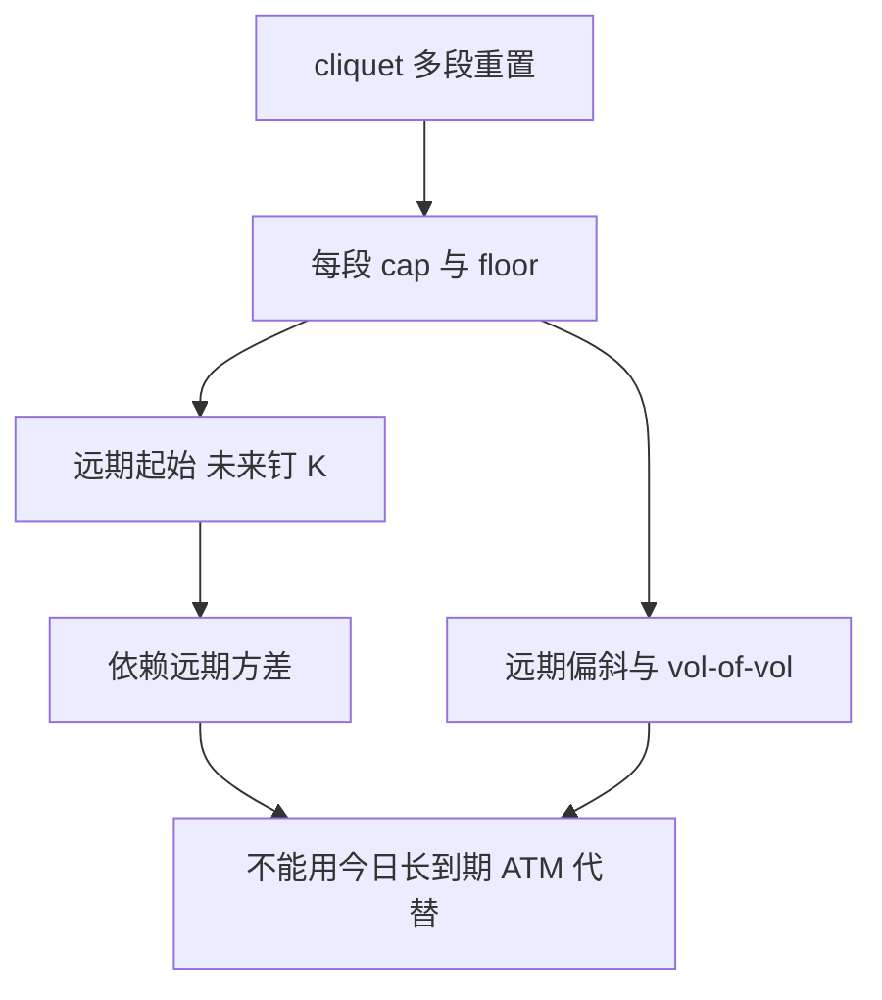

# 远期起始与 cliquet

远期起始期权在未来某日才把执行价钉成当时的现价；cliquet 是一串重置的远期起始，局部收益被封顶封底后再累加。

<footer>—— Rubinstein, Pay Now, Choose Later, Risk, 1991；cliquet 结构见结构产品实务与 Wilmott 对重置期权的讨论</footer>

[上一课](/quant/quanto-options)把外汇计价加进多资产。本课回到单资产，但把**执行价的时钟**推迟：远期起始在 $t_0\gt 0$ 才令 $K=S_{t_0}$，cliquet 把区间收益 $\bigl(S_{t_{i+1}}/S_{t_i}-1\bigr)$ 逐段封顶，再累加或复合。缺口是前向微笑——ATM 香草曲面不够，因为每段重置都在未来的 ATM 上取值。后课 autocallable 会把重置与障碍耦合。

## 问题

普通香草的 $K$ 在 $t=0$ 已知，Vega 落在当前曲面的一个点。远期起始的价值在 GBM 下可写成折现的 ATM 公式，只依赖从 $t_0$ 到 $T$ 的远期波动；有微笑与期限结构时，需要的是**未来那一天的 ATM 已实现隐波**，也就是远期波动，而不是把 $T$ 到期的今日 ATM 拿来用。Cliquet 把许多段短到期的远期起始串起来，再对每段施加 cap/floor，于是对远期偏斜与远期波动的凸性极度敏感。

卖方若用今天的短到期 ATM 去加总，会漏掉 vol-of-vol：未来 ATM 会动，封顶使每段收益的分布被截断，凸性符号与香草相反。2000 年代欧洲 cliquet 的亏损，多来自用局部波动或扁平远期 vol 低估了这种凸性。

### 一段远期起始不是「到期更晚的 ATM」

记区间 $[t,T]$。远期起始看涨在 $t$ 变成执行价 $S_t$ 的 ATM（或 $\alpha S_t$ 的百分比执行价）。其 $t=0$ 的价格依赖 $t$ 到 $T$ 的远期方差。今日交易的 $T$ 到期 ATM 含 $0$ 到 $T$ 的整段方差，减不干净 $0$ 到 $t$ 的那一段与相关。必须用方差互换或日历结构抽出远期方差，见 [方差互换](/quant/variance-swap-vix) 与 [隐波曲面](/quant/vol-surface)。

百分比执行价 $\alpha\neq1$ 的远期起始，吃的是未来微笑上 $\alpha$ 那一点，不是未来 ATM。局部 cap 为 5% 的月度 cliquet，对每个月的上侧偏斜一阶敏感。

## 方法

GBM：远期起始有闭式，cliquet 在独立对数正态段下可把每段当封顶封底的数字组合。有微笑：局部波动能重现今日香草，但远期微笑往往过扁，cliquet 会系统性偏便宜或偏贵，应对照 [Heston](/quant/heston) / [SABR](/quant/sabr) 的远期微笑。数值上用带重置的 [蒙特卡洛](/quant/mc-pricing)，状态含当前现价与已累计票息；不要对整段路径只看 $S_T$。

对冲：逐段的远期 Vega、对 cap 水平的数字风险、以及重置日附近的 Gamma。日历对冲用香草日历价差去逼近远期方差，残差是偏斜与 vol-of-vol。

## 机制

重置把路径切成相邻收益。每段的封顶等价于卖出该段上侧数字/看涨价差，封底等价于买入下侧保护。整份 cliquet 于是是一串远期起始的香草与数字。定价核关心的是每段收益的风险中性分布，也就是远期微笑。局部波动沿今日密度演化，对未来偏斜的预测往往不足，这正是 cliquet 成为模型试金石的原因——不是因为结构「更奇异」，而是因为它把曲面的时间演化暴露出来。

## 边界

段与段之间的相关（波动聚集）会改变累计票息的分布，独立段假设会错。离散分红、停牌、涨跌停让「区间收益」的定义依赖合同。权益连结年金与零售 cliquet 还叠加死亡率与退保，本课只写市场风险那一块。

不要把 cliquet 当「每月锁定收益的理财」。cap 已经把上侧卖掉，floor 的成本在票息里；模型若低估远期偏斜，卖掉的上侧会系统性便宜。

## 小结

- 远期起始吃的是未来 ATM（或百分比执行价）的远期波动，不是今日长到期 ATM。
- Cliquet 是带 cap/floor 的重置串，对远期微笑与 vol-of-vol 敏感，局部波动常不够。
- 对冲要拆成远期方差、数字与重置日 Gamma。
- 出处：Rubinstein, *Risk*, 1991；远期微笑与 cliquet 的模型敏感见 Bergomi 对远期方差的论述。
