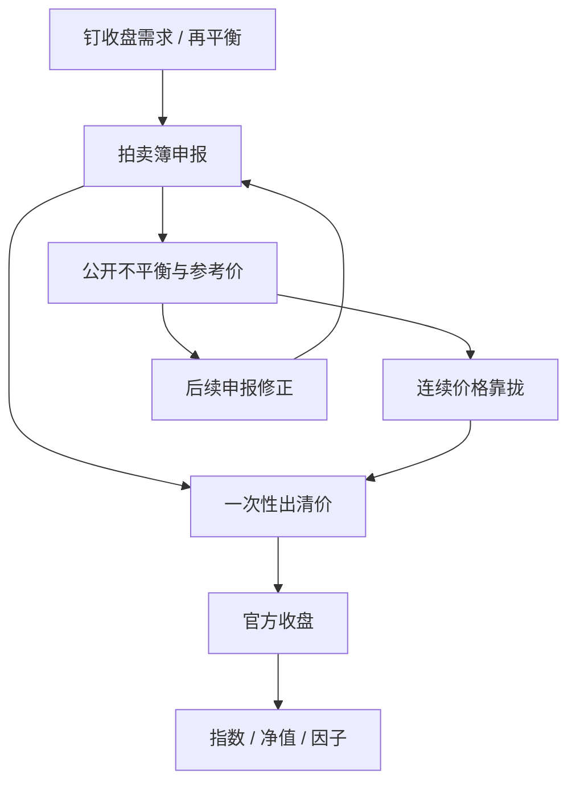

# 收盘竞价不平衡

    
收盘价往往不是连续竞价的最后一笔，而是一段时间申报一次性出清的价格；出清前公开的未匹配量，是流动性与信息的混合物，不是一张免费的方向支票。

    <footer>—— 据 NYSE / Nasdaq 收盘竞价与上交所、深交所收盘集合竞价公开规则整理</footer>

许多基准——指数、基金净值、因子收益——钉在官方收盘价上。官方收盘在拍卖市场里由收盘集合竞价产生：一段时间接受市价与限价（及各市场规定的收盘指令），按最大成交量等规则确定单一出清价。出清前，交易所往往公布买卖不平衡（imbalance）：市价收盘指令与可成交限价在当前参考价上未能匹配的净量。Cushing 与 Madhavan、以及后续对收盘拍卖份额上升的研究，把尾盘当成机构再平衡与指数叠加的高密度时段。本篇写不平衡的公开机制、它如何进入价格发现、以及执行上如何把收盘拍卖当成场所而不是当成信号工厂。A 股规则细节对照 [涨跌停与集合竞价](/quant/cn-limit-auction)；此处把拍卖不平衡当作跨市场的对象。

## 问题

连续簿上的订单不平衡是各档净深度或 OFI，见 [订单流毒性](/quant/ofi-toxicity)。收盘不平衡是拍卖机制里的未匹配量：在当前参考价上，愿意以收盘价买的量减去愿意卖的量（定义因交易所而异，常把市价收盘指令优先计入）。它在连续交易仍进行时被公布，于是有两台同时运行的市场：连续限价簿，以及即将出清的拍卖簿。问题是三重的。第一，收盘价如何由拍卖规则生成，连续最后一笔不能替代。第二，不平衡公布改变连续价格与后续申报，回测必须用当时已公布的快照，不能用最终收盘后的净量。第三，母单是否、以何种上限参与拍卖：拍卖提供集中流动性，也集中冲击，且部分时段不可撤单。

指数再平衡、ETF 申赎、主动基金的「钉收盘」使收盘拍卖的量远大于普通时段的同等分钟。把收盘价当无摩擦标记，会低估真实 [实施缺口](/quant/implementation-shortfall)：你要么在拍卖里与所有钉收盘的人挤在一起，要么提前完成而承担相对收盘的偏离——两头都有成本。

### 公布是信息释放，也是博弈对象

不平衡公布降低信息不对称：做市商与套利者看到将在收盘出清的净需求。公布也会成为博弈对象：早期申报可以试探，使参考价与不平衡数字移动，诱使他人提供反向流动性。各交易所用不可撤时段、随机收盘、价格笼子、对市价收盘指令的截止时间来限制这种试探。把美股 15:50 之后的不平衡当成「已知的收盘方向」去在连续盘抢跑，忽略了随后仍有反向 LOC、D 类指令与取消（在仍允许取消的市场），以及拍卖出清价不必等于当前连续中间价。A 股 14:57–15:00 不可撤，试探被关掉，提交变成硬赌注；虚拟未匹配量是当时可见的不平衡代理。

不平衡的符号与收盘收益同向相关，是公开的经验事实，因为它部分就是将要发生的净需求。相关不等于可交易净边缘：价差、不可撤、反向流动性的到达，以及你自己的参与会改写数字。把历史相关写成 alpha，而不扣拍卖冲击，是纸面收益。

## 方法

数据层。每只证券、每个交易日保留：不平衡公布时点的净量、参考价、配对量、随后修正（若有多次公布）、连续中间价、最终出清价与成交量。特征只用当时已发布字段。A 股用竞价阶段的虚拟参考价、虚拟匹配量、虚拟未匹配量，且 14:57 后的申报在模拟器里不可撤销。美股需区分交易所：NYSE 与 Nasdaq 的指令类型、公布频率、市价收盘截止时间不同，不能用一个「美国收盘不平衡」字段混用。

执行层。母单若以收盘为基准，应显式分配：连续时段完成多少、拍卖申报多少。拍卖腿的上限按预测拍卖量的参与率设置，与连续 POV 分开，见 [自适应 POV](/quant/adaptive-pov)。市价收盘指令优先成交、对出清价没有保护；限价收盘指令提供价格保护、有不成交风险。规格必须写指令类型。评价用决策价或到达价，而不是「是否贴近收盘」——贴近收盘是同义反复，若你的量已经进入收盘成交。

### 出清价规则决定不平衡如何被吸收

集合竞价的典型原则：最大成交量；优于出清价的申报全部成交；等于出清价的一侧至少全部成交；多解时按未成交量或中间价等次级规则。不平衡在出清价上被尽量吸收；吸收不完的市价意向要么按规则以出清价排队到下一时段（若有），要么失效。因此「巨大的买不平衡」不保证价格涨 10%：若卖限价在附近堆着，出清价可以只移动一档，巨量在该价成交。冲击模型必须用拍卖供给曲线（公开的量价）而不是用连续平方根去外推拍卖。连续平方根描述的是吃多层连续簿；拍卖是一次出清，深度是累积申报。

涨跌停走廊截断拍卖出清价。A 股收盘集合竞价仍在涨跌幅内；若意愿价越出走廊，出清停在涨跌停价，未匹配量留下，次日开盘再发现。用收盘价计算的因子收益，在锁定板上对受约束的一侧不可实现。

## 机制

收盘拍卖把分散的「必须在官方价格上成交」的需求集中到一个出清。集中的好处是配对厚度：买卖双方的限价在同一价格相遇，有效价差可以小于连续尾盘的浅簿。集中的坏处是拥挤：同向母单相关，供给曲线更陡。不平衡公布是把将要发生的净需求提前显示，连续价格会向出清价靠拢，套利者用连续腿对冲拍卖腿。靠拢使最终跳开变小，但把发现从 15:00 整点提前到公布窗口——对在公布后才下连续单的人，信息已经被部分写入。

钉收盘的机制来自契约：指数基金要最小化相对指数的追踪误差，指数用收盘价；主动基金的日净值与考核也常用收盘。契约把弹性需求变成无弹性需求，拍卖量因此对「这一分钟的 alpha」不敏感。执行架构应把这类流量当制度季节性（再平衡日、期权到期、季末），冲击核单独校准，而不是用平静日的 $G(\tau)$。

自己的收盘申报会计入随后公布的不平衡。大单用市价收盘，会把自己写成「市场不平衡」再让自己去交易这个信号。研究不平衡预测时必须剔除或滞后自身订单，否则是循环。

### 与连续 OFI、开盘拍卖的差别

连续 OFI 是事件驱动、可撤、影响中间价的瞬时斜率。收盘不平衡是存量、受截止与不可撤约束、影响一次性出清价。开盘拍卖与收盘拍卖同族，但开盘面对隔夜信息、参与者集合不同，不平衡对后续连续价格的预测力通常更强，因为连续尚未开始。收盘时连续已经交易了一天，拍卖更多吸收钉价流量。把开盘不平衡的系数用到收盘，或把美股多次公布的斜率用到 A 股三分钟不可撤，都是对象错配。港股收盘竞价时段的随机结束、价格限制与不可撤规则又是另一套，必须按交易所分模型。

## 边界与工程取舍

拍卖规则会改。用过期的截止时间回测当前策略，会把不可用的撤单写成风控。模拟器必须版本化。部分市场允许收盘后修正或盘后交易，官方收盘与你可成交的最后价格不是同一个；产品合同要写用哪一个标记净值。

不要把公布的不平衡当免费 alpha。学术上的可预测性经过成本与拥挤之后往往很薄，且在拍卖份额上升后衰减。不要为了「提供流动性赚不平衡溢价」而无上限地挂反向限价收盘：一旦出清价跳过你的限价，你不成交，追踪误差留下；一旦所有人都挂在同一侧，溢价消失。容量由拍卖深度决定，不是由连续 ADV 决定。

跨上市标的（A/H、ADR）的收盘不同步，一边的拍卖不平衡不能当另一边连续盘的同步信号而不处理时差与汇率。指数期货在股票收盘前后的基差，含拍卖发现，见股指期货贴水讨论；用期货去「对冲」股票拍卖腿，对冲比在出清完成前是估计值。

本篇说明公开不平衡如何进入发现与执行选择，不讨论伪造不平衡、在截止前撤单诱导或干扰收盘价的手法。那些属于市场操纵范畴，不是执行架构。

## 小结

- 收盘竞价不平衡是拍卖出清前的未匹配净量，与连续 OFI 不是同一对象；回测必须用公布时点的快照。
- 官方收盘由最大成交量等拍卖规则生成，不能用连续最后一笔替代。
- 拍卖提供集中流动性也集中拥挤；母单应单独设拍卖参与上限，指令类型（市价收盘 vs 限价）必须写进规格。
- 不平衡与收盘收益的相关含将要实现的净需求，扣冲击与自身订单后才谈得上边缘。
- 自身收盘申报会进入随后的不平衡数字，信号研究要避免循环。
- 再平衡日与季末应单独校准冲击，平静日的连续核不适用。
- 出处：Cushing and Madhavan 对尾盘与收盘集中的讨论；Harris, *Trading and Exchanges*；上交所 / 深交所交易规则收盘集合竞价条款；NYSE、Nasdaq 收盘竞价公开规则。
