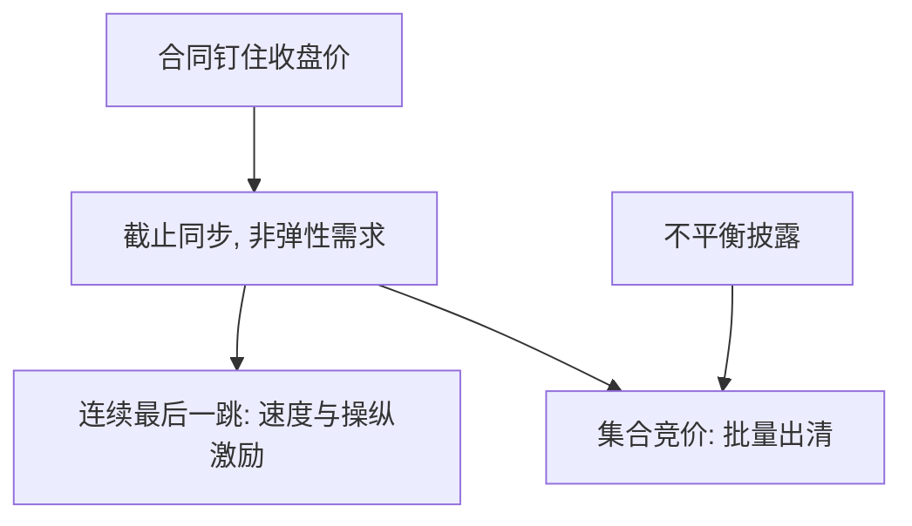

# 收盘竞价机制对比

收盘价是指数、基金与衍生品的参照，不是普通的又一笔连续成交。把参照放在连续簿的最后一跳上，会把截止时间硬约束与速度竞赛叠在最贵的那一分钟；放在集合竞价上，则把竞争改回批量出清。

<footer>—— Pagano and Schwartz, A closing call's impact on market quality at Euronext Paris, Journal of Financial Economics, 2003</footer>

[速度颠簸](/quant/speed-bump-iex)处理连续时段的跨市场狙击。缺口是一天里信息与仓位最集中的一点：收盘。Pagano 与 Schwartz（2003）评估收盘集合竞价对质量的影响；Barclay 与 Hendershott 对盘后发现的研究说明参照时刻一过，发现转移到别处。本课比较连续收盘、收盘拍卖、收盘不平衡披露，不重写开盘拍卖的全部规则。

## 问题

指数基金、期权到期、杠杆再平衡把大量非弹性需求钉在官方收盘价。Admati–Pfleiderer 的择时在此变成强制同步：$T=0$ 对所有人同时成立，限价/市价阈值倒向必须成交。若收盘只是连续簿最后一毫秒，狙击与幌骚的收益最大，因为价格进入合同。若收盘是集合竞价，订单在交叉前累积，统一价出清，时间优先弱化，接近一次性 Kyle 批量——但需求弹性仍可能很差，冲击可以很大，只是竞赛形态变了。

问题是机制比较：是否披露不平衡、是否允许价格限制、是否与连续时段隔离、跨市场如何定义「同一时刻」。

### 披露不平衡的双刃

NYSE 等披露收盘买卖不平衡，吸引反向流动性，降低出清冲击，也给知情者一个信号去加码同向。透明课的权衡在收盘被放大：参照价的公共价值使信号更值钱。完全不披露则反向供给靠猜，冲击方差大。设计是披露精度与次数，不是二元。

中国与欧洲、美国的收盘协议差异大。本课写比较维度，不背诵某一交易所手册。涨跌停收市另见涨跌停课，本课假设连续时段已经结束或并行。

## 方法

质量指标应对准收盘价的用途：收盘价相对随后开盘或过夜中点的回复（暂时成分）、收盘窗口的有效冲击、拍卖参与率、跨市场领先滞后。Pagano–Schwartz 看引入收盘 call 之后的波动与定价误差。比较静态：强制入拍卖的订单比例越高，拍卖越厚，连续尾盘越薄——场所在两种协议间转移即时性。

与 FBA：收盘拍卖是一天一次（或几次）的长批次，不是毫秒 FBA。它解决参照价的竞赛，不解决午盘的跨市场狙击。

## 机制

收盘价是公共品。连续协议下，公共品的最后一跳被私人速度占有。拍卖把占有改成价格竞争，但仍可能被大单操纵若流动性不够反向。义务做市商常被要求参加收盘，是压力义务的日常版。指数编制若改用一段时间的 VWAP，等于把批次拉长，操纵成本上升，但对「那个价格」的合同要全部改写。

策略噪声在收盘不是噪声：他们是指数与 ETF。把收盘量当信息事件会系统性高估 PIN。Easley–O'Hara 的无事件日仍会有巨大收盘不平衡。

## 边界

多上市股票的官方收盘以哪一场所为准，决定竞赛地点。ETF 与期货的收盘若不同步，基差在最后几秒爆炸，传导回现货拍卖。盘后继续交易则「收盘」只是会计时刻，发现未结束——下一课盘前盘后。拍卖规则的细节（是否允许市价、如何处理无法出清）会改变 $P(Q)$，不能只用「有拍卖」当虚拟变量。

执行上，被动指数仓位应进入拍卖而不是在尾盘连续簿上假装自己是噪声掩护；那里的 $\lambda$ 是同步冲击，不是 Kyle 掩护。

期货收盘与现货拍卖若时钟错开，领先市场仍可以在连续协议里定义参照。下一课看期货撮合算法本身，那才是许多指数产品的发现场所。

## 小结

- 收盘价的合同用途使截止同步，连续最后一跳放大速度与操纵激励。
- 集合竞价把竞争改回批量；不平衡披露吸引反向供给也泄露信号。
- 收盘量不是信息事件的充分统计量。
- 出处：Pagano and Schwartz, *Journal of Financial Economics*, 2003；对照 Barclay and Hendershott 对交易时段与发现的研究；批量直觉见 Kyle, 1985。
