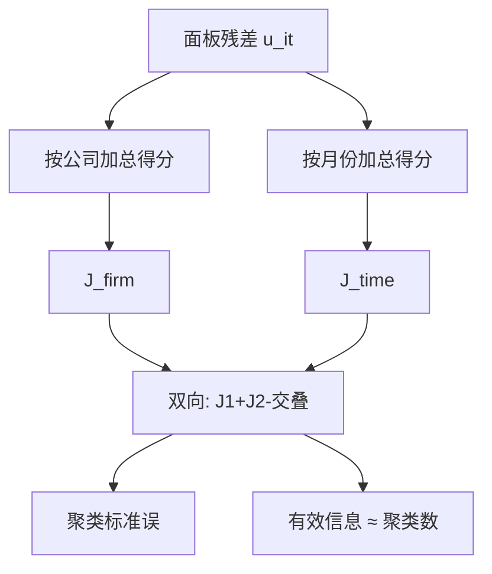

# 聚类标准误

同一家公司的多年残差、同一月份所有股票的残差，都不是独立实验；把相关关进聚类里，信息量按聚类个数来数，而不是按观测行数来数。

<footer>—— Petersen, Estimating Standard Errors in Finance Panel Data Sets: Comparing Approaches, Review of Financial Studies, 2009</footer>

[Newey–West](/quant/newey-west) 把**一条**时间序列的得分自相关写进长期方差。资产定价与公司金融的数据却是面板：多只股票、多个日期。只对时间做 HAC，等于假装不同股票同期独立；只对股票做稳健，等于假装同一股票跨年独立。Petersen 把金融面板里常见的低估标准误写成可对照的实验：真实相关结构一开，OLS/White 的拒绝率远超名义水平。本课缺口是把三明治的「独立观测」换成**聚类**：组内任意相关、组间独立。双向聚类（公司与时间）是金融默认之一，与 [Fama–MacBeth](/quant/fama-macbeth) 是同一问题的两种算法。

## 问题

面板 $y_{it}=x_{it}^\top\beta+u_{it}$。若 $\mathrm{Cov}(u_{it},u_{jt})\neq 0$（同期行业、市场冲击）或 $\mathrm{Cov}(u_{it},u_{i,t+k})\neq 0$（公司持久未观测），得分 $g_{it}=x_{it}u_{it}$ 在组内相关。把 $NT$ 当样本量，标准误以 $\sqrt{NT}$ 缩小，实际上独立信息可能只有 $N$ 家公司或 $T$ 个月。

聚类估计把组 $c$ 内的得分先加总成 $G_c=\sum_{i\in c}g_i$，再对 $\{G_c\}$ 做 White：

$$
\hat J=\sum_c G_c G_c^\top.
$$

组内相关形式不必指定。问题是：**聚类维怎么选**，以及聚类数太少时渐近以谁为准。

### 单向还是双向

只按公司聚类：允许公司内任意序列相关，但假定不同公司同期独立——月度截面里这条假。只按时间聚类：允许同期任意截面相关，但假定跨期独立——持久的公司效应下这条假。Petersen 与 Thompson、Cameron–Gelbach–Miller 的双向聚类把两个 $J$ 相加再减去交叠项（公司–年格子），同时覆盖两种依赖。金融月度面板上，双向往往比只选一个方向更接近真实拒绝率。

聚类维应与识别假设对齐。政策按州实施，残差按州聚类；因子冲击按月到来，至少按月聚类。按「行业–年」聚类若行业数很少，名义上很稳健，实际上自由度是两位数。

## 方法

**实现。** 多数软件的 `cluster` 是对指定 id 把得分加总。双向需要公司与时间两个 id。小样本校正（G 个聚类时乘 $G/(G-1)$）应打开。聚类数小于约 30 时，渐近 $z$ 会过度拒绝，应用聚类 bootstrap 或对 $t$ 用 $G-1$ 自由度（Cameron–Miller 综述）。

**与固定效应。** 公司固定效应吸收了不随时间变的组内相关的一部分，但时变的公司残差相关仍在，仍要按公司聚类。时间固定效应吸收共同冲击的水平，股票特异的同期相关（行业）仍在，仍要按时间或行业聚类。FE 与聚类不是替代，见下一课 [面板与固定效应](/quant/panel-fe-finance)。

**与 Fama–MacBeth。** FM 把每一期截面当一次实验，对 $\{\hat\lambda_t\}$ 取时间序列标准误——本质上是按时间聚类的一种。个股特征回归里，Petersen 表明：只 FM、不处理公司内相关，仍会偏小。实务对照：双向聚类的混合 OLS、FM + 公司聚类的 $\lambda_t$ 序列、以及后课 GMM。结论只在某一种标准误下显著，应写明。

### 聚类不能替代的东西

聚类不管内生。按州聚类不会让反向因果消失。重叠长期收益若在同一公司多行出现，聚类能吸收一部分，但正确对象仍是重叠结构本身。极不平衡面板里，一个超大公司占 $G_c$ 的大部分，聚类方差被该实体主导——应报告是否对规模加权、是否剔除。

## 机制

独立时每个 $g_{it}$ 都是新信息。组内完全相关时，一个组只贡献一份信息，$G_c$ 的方差不随组内行数下降。三明治用 $G_c G_c^\top$ 自动完成这件事：组内怎么相关都进了 $G_c$ 的二次型。这就是「信息量按聚类数数」的机制。

双向的机制是 Bonferroni 式的并：公司内链与时间内链都允许，再减掉格子被算两次的对角。它仍要求**不同公司在不同时间的残差**不要有尚未被 $x$ 吸收的共同结构——例如所有公司共享一个未被回归元抓住的长期制度。那种情况需要更厚的 HAC、因子、或把标准误再加一层。

「聚类让标准误变大」不是定理。若组内相关为负（超常收益后的反转被重复计算），聚类标准误可以变小。应看经济上相关该是正是负，而不是把变大当成稳健的充分统计。

### 多维与过细

可以按「公司 × 交易所」聚，若这才是独立实验的边界。过细（按公司–日）等于回到 White。过粗（按十年一个体制）只剩几个聚类，估计的是那几个块的方差，不是 $\beta$。先写清随机性来自哪一维：抽样公司、抽样年份，还是抽样市场冲击。

## 边界与工程取舍

$T=12$ 的短面板按时间聚类没有渐近。IPO、退市导致的非平衡会让晚期月份的 $G_t$ 更吵。国际面板按国家聚类，国家数往往太少。高频面板不要按毫秒当时间聚类——应对齐到事件或分钟，否则 $T$ 虚高。

工程默认：公司金融年度面板按公司聚类；资产定价月度个股按公司与月双向；组合对因子的时间序列则 Newey–West 即可，不必「再按组合聚类」。不要用聚类去掩盖只有 15 个事件的事件研究。不要在同一张表为每个系数挑选使 $t$ 最大的聚类维。

## 小结

- 金融面板的独立信息通常按公司数或月数计，不按 $NT$ 计。
- 聚类把组内相关关进加总得分；双向聚类同时覆盖公司内持续与同期截面相关。
- 聚类数太少则渐近失效，应改 bootstrap 或更粗的检验。
- 与 FM、FE、HAC 分工：同一依赖结构的不同写法，不是层层叠加的护身符。
- 出处：Petersen, *Review of Financial Studies*, 2009；双向见 Thompson, *Journal of Financial Economics*, 2011，以及 Cameron, Gelbach and Miller, *Journal of Business & Economic Statistics*, 2011。
