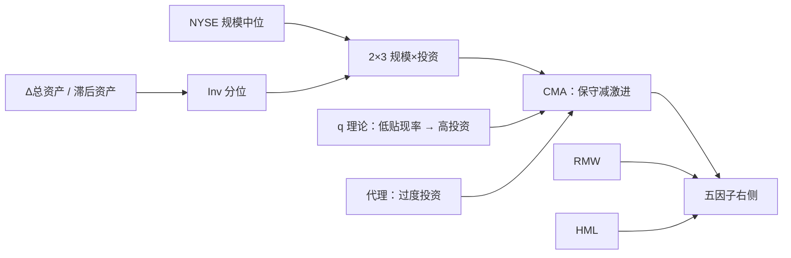

# 投资因子 CMA

    
在股利贴现模型里，给定账面市值比与盈利，更高的预期投资意味着更低的预期收益；把低投资减高投资写成因子，就是 CMA。

    <footer>—— Fama & French, A five-factor asset pricing model, Journal of Financial Economics, 2015</footer>

CMA（Conservative Minus Aggressive）是五因子里的投资腿：做多资产增长保守的公司，做空扩张激进的公司。会计定义是总资产相对再上一年的增长率，不是单一资本开支，也不是「成长股」的别名。更宽的[资产增长文献](/quant/investment-factor)由 Titman–Wei–Xie 与 Cooper–Gulen–Schill 铺开；本篇只写 Fama–French 如何把它收成与 SMB、HML、RMW 同一套语言的多空因子，以及 q 理论与过度投资两条机制在组合上无法被区分的事实。

## 问题

股利贴现把当前市值写成未来超额盈利相对再投资的折现。两边同除以账面股权，得到比较静态：B/M 高、预期盈利高、或预期投资低，都对应更高的内部收益率。三因子只用了 B/M（以及规模），等于把投资信息压缩进价格。若市场对投资的定价不完整，或者投资有独立于估值的共同变动，按资产增长排序的组合就会在三因子上留下负 α。

经验上这正是 1990 年代之后美股的情况：总资产增长、资本开支增长预测负收益，且控制 B/M 后仍然在。问题不是再找一个「能分开组的财务比率」，而是如何做成与 HML 同期重构、同一套 NYSE 断点的因子，并检查它与[盈利](/quant/gross-profitability)、价值的共线是否让某一条腿变得多余。

### 保守减激进，不是成长减价值

CMA 的多头是低 $\Delta A/A$ 的「保守」公司，空头是高增长的「激进」公司。HML 的空头是低 B/M 的成长股。低 B/M 与高投资经常重叠——扩张叙事往往伴随着高估值——但不是恒等：有的公司贵却不投，有的公司便宜却在加杠杆扩表。把 CMA 叫成「反成长因子」会和 HML 的成长腿搞反符号，也会在归因里把同一笔收益算两次。

$$
\mathrm{Inv}_t=\frac{A_t-A_{t-1}}{A_{t-1}}, \qquad \mathrm{CMA}=\overline{R}_{\mathrm{low\,Inv}}-\overline{R}_{\mathrm{high\,Inv}}.
$$

平均收益在规模配比的价值加权组合上取。符号必须保持「低减高」：做成高减低再抱怨与理论不符，只是把腿接反了。

CMA 的「投资」是总资产增长，含并购、存货、应收与现金堆积，不只是 capex。只用资本开支会得到 Titman–Wei–Xie 那条异常，与 CMA 相关但空头持仓不同。复制 French 数据库不要用 capex/销售再对不上数。

## 方法

规模断点仍是 NYSE 中位；投资用 NYSE 的 30% 与 70% 分位。投资取上一年年报相对再上一年的总资产增长，6 月重构以保证财报已发布。主方案是规模×投资的 2×3：六个价值加权组合里，小盘与大盘各自做低投资减高投资，再平均得到 CMA，从而在规模上尽量中性。SMB 在五因子里要对三套 2×3（估值、盈利、投资）的小盘减大盘再平均，以免规模因子只在某一特征上中性。

备选是 2×2×2×2：规模、B/M、盈利、投资各切两档，十六格再按投资维平均多空。交叉控制更干净，格子更稀、微型组合更噪。French 数据库的默认是 2×3。时间序列检验写为

$$
\begin{aligned}
R_{it}-R_{ft}&=\alpha_i+\beta_{iM}(R_{Mt}-R_{ft})+\beta_{iS}\mathrm{SMB}_t\\
&\quad+\beta_{iH}\mathrm{HML}_t+\beta_{iR}\mathrm{RMW}_t+\beta_{iC}\mathrm{CMA}_t+\varepsilon_{it}.
\end{aligned}
$$

按投资排序的检验组合应被 CMA 吸收；若 α 集中在小盘高投资一格，容量叙事要改写，不能把价值加权因子的夏普直接外推到等权空头。

### 与 q 因子对齐，而不是混用两条投资腿

Hou、Xue、Zhang 的 q 因子同样用资产增长，组合是规模×投资交叉，再配 ROE 盈利腿，不用 HML。五因子再交叉营业利润率，并把 SMB 重定义。两条投资因子相关高，但重构日历、分位与样本筛选并不相同。诊断应看盈利×投资表：高盈利高投资的格子里，是 RMW 还是 CMA 在主导。不要下载 CMA 后再塞一条 q 投资多空，声称独立 α。

## 机制

q 理论把高投资读成低贴现率的**结果**：边际 q 高时公司扩张，而边际 q 高可以来自风险溢价下降。于是激进组随后收益低，不是因为市场「罚」投资，而是因为投资已经把低预期收益暴露出来。这条路预测宏观上投资高的年份随后市场收益也低，证据有正有负，公司截面比时间序列干净。

公司金融路径相反：自由现金流充裕时经理过度投资、帝国建造，市场逐步认识到 NPV 为负的项目，价格下调。这条路径预测治理差、反收购强、现金多的公司上效应更大。会计路径第三：扩张伴随高应计与随后的 ROA 回落，投资者对盈利水平反应不足，投资像一个「未来盈利失望」的代理。用现金盈利控制后若溢价仍在，就不只是应计。

五因子把三种解释收成同一对多空腿，并不检验哪一种对。对冲含义却不同：q 理论要对冲贴现率冲击（久期、曲线），代理问题要对冲治理与信用周期，会计路径要对冲盈余公告。工程上只能先承认「CMA 是特征因子」，再在归因里看它与利率、盈利修正的同期相关。

### 与价值、动量的时间冲突

价值股在资本开支上往往更保守，CMA 与 HML 正相关；加入 CMA 之后，美股样本里 HML 对其他四因子常常显得冗余。这不是说价值特征不再预测收益，而是说作为右侧因子，HML 的独立定价贡献变弱。动量赢家里有一批刚完成扩张叙事的公司，CMA 空头与 WML 多头短期冲突。危机后 capex 冰冻，CMA 多头变拥挤；一旦资本开支周期重启，因子会集中回撤。换手低并不等于风险平：经济暴露堆在「扩张是否被证伪」的几年。

CMA 不是反转。一个月收益高的公司不必在投资上激进。长期反转更贴近价格路径，投资更贴近资产负债表扩张。控制过去三年收益后，资产增长仍常显著；把 CMA 写成「长期反转的会计版」并不准确。

## 边界与工程取舍

财务滞后与 6 月重构同样适用。用未发布年报的资产会前视。季度资产能加快信号，并购一次性跳跃会主导排序，需要缩尾或把「重组年」单独分组。金融行业的资产增长含义不同（资产负债表就是产品），French 的股票因子通常剔除金融。A 股借壳、重组可在一年内把总资产翻数倍，等权空头会被这些点绑架。

不要在五因子回归里再塞 capex 多空并声称独立 α，除非已对 CMA 正交。不要把「高 capex 是好公司」的基本面故事直接翻成正的预期收益——截面符号是负的。也不要把本篇的 CMA 与单变量资产增长 decile 画在同一张图上当连续序列：2×3 价值加权、规模中性之后，与等权十分位的空头成分不同。容量上大盘 CMA 可交易；小盘高增长空头含不可借券与停牌。

真实出处：Fama & French, *A five-factor asset pricing model*, Journal of Financial Economics, 2015。资产增长见 Cooper, Gulen & Schill, Journal of Finance, 2008；q 因子见 Hou, Xue & Zhang, Review of Financial Studies, 2015。不要把 CMA 的组合定义标成 2008 年论文。

## 小结

- CMA 是低总资产增长减高总资产增长的规模配比因子，对应股利贴现里「投资高则内部收益率低」。
- 定义宽于 capex，含并购与现金；复制必须对齐 $\Delta A/A$ 与 2×3 断点。
- 机制可以是 q 理论、过度投资或盈利失望，五因子不区分它们。
- 与 HML、RMW、净发行共线，须交叉检验；美股上 HML 冗余不能直接搬到 A 股。
- 出处：Fama & French, Journal of Financial Economics, 2015。
