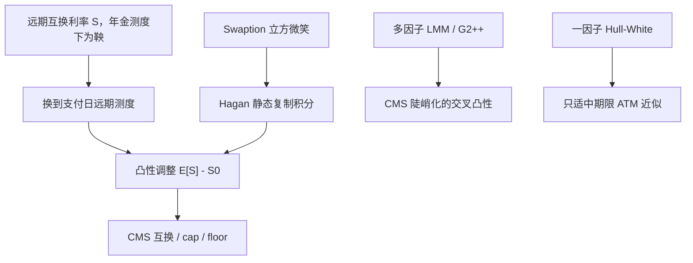

# CMS 凸性调整

    
CMS 支付的是某个期限的互换利率，但计价物不是该互换的年金；把它当成普通远期互换利率来贴现，会系统性标错。

    <footer>—— Hagan, Convexity Conundrums: Pricing CMS Swaps, Caps, and Floors, Wilmott, 2003</footer>

固定期限互换利率（constant maturity swap rate, CMS）出现在结构化票据、陡峭化票据和许多「按 10Y 互换利率支付」的合同里。标准互换里，浮动端若按同一套互换利率在年金测度下结算，互换利率是鞅，平价合约无需凸性调整。CMS 把这个利率在另一个支付日、按另一个年分数付给持有人，计价物变成普通零息或 Libor 腿，鞅性质丢失。Hagan（2003）把由此产生的凸性调整写成可用香草 swaption 静态复制的对象；Hunt、Kennedy 与 Pelsser（2000）的马尔可夫泛函模型则给出与整条微笑一致的动力学框架。本篇写调整从哪一个测度来、复制如何落到 swaption 立方，以及为何一因子 [Hull-White](/quant/hull-white) 对 CMS 斜率产品不够。[LMM](/quant/lmm) 与 [HJM](/quant/hjm) 提供多因子相关，[百慕大互换期权](/quant/bermudan-swaption) 则是另一类必须用同一立方校准的曲线期权。

## 问题

记 $S_t$ 为从 $T$ 开始、期限 $\tau$ 的远期互换利率，年金为 $A_t$。在年金测度 $\mathbb{Q}^A$ 下 $S$ 是鞅，$\mathbb{E}^A[S_T]=S_0$。CMS 合同在 $T_p$ 支付 $S_T$（或 $(S_T-K)^+$），折现用 $P(\cdot,T_p)$。需要的是 $T_p$-远期测度下的期望 $\mathbb{E}^{T_p}[S_T]$。Radon–Nikodym 由 $A$ 与 $P(\cdot,T_p)$ 的比给出，$S$ 在该测度下有漂移，于是

$$
\mathbb{E}^{T_p}[S_T]=S_0+\text{凸性调整}.
$$

调整随互换久期、波动和支付滞后增大。忽略它，CMS 互换的固定端会标得过低（对通常的正凸性），账簿在波动上升时出现无法用普通 DV01 解释的亏损。问题不是「再乘一个经验乘数」，而是选择：解析近似、复制积分，还是全因子模拟。

第二问题是微笑。凸性调整近似于 $S$ 的方差对支付测度的加权，深度虚值与实值的 swaption 都进入复制。只用 ATM cap 校准的一因子树，会把 CMS cap 标在错误的翼部。这与用同一棵树给共终端欧式 swaption 标价不是同一难度：CMS 对微笑的依赖更苛刻。

### 为何标准互换没有这笔调整

平价互换的浮动端可以写成 $1-P$ 对年金的比，恰好使 $S$ 成为可交易资产比，故在 $\mathbb{Q}^A$ 下为鞅。CMS 并不支付「进入该互换」，只抽取 $S$ 这个数当浮动票息。抽取操作换了计价物。Hagan 称之为 convexity conundrum：同一 $S$，在一种结算惯例下是鞅，在另一种下不是。工程上必须按合同写测度，而不是按「都是 10Y 互换利率」复用远期。

支付滞后、锁定与 in-arrears 会再叠加一层标准的凸性（类似 LIBOR-in-arrears）。应先做 CMS 相对年金测度的调整，再加支付惯例调整，不要把两笔揉成一个「经验 4bp」。

## 方法

**复制。** Hagan 指出，在适当假设下，$S$ 的任意（足够光滑的）函数可用一组香草 swaption 的静态组合复制。CMS 支付 $S$ 本身时，复制变成对执行价积分的看涨与看跌加权；CMS cap/floor 则更直接地对应 OTM swaption。实施：从市场 swaption 立方取出该到期、该期限的微笑，插值到复制所需的执行价网格，积分得到凸性调整后的远期 CMS，再按折现曲线送到今天。翼部要用无套利外推，否则积分被高执行价的噪声主导，见期权侧的凸性约束。

**解析近似。** 对对数正态或位移对数正态的 $S$，把 $A$ 对 $S$ 的函数做 Taylor，调整约正比于 $S$ 的方差乘以年金对 $S$ 的凸性。Hull–White 一因子下债券仿射，可以写出更紧的近似，便于快速风险。近似在 ATM、中等期限可用；对 30Y CMS、长滞后、或陡微笑，应以复制或模拟为准。

**模拟。** 在 LMM 或多因子 Hull–White / G2++ 里模拟曲线，在支付日读取互换利率（用当时的折现与投影曲线），折现回今天。相关结构决定 CMS 陡峭化（CMS 10s2s）的凸性：两个 CMS 的调整不能分别做完再减，交叉凸性来自协方差。一因子模型里 10Y 与 2Y 互换利率几乎完全相关，CMS spread 的波动被严重低估。

### 多曲线与 SOFR

折现用 OIS/SOFR，投影用合同指数，年金 $A$ 必须用对冲该互换时真正支付的那条折现。危机后「CMS 对 3M LIBOR」与「CMS 对 SOFR」的复制仪器不同，立方不能混用。后备把 LIBOR CMS 换成 RFR 加常数时，凸性针对的是新指数的互换利率，利差调整不进波动积分。见[SOFR 过渡](/quant/sofr-transition) 与[多曲线](/quant/multi-curve-ois)。

## 机制

机制是伊藤：互换利率是债券的非线性函数，换测度等于把 $S$ 的扩散乘到计价物比的波动上，产生漂移。波动越大、互换越长（年金对利率越弯）、支付日离互换起点越远，漂移越大。符号在通常的收益率定义下使 $\mathbb{E}^{T_p}[S_T]>S_0$，即 CMS 浮动端比远期互换利率更「贵」。卖方若按无调整远期收固定，等于白送凸性。

微笑进入是因为复制积分覆盖全部执行价：翼部越肥，调整越大。这与方差互换对对数合约的复制是同一类静态逻辑，只是权重由年金函数决定而不是由 $1/K^2$。交易 CMS 却只对冲 ATM swaption，是在裸奔翼部 vega。账簿应按执行价分桶报告 CMS 的 vega，而不是一个「10Y 到期的 vega 总和」。

把凸性调整当成「多加几个基点的经验规则」只在小波动、短 CMS 上碰巧可用。波动翻倍时调整几乎按方差走，经验表会在 2020 年这类事件里炸开。规则应来自复制或模型，经验只用来做合理性检查。

### 与短端树、百慕大的计算分界

Hull–White 树擅长美式取消与路径依赖票息，也能给 CMS 一个数，但一因子把曲线模态绑死，CMS 10s30s 的价格不可信。实务分工：欧式 CMS 用复制（市场立方）或校准到立方的微笑模型；带取消的 CMS 结构化票据用低因子马尔可夫泛函或回归 Monte Carlo，并强制欧式边界贴近复制价格。百慕大 swaption 校准共终端香草；CMS 校准整个微笑切片。两种产品不要共用「只拟合 ATM 的 $a,\sigma$」。Hunt–Kennedy–Pelsser 的马尔可夫泛函正是为了让低维状态仍能贴住今日的香草微笑，从而改善 CMS 一类函数。

## 边界与工程取舍

不要用 caplet 波动代替 swaption 波动做 CMS 复制：标的不同。不要在复制积分里使用无约束的外推微笑，负密度会把调整变成任意数。不要对 CMS 陡峭化用两个边际调整相减，必须联合分布。不要用国债 CMS 的历史来标定互换 CMS，[互换价差](/quant/swap-spread) 会进去。

计算上，复制对每个定盘日、每个期限都要一条微笑切片，日历与立方的完整性往往比模型选择更致命。风险上，CMS 对关键期限的 DV01 是状态依赖的：利率上升时 10Y CMS 的久期缩短，线性[关键期限 DV01](/quant/key-tenor-dv01) 只是当日快照，大场景要用重定价。

Hagan（2003）是工程入口，不是唯一严格证明。复制假设互换利率与年金之间有单调确定关系（一因子型）。多因子下这只是近似，残差用模拟估。报告应写明用了复制还是联合模拟。

## 小结

- CMS 抽取互换利率作为支付，计价物不是年金，故需凸性调整：$\mathbb{E}^{T_p}[S_T]\neq S_0$。
- Hagan（2003）用香草 swaption 静态复制；解析近似适中期限 ATM；斜率 CMS 必须多因子。
- 微笑翼部进入积分，只用 ATM 的 Hull–White 会系统性标错。
- 多曲线下年金与复制仪器必须与合同指数、折现一致；SOFR 转换后立方要换。
- Hunt–Kennedy–Pelsser（2000）马尔可夫泛函是「低维状态贴住香草微笑」的一条路。
- 出处：Hagan, *Wilmott*, 2003；Hunt, Kennedy & Pelsser, *Finance and Stochastics*, 2000；测度与年金鞅见 Jamshidian 及 Brigo–Mercurio 教科书表述。
