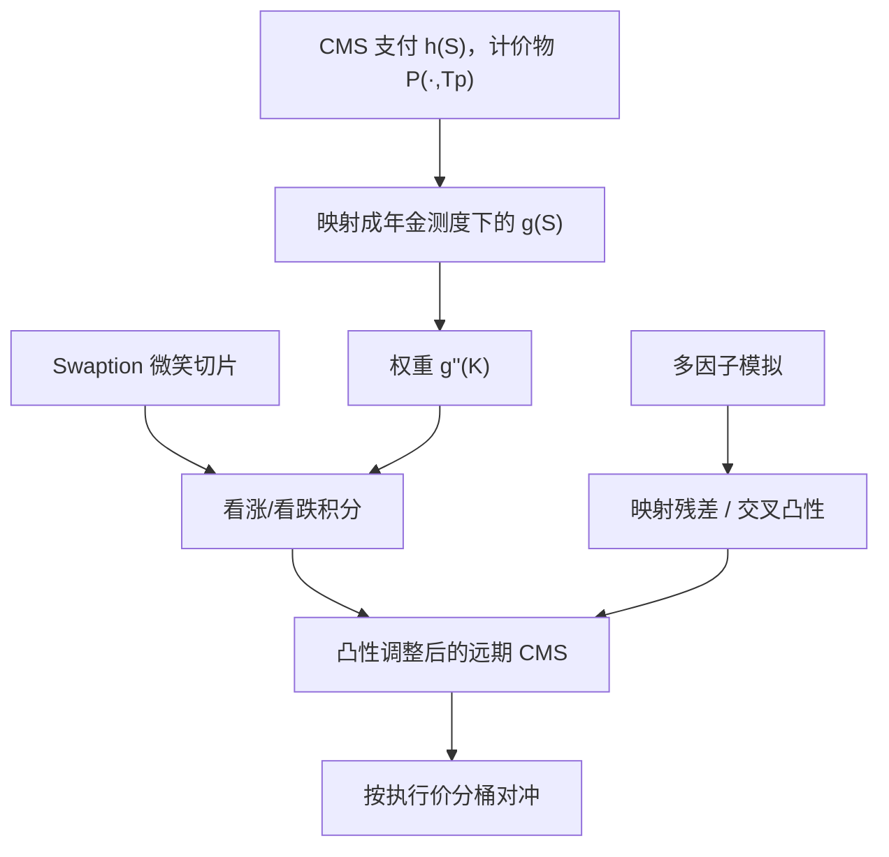

# CMS 复制与凸性调整

把 CMS 支付写成互换利率的光滑函数之后，它的凸性就是对香草 swaption 密度的积分；静态复制把测度变换从「模型里的漂移」变成可以在立方上对冲的一排执行价。

<footer>—— Hagan, Convexity Conundrums: Pricing CMS Swaps, Caps and Floors, Wilmott, 2003</footer>

[CMS 凸性](/quant/cms-convexity) 已经说明：互换利率 $S$ 在年金测度下是鞅，CMS 却按另一计价物支付，故 $\mathbb{E}^{T_p}[S_T]\neq S_0$。本篇把调整从「存在」推进到「如何用 swaption 买下来」。Hagan（2003）的静态复制与 Carr–Madan 对任意支付的积分表示是同一条数学：二次可微支付等于债券加一排香草。差别在于 CMS 的有效支付 $g(S)$ 不是 $S$ 本身——中间隔着年金或现金结算函数——因此权重要用 $g''(K)$，而不是方差互换的 $1/K^2$。一因子 [Hull-White](/quant/hull-white) 可以给一个解析凸性，但复制用的是市场立方，不依赖短端动态；[LMM 测度变换](/quant/lmm-drift-measure) 则给出联合分布，用来检查复制在多因子下的残差。

## 问题

记 $S_T$ 为定盘日的互换利率，$A$ 为对应年金。物理结算的 CMS 在 $T_p$ 支付 $S_T$（或 $(S_T-K)^+$），折现用 $P(\cdot,T_p)$。需要 $\mathbb{E}^{T_p}[h(S_T)]$。Radon–Nikodym 导数正比于 $A_T/P(T,T_p)$。若存在确定的单调映射，把 $A/P(\cdot,T_p)$ 写成 $S$ 的函数，则存在 $g$，使

$$
P(0,T_p)\,\mathbb{E}^{T_p}[h(S_T)] = A_0\,\mathbb{E}^{A}[g(S_T)].
$$

右端是年金测度下对 $g$ 的期望，而该测度下 $S$ 的密度可由香草 swaption 的第二导数读出。问题于是变成：构造 $g$、从立方取出微笑、处理翼部外推，以及现金结算（欧式 CMS 常见）与实物结算的 $g$ 是否同一。忽略映射、把 $g$ 当成恒等，等于用远期互换利率贴现 CMS，系统性强。

第二问题是对冲。复制是静态的：今天买一篮执行价上的 swaption，到期收取 CMS 凸性。立方一动，篮子的 vega 剖面必须与 $g''(K)$ 对齐。只用 ATM 对冲 CMS 账簿，是在裸奔翼部。这与用同一立方给 [百慕大](/quant/bermudan-swaption) 定共终端是不同切片：CMS 要的是**给定到期与给定期限的整条微笑**，不是一条共终端带。

### 二次积分把 $g$ 变成香草

对足够光滑的 $g$，Carr–Madan / Hagan 给出

$$
g(S)=g(F)+g'(F)(S-F)+\int_{-\infty}^{F}g''(K)(K-S)^+\,\mathrm{d}K+\int_{F}^{\infty}g''(K)(S-K)^+\,\mathrm{d}K.
$$

取期望并把香草换成市场报价，年金测度下 $\mathbb{E}^{A}[g(S)]$ 变成 $g(F)$ 加看跌与看涨的积分。$F$ 取今日远期互换利率。CMS 的凸性调整就是积分项除以适当的折现与年金因子之后、相对 $F$ 多出来的那一段。权重 $g''(K)$ 由结算惯例决定：现金结算的年金是 $S$ 的显函数 $\psi(S)$，欧式市场上 $g$ 可以直接写；实物结算下 $A/P(\cdot,T_p)$ 还依赖整条曲线，一因子才严格是 $S$ 的函数，多因子下复制是近似。

复制积分的噪声来自高执行价。$g''(K)$ 若衰减不够快，翼部一个错误的 1% 波动会主导调整。必须用无套利外推（密度非负、两端衰减），不能把立方最后一档平推到无穷。

## 方法

**构造 $g$。** 现金结算 CMS（许多欧式合同）支付 $S\cdot\psi(S)$ 一类，其中 $\psi$ 是标准现金年金属性、只依赖定盘 $S$ 与固定的年分数。此时 $g$ 在一维上闭合，复制在模型假设上最干净。实物结算或「CMS 作为结构化票息、再按 Libor 腿贴现」要把 $A/P$ 投影到 $S$：Hagan 用久期/年金对 $S$ 的局部展开；更高阶把凸性与三阶（偏度）分开。支付滞后、in-arrears 再叠加标准的 Libor 凸性，应分步做，不要揉进一个经验加点数。

**立方。** 取出定盘到期、互换期限 $\tau$ 对应的 swaption 微笑，插值到复制网格（执行价相对 ATM 的对数货币性）。每一档换成年金测度下的 Black 或位移 Black 价格，再数值积分。位移在负利率与低执行价上几乎是必需，否则看跌积分裂。CMS cap/floor 的 $h(S)=(S-K)^+$ 使 $g$ 更接近 OTM swaption 本身，对翼部更敏感；CMS 互换对 $g''$ 的积分更平滑，但对微笑水平与斜率都敏感。

**多因子残差。** 在 [LMM](/quant/lmm) 或 [两因子 Hull-White](/quant/hw-two-factor) 里模拟联合曲线，比较复制价格与模拟价格。残差来自「$A/P$ 不是 $S$ 的确定函数」。一因子残差应接近零（数值误差内）；两因子若 2s10s 波动很大，实物 CMS 的复制会漏交叉凸性。CMS 陡峭化必须联合复制或联合模拟，两个边际 CMS 调整相减得不到 spread 的凸性。

### 对冲：按执行价分桶而不是一个 vega

复制篮子的 swaption 名义正比于 $g''(K)\Delta K$。报告应将 CMS 账簿的 vega 映到与立方相同的到期×期限×执行价桶。ATM 桶解释水平，25Δ 解释偏斜，翼部解释凸性调整对肥尾的依赖。立方插值方法一变，篮子名义就变，这是运营风险：复制网格、外推规则、位移 $\delta$ 必须版本化，与前台 CMS 估值同一套。动态对冲还要补 $S$ 的 delta（对冲对应远期互换）以及折现曲线的关键利率，否则只对了凸性、不对票息的线性部分。

现金与实物两种 CMS 的 $g''$ 形状不同，不能共用一个「10Y CMS vega」限额。欧元现金结算惯例与美元实物惯例混在同一限额里，翼部对冲会对错合同。

## 机制

机制是换测度的凸性被市场密度重新定价。年金测度下 $S$ 的风险中性密度是 swaption 价格对执行价的第二导数（Breeden–Litzenberger）。CMS 需要的是另一测度下的均值，等价于对密度乘 Radon–Nikodym（由 $g$ 编码）再积分。波动越大，密度越分散，落在 $g$ 弯曲处的质量越多，调整越大；互换越长，$g$ 通常越弯；支付越滞后，映射越陡。符号在通常惯例下使远期 CMS 高于远期互换利率：卖方若按无调整远期收固定，等于送出一篮 OTM swaption。

这与方差互换复制同构，权重不同。方差用 $\log$，权重 $1/K^2$；CMS 用结算函数，权重 $g''(K)$。两者都要求静态持有翼部。交易 CMS 却按 ATM swaption 滚动，是用线性工具对冲二次支付。Hagan 称之为 conundrum 的工程解：不是找一个更聪明的短端 $\sigma$，而是承认计价物变了，并把差价做成可交易的香草组合。

解析凸性（对数正态下调整 $\propto \sigma^2 T$ 乘久期凸性）只覆盖 $g$ 的二阶、微笑平坦。偏斜与翼部进入的是 $g$ 与密度的更高阶耦合。波动翻倍时经验「加 4bp」会失效；规则应来自积分，经验只做合理性检查。

### 与短端树、LMM 的分工

[一因子 Hull-White](/quant/hull-white) 树能给 CMS 一个数，且 $g$ 映射在模型内精确，适合快速风险与中等期限 ATM。它不能提供市场翼部，也不能提供独立斜率。[两因子](/quant/hw-two-factor) 改善 10s2s，仍无 smile。LMM 提供联合动态与相关，适合带取消的 CMS 结构，但欧式 CMS 的基准应是复制：否则模型微笑与立方不一致时，取消权溢价和凸性调整会缠在一起无法对冲。Hunt–Kennedy–Pelsser 马尔可夫泛函的动机，正是让低维状态仍贴住今日微笑，从而让复制边界与早行权共用一条曲线。

## 边界与工程取舍

不要用 caplet 微笑替代 swaption 微笑：标的是远期 Libor 还是互换利率，密度不是同一个。不要在 $g''$ 积分里使用产生负密度的插值。不要对 CMS 10s30s 分别复制再减。不要把国债 CMS 的历史凸性搬到互换 CMS，[互换价差](/quant/swap-spread) 会进去。多曲线下年金必须用真正贴现该互换的 OIS，复制仪器与合同指数一致；LIBOR CMS 的立方不能直接给 SOFR CMS 用。

日历：每个定盘日、每个期限一条切片，节假日与 roll 比模型选择更容易把调整算错。风险上，利率大动时 $g$ 本身随曲线变形，线性关键利率只是当日快照，情景要用重定价。复制是欧式、静态的；一旦 CMS 票息嵌在可取消结构里，静态篮子只解释欧式边界，取消权仍要模型。

Hagan（2003）是工程入口。严格复制假设一维映射。多因子残差必须用模拟量化并计入模型风险，而不是把复制价当成无模型的真理后再对残差假装为零。

## 小结

- CMS 复制把支付测度相对年金测度的凸性，写成对香草 swaption 的 $g''(K)$ 积分。
- $g$ 由现金或实物结算惯例决定；翼部外推与位移决定积分是否稳定。
- 对冲必须按到期×期限×执行价分桶；ATM vega 覆盖不了凸性。
- 一因子树给出模型内精确映射但错误翼部；LMM 给出联合残差；欧式基准应是立方复制。
- 斜率 CMS 不能边际相减；多曲线与指数过渡要换立方，不能换名字。
- 出处：Hagan, *Wilmott*, 2003；任意支付的积分表示见 Carr–Madan 一脉；测度背景见 Brace–Gątarek–Musiela 的 LMM 与 [CMS 凸性](/quant/cms-convexity) 篇。
