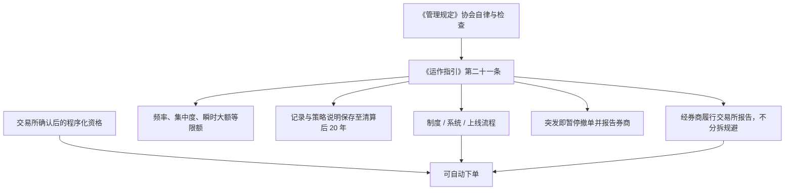

# 中基协程序化交易自律要求

主要开展程序化交易的私募证券投资基金，应当制定专门的业务管理和合规风控制度，技术系统须具备交易场所规定的基本功能并充分测试，按交易所报告制度履行手续，不得以规避报告等监管要求为目的分拆基金；相关资料自基金清算结束之日起保存不少于二十年。

<footer>—— 中国证券投资基金业协会《私募证券投资基金运作指引》第二十一条；上位衔接证监会《证券市场程序化交易管理规定（试行）》第四条、第五条、第十四条、第二十五条</footer>

程序化的账户报告发生在交易所与会员之间；基金产品还有一层行业协会自律。证监会《管理规定》写明：证券交易所、中国证券业协会、中国证券投资基金业协会按职责制定程序化相关业务规则并实行自律管理；证监会指导包括基金业协会在内的单位建立统计监测与跨市场共享；协会可对相关机构约谈提醒或现场检查，并可采取管理措施。中基协 2024 年 4 月 30 日发布、8 月 1 日起施行的《私募证券投资基金运作指引》把程序化收成第二十一条七项要求，并与场外衍生品、流动性、杠杆等运作规范放在同一份自律规则里。本篇按这些公开文本写管理人侧约束：制度、系统、流程、风控、档案、报告、应急。它不是如何把产品拆小以免报告，也不是协会「认可策略」的背书。

## 问题

私募证券基金用程序化下单时，面对两套必须同时满足的规则。交易所侧：先报告后交易、四类异常、高频额外报告。协会侧：管理人是否就程序化建立了专门制度与指令审核监控；系统是否具备验资验券、权限、阈值、异常与应急；策略是否经过研发、测试、验证、合规审查、上线；是否对流动性、集中度、杠杆、交易频率、期现匹配、风格暴露、瞬时大额成交等有可执行风控；档案是否留到清算后二十年；是否按交易所制度报告且不分拆规避；突发事件是否立即暂停并告知委托的证券公司或期货公司。问题是把协会条款写成产品的准入与存续条件：备案与运作检查会问这些「是否」，回测不会问。只满足券商报备表格、内部没有对应制度与测试记录，仍可能在协会检查上失败。

《管理规定》第十四条对公募、私募、合格境外投资者提出专门业务管理和合规风控、指令审核监控的要求，与指引第二十一条第一项同方向。协会文本把「主要开展程序化交易」的私募证券基金标出来，给出更细的流程与档案口径。是否「主要开展」以协会监管实践为准，不能靠把程序化改名成「辅助下单」来退出条款。

### 不得分拆，是协会与交易所共用的禁令

指引明确不得以规避报告制度等监管要求为目的分拆私募证券投资基金。交易所实施细则对机构以产品维度程序化的，不得通过分拆产品规避异常交易监管。两句话覆盖报告与监控两个目的。产品数量、份额、策略相似度若呈现「把一个高频账户切成多个刚过线的小账户」，会被放在这条禁令下解释。研究与产品设计应把合并口径的报撤与异常作为真实约束，而不是把分拆当成容量工具。

保存期限自基金清算结束之日起不少于二十年，对象包括历史交易记录、算法或策略的文字说明等投资决策与交易资料。比交易所对会员「不少于二十年」多了一个「自清算起算」的起点。策略文档删除、代码无版本、成交回报只留三个月，与指引直接冲突。

## 方法

管理人侧的最小可行合规集可以按指引七项做成清单，并与券商报告字段对齐。制度：程序化业务管理、合规风控、指令审核与监控职责到人。《管理规定》还要求负责合规风控的责任人员对程序化合规性进行审查监督。系统：功能对齐交易所技术规范，充分测试，定期验证，留测试记录；实际下单系统须与验证过的系统一致，否则会员可拒单。流程：研发到上线的闸包括合规审查，不能「研究环境直接连实盘」。风控：把瞬时大额成交、频率、期现匹配写成可拒绝的限额，而不是事后解释。报告：经托管券商履行交易所程序化报告，资金与杠杆来源与基金合同、托管数据一致。应急：故障与人为差错时先停再报券商，与细则第二十四条同一动作。

协会检查与证监局自查底稿已把程序化列为独立部分，包括是否利用券商对接非法经营、是否违规给第三方接入、是否按规定缴纳增强行情费用、高频前是否报告服务器地与应急方案。这些检查项应回指到[程序化规定](/quant/cn-program-trading-rules)与[高频认定](/quant/cn-hft-threshold)，而不是另造一套内部定义。

### 场外衍生品与程序化是并列条款，不是替代通道

同一份《运作指引》规范场外衍生品交易与程序化。用收益互换、场外期权把股票暴露挪到券商账户，再由券商程序化执行，并不自动退出第二十一条：指引要求收益互换类通过自身账户程序化的，交易所还可要求报告客户信息；分拆与规避目的条款看实质。雪球等结构的定价与对冲见[雪球定价](/quant/snowball-pricing)，其合法前提是场外衍生品的适当性与协会、证券业协会的柜台业务规范，不是「把股票程序化换成场外就不受报撤监控」。

## 机制

协会规则把程序化从交易环节前移到基金治理：谁批准策略上线、谁保存代码与记录、产品边界是否为了摊薄监管指标而存在。交易所罚的是账户行为；协会管的是管理人有没有能力不让行为失控。跨市场监测（证监会指导协会参与）意味着股票、期货程序化可以在协会与交易所之间对上同一管理人。单市场「没碰到第十八条」不等于自律检查通过。

《管理规定》第二十五条：违反规定的，协会应按规定采取管理措施。措施类型在规章征求意见稿中曾列举口头警示、书面警示、责令改正、限制交易等，具体以协会当时有效的自律措施规则为准。把协会理解成「只备案不执法」与公开条文不符。

### 公募与私募的报告路径差别

使用交易所交易单元的公募基金管理人，按《管理规定》第九条直接向交易所报告自身程序化。私募通常作为会员客户，经证券公司转报。指引第二十一条第六项把私募拉回同一报告制度，并加上分拆禁令。合格境外投资者可约定由会员代报。三条路径的共同点是未经确认不得程序化交易；差别是表格谁填、谁签字。内部系统若按「只有私募要报」来设计，会漏掉公募自营式使用单元的情形。

## 边界与工程取舍

《运作指引》自 2024 年 8 月 1 日施行，过渡期安排以协会通知为准；《管理规定》自 2024 年 10 月 8 日施行。历史产品不能用今日第二十一条去改写当年备案材料，但存续产品须在施行后满足现行要求。期货程序化另有期货业协会与期货交易所规则，本篇只覆盖证券基金侧公开文本。「主要开展」的定量界限若协会后续以问答明确，应从新口径。协会问答、窗口指导若未公开，不得当成可引用的放宽依据。

不要为规避报告而新设多层产品或关联管理人轮换。不要把未测试系统接入券商。不要在突发事件里为等待「研究确认」而延迟停机。公开文本下，研究止于：协会七项如何改变产品可交易集合与档案成本，以及它们与交易所报告如何对齐。

自查底稿中的「是否违规转让、出借投资交易系统或者为第三方提供系统接入」指向的是系统隔离。把程序化平台租给未报备的外部信号方，既撞上协会项，也撞上会员对实际系统与验证系统一致性的要求。

## 小结

- 中基协在《管理规定》下对程序化实行自律管理，并可检查、采取措施。
- 《运作指引》第二十一条从制度、系统、流程、风控、档案、报告、应急七项约束「主要开展程序化」的私募证券基金。
- 不得为规避报告或异常监控而分拆产品；档案自清算起不少于二十年。
- 场外衍生品不能自动替代程序化报告；系统不得出借或给未验证的第三方接入。
- 交易所报告与协会治理必须同时满足。
- 出处：《私募证券投资基金运作指引》第二十一条；证监会公告〔2024〕8 号第四、五、十四、二十五条；交易所实施细则关于分拆与会员核查的条款。
