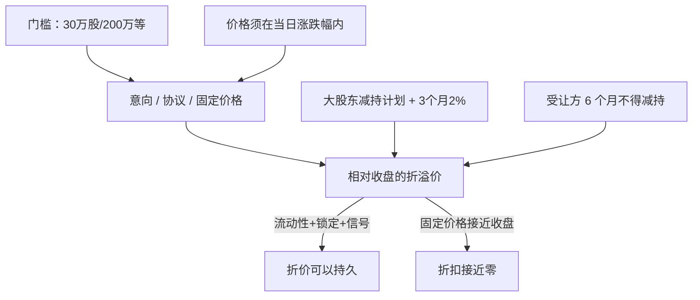

# 大宗交易与折价

A 股单笔申报数量不低于三十万股或成交金额不低于二百万元的，可以采用大宗交易。有价格涨跌幅限制证券的大宗成交价，由买卖双方在当日涨跌幅限制范围内确定。大股东通过大宗减持的，受让方在受让后六个月内不得减持所受让股份。

<footer>—— 《上海证券交易所交易规则》大宗交易节；中国证监会《上市公司股东减持股份管理暂行办法》（2024 年）</footer>

[上一课](/quant/cn-margin-trading)把两融杠杆写成开仓保证金与维持担保比例，标的调出与 T+1 会在保证金仍充足时切断调仓。缺口是大额股票还有竞价之外的通道：大宗是门槛、时段与涨跌幅约束下的协议或固定价格成交，不是盘中暗池。有涨跌幅股票的大宗价不能越板；2024 年减持办法要求预披露、三个月 2% 上限、受让方六个月不得减持。本课写折价如何覆盖流动性、信息与锁定，不重写两融强平线。

## 问题

沪市 A 股大宗的数量或金额门槛为 30 万股或 200 万元，基金、债券另有门槛；科创板股票的数量/金额门槛更低（10 万股或 100 万元量级，以当时特别规定为准）。深市主板、创业板门槛与沪市主板同量级。意向申报时段覆盖竞价交易时段并延至 15:30，成交申报确认在 15:00–15:30；固定价格申报在 15:00–15:30 接受。15:00 仍停牌的证券当日不再接受大宗。16:00–17:00 的成交申报（若该时段开放）按次日清算。时钟已经说明：大宗大多是收盘后的协议价，不是盘中可随时吃的隐藏流动性。

有涨跌幅证券的大宗价格必须落在当日涨跌停之间，所以「相对收盘折价 10%」只在股票当日没有封死跌停、且跌停幅度允许时才合法。主板 10%、科创板与创业板 20%、风险警示股 5%，同一「九折」在不同板块的可成交性不同。无涨跌幅限制的股票、存托凭证，成交申报价格被限制在当日竞价均价与最高最低价的更窄带内（均价 80%–120% 与当日最低/最高的孰高孰低），不能按旧的「均价 70%–130%」回测现行规则。

### 减持通道上的折价不是自由议价

证监会 2024 年《上市公司股东减持股份管理暂行办法》把大宗明确写成受监管的减持方式：大股东计划通过集中竞价或大宗减持的，须在首次卖出前十五个交易日披露减持计划；大宗三个月内减持不得超过公司股份总数的 2%；受让方受让后六个月内不得减持。破发情形下控股股东、实际控制人不得通过竞价或大宗减持（已披露计划或证监会另有规定的除外）。于是卖方愿意给出的折价，必须覆盖买方六个月的价格风险与资金占用；买方不是在买「次日可卖的便宜筹码」。把 2017–2023 年受让方可较快卖出的样本，与 2024 年之后六个月锁定的样本混在一条折价回归里，会高估折价收敛速度。

大宗成交价不参与当日指数实时计算，也不改变连续竞价的最后一笔。用收盘价对大宗价算折价完全正确；用这个折价去预测「指数会被拖累」，把未计入指数的协议成交写成了指数冲击。

## 方法

可研究的对象应拆成三类成交：减持型协议转让、机构之间的仓位腾挪、固定价格申报（以当日收盘价或均价为基准的盘后撮合）。前两类折价含信息与锁定期，后一类更接近在收盘价上的大额成交，折价通常更窄。每笔应记录：相对当日收盘（或均价）的折溢价、是否属于减持计划披露后的卖出、受让方是否进入六个月限制、标的当日涨跌幅与是否涨跌停、成交是否于 15:00–15:30 确认。

次日开盘的「折价回归」检验必须条件化。若买方被锁定六个月，其最优行为不是次日砸盘，而是持有或对冲；次日竞价的卖压更可能来自未锁定的跟风盘或减持计划的后续竞价额度。回归应对：锁定样本与非锁定样本、涨停/跌停日、ST 与正常股票分别估计。冲击方面，大宗本身不走订单簿，对当日 VWAP 无直接贡献，但对次日集合竞价的订单流有信息效应——市场看到折价减持，会更新供给预期。

### 固定价格与协议成交的价差含义

固定价格大宗以收盘价或规则指定的基准成交，折价接近零，功能是在收盘后完成大额换手，减少对连续竞价的冲击。协议成交的折价才是议价结果。若把两类成交放进同一张「平均折价」表，固定价格会把减持折价向下拉。规格应写清：统计的是协议成交相对收盘的折扣，还是全部大宗的量权折扣。科创板、创业板 20% 涨跌幅使协议折价的合法空间大于主板 10%，跨板块比较必须先除以当日可允许的最大折扣，否则会把制度空间写成「科创板折价更深所以更无效」。

## 机制

折价的经济来源有四块：买方六个月锁定与资金成本、大额持仓的流动性补偿、减持信息披露带来的负面信号、以及买卖双方在涨跌停约束下的议价区间。前三块使折价可以为正且不必在次日消失；第四块给折价一个硬上限。溢价大宗同样存在，常见于买方急于建仓、标的涨停买不到、或过桥过户，不能用「大宗=打折货」的单向叙事。

与连续竞价的相互作用是信息性的。披露减持计划后，竞价市场会提前消化供给，大宗成交往往发生在计划区间内的若干日，折价是计划被执行的结果而不是意外冲击。未披露的机构互倒（非大股东、非特定股份）折价更接近纯流动性，回归更快，但成交更少、更难与减持样本区分——必须用股东身份与公告匹配，而不是只看「大宗」标记。

受让方六个月不得减持，并不禁止其用其他工具对冲，但融券标的、套保额度与期货基差会限制对冲完整性。把锁定当成「该筹码从市场消失」，忽略了对冲盘可能在期货或相关 ETF 上出现。

### 停牌、涨跌停与当日不可用

15:00 仍停牌则当日无大宗，复牌日的折价会与积压的减持计划叠加，样本极厚尾。全日涨停的股票，大宗价格不能高于涨停价，折价空间最大（相对涨停价可以回到跌停），但卖方若不愿按跌停附近出货，成交会零。全日跌停则大宗不能低于跌停，折价上限被压到零附近，看起来「没有折扣」，其实是制度截断。这些日子应从「平均折价」的无条件均值里分开，否则会把涨跌停日的截断当成市场平均议价。

## 边界与工程取舍

不要把大宗折价当开盘买入信号。不要忽略 2024 年减持新规对受让锁定与 2% 配额的改变。不要用指数实时行情去度量大宗冲击。回测须使用当时有效的门槛、价格带与减持规则；科创板门槛、无涨跌幅证券的 80%–120% 均价带、主板盘中接受成交申报后于 15:00–15:30 确认，都是规则变更点。

容量上，单只股票三个月大宗减持配额是股本的 2%，不是成交额的无限供给。买方锁定使「折价后的流通筹码」短期减少而不是增加。报告应分开：减持计划执行样本的折价分布、非减持协议样本、固定价格样本，以及次日开盘超额收益是否在锁定规则实施后消失。

《减持办法》第十四条把大宗受让后六个月不得减持写进部门规章，不是交易所的临时通知。用锁定前的「折价次日转正」文献直接当现行可交易规则，是把已废止的激励结构当成策略。

## 小结

- 大宗是门槛、时段与涨跌幅约束下的协议或固定价格成交，不是盘中暗池。
- 有涨跌幅股票的大宗价不能越板；无涨跌幅证券适用更窄的均价带。
- 2024 年减持办法要求大宗减持预披露、三个月 2% 上限、受让方六个月不得减持，折价须覆盖锁定。
- 折价含流动性、信息与锁定期，不保证次日向收盘回归。
- 停牌、涨跌停会截断可成交折扣，无条件平均折价没有交易含义。
- 出处：《上海证券交易所交易规则》大宗交易条款及 2022 年价格带调整通知；深交所对应规则；证监会《上市公司股东减持股份管理暂行办法》（2024 年 5 月公布施行）。
